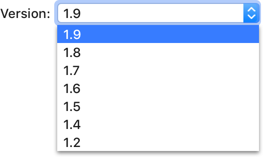
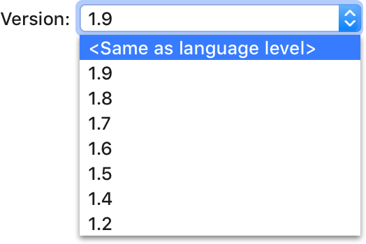
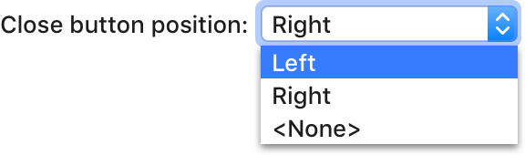

<!-- Copyright 2000-2024 JetBrains s.r.o. and contributors. Use of this source code is governed by the Apache 2.0 license. -->

# Drop-Down List

<link-summary>UI guidelines on using drop-down lists.</link-summary>

<tldr>ComboBox</tldr>

A drop-down list is a type of button that appears in dialogs. It shows a list of choices on clicking it and allows selecting one option.

## When to use

Use a drop-down list if:

A single option should be selected.

The possible choices are objects or states.

The number of choices is more than 4.

The screen space is limited, so there is not enough room for radio buttons.

The default value is recommended for the most users. A drop-down is a good way to hide unpopular alternatives.

*“Subpixels” is the best choice for most users.*

If there are other drop-downs in the same window and these options are not more important than others. A list of radio buttons is more noticeable than the drop-down.

If a layout combines various UI elements for one setting, use a drop-down even if there are 4 options or fewer:

### When not to use

If multiple selections are possible, use checkboxes.

If there is a list of actions, use a menu or a split button:

If there are 4 options or fewer, use radio buttons.

If users may need to enter a value that not currently in the list, use a combo box.

If a drop-down appears on a toolbar, use [toolbar drop-down](toolbar_drop_down.md) instead.

## How to use

### Label

Follow the rules for the [input field](input_field.md#label).

### Default value

Select the most likely or the safest value by default.

*The safest value is “Ask”, the behavior will not be unexpected to the user.*

Do **not** use an empty value as the default value. If no values are added to a drop-down yet, replace it with a button to add values.

| Incorrect                | Correct         |
|--------------------------|-----------------|
|  |  |

## Menu {id="menu_1"}

### Control

A drop-down menu opens on clicking the drop-down button anywhere or pressing the Down key when the drop-down is
focused.
The menu opens down by default. If there is not enough space, the menu opens up.

When the menu opens, the default option (displayed when the menu is closed) is selected.

Move the selection in the menu on pressing Up and Down arrows when an item is hovered. On hover the cursor over the item just move selection, do not update the value.

<!-- * Filter items in the list on typing:

    
-->

The menu remains opened until the user selects an item, clicks outside the menu, presses the <shortcut>Esc</shortcut> key or
switches to another app.

Allow single-click activation using mouse: click on a drop-down, the drop-down opens, select an item by hovering, close the drop-down with the new item selected by releasing the mouse button.

### Menu items

Use sentence-style capitalization for each menu item.

Avoid repeating words in drop-down list items. Move repeating words to the label or after the drop-down.

Sort items in one of the following orders:

* Logical order, for example in a spatial relationship:

    

* Alphabetical or numeric order if the options are equivalent to make it easier to find items:

    

* Place the most common options first. If there are more than 10 options, separate the most popular options with a line:

    

Group related options, add a separator and group header if possible:

If there are actions related to the drop-down, put them under the gear icon on the right:

Enclose meta-options in pointy brackets and place meta-options at the beginning or at the end if they are secondary.

*<control>&lt;Choose per test></control> is a meta-options because it’s not a  real runner.*

Do **not** assign special meanings to numeric or string values, use meta-options instead. It can be unclear that 0 or an empty string are used to disable an option.

| Incorrect                                               | Correct                                               |
|---------------------------------------------------------|-------------------------------------------------------|
|  |  |

  
<em>In the incorrect example an empty string is used to set <control>&lt;Same
  as language level&gt;</control>, which is unclear.</em>

  
Replace the <control>&lt;None&gt;</control> option with a checkbox if it does not make the layout more complex:

  
Incorrect

  

  
Correct

  

Preview list items with images if they are associated with well-known icons. Use formatting for a list of fonts. It will help users make a choice.

Use **bold** font to show default values, blue font for values changed from the default,
 and grey font to add a hint.

*Default and Darcula are bundled schemes, Default is blue because it’s customized.*

Submenus are not supported for the drop-down list. Use a tree view instead:

## Sizes and placement

### Width

A drop-down width is fixed and does not change depending on the selected value.

A drop-down width should be enough to fit the longest option plus 20px, but not less than 72px.

### Menu

The width of a drop-down menu can either equal the drop-down control width, or be wider to fit longer items.

Choose a list length that eliminates unnecessary vertical scrolling. The minimum height of the list with scrolling is 200px. Expand the list to 600px if space is not constrained and the list does not hide meaningful information under it, e.g. the information that can be important to make a choice.

[//]: # (TODO: For sizes inside the menu list see [Menu list]&#40;menu_list.md&#41;.)

### Placement

Follow the rules for the [input field](#placement).

