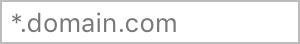
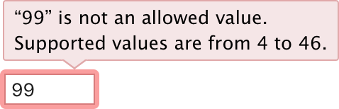
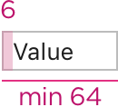
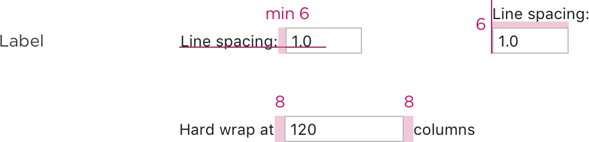
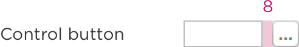

<!-- Copyright 2000-2024 JetBrains s.r.o. and contributors. Use of this source code is governed by the Apache 2.0 license. -->

# Input Field

<link-summary>UI guidelines on using input fields.</link-summary>

<tldr>JBTextField</tldr>

An input field allows users to enter or edit a text line using the keyboard.

## When to use

Use an input field if it’s not possible to enumerate the most likely values. Otherwise, use a [combo
 box](combo_box.md) or a [drop-down list](drop_down.md).

If input has to be in a specific format, use one of the following controls:

* If the previous user input must be preserved, use a [combo box](combo_box.md).
* Use a [text area](text_area.md) for long (commit message) or multi-line (code snippet) input. If place is constrained, use an [expandable input field](#input-field-types).
* Use a slider if a precise value is not required, or if it’s possible to provide feedback on the effect of setting changes. If place is constrained, use an input field.
* Use a [search field](search_field.md) to input a search query.
* Use calendar to set a date.
* Use color box to choose a color.

## How to use

### Label

A label accompanies each input field and indicates the information type.

Labels should be [short and descriptive](writing_short.md).

Write the label either as a noun and end it with a colon:

Or as a phrase with no ending punctuation:

Do **not** use labels to tell users what to do:

Use sentence-style capitalization.

If there are several input fields on a form, it’s recommended to make labels approximately the same length to avoid gaps between labels and fields. For example:

<table style="header-column">
    <tr>
        <td> 
Incorrect
 </td>
        <td>  </td>
    </tr>
    <tr>
        <td> 
Correct
 </td>
        <td>  </td>
    </tr>
</table>

If an input field is disabled, disable the label too:

Make the label text selectable. The user may want to search for this option on the Internet or to send a question to support.

Place the label on the left or above the input field. For more details see [Layout](layout.md).

### Placeholder
Placeholder is grey text placed inside an input field. Follow these rules:
* Use sentence-style capitalization.
* Do **not** use ending punctuation or ellipsis.
* Hide the placeholder when the user starts typing, not when the input field gets the focus.

To show placeholder text, use `JBTextField.getEmptyText().setText(...)`.

Use the placeholder to indicate that an input field is optional.

Use the placeholder to show the default value:

If the user overwrites the value, it can be restored by removing the new value from the input field or by clicking the "Reset to default" link on the right:

Do **not** use the placeholder to show examples. The user can get the impression that the field is already filled. Provide examples or explanation under the input field (see [Context help](context_help.md)):

<table>
    <tr>
        <td>Incorrect</td>
        <td>Correct</td>
    </tr>
    <tr>
        <td>  </td>
        <td>  </td>
    </tr>
</table>

Do **not** use the placeholder as the field label. After the field has been filled, it is difficult to understand its purpose.

### Prefilled value
Pre-fill the field if it has the default or a frequently used value. Use the default text color for pre-filled values:

Do **not** prefill with “Unnamed”. It takes time to read it and does not help the user to fill the form.

### Field focus
When an input field gets the focus, place the caret at the end of the text:

If users are more likely to re-enter the entire value, select the whole text, when the field gets the focus:

### Input field types

If input text can be long and place is constrained, use an expandable input field `com.intellij.ui.components.fields.ExpandableTextField`. For more details see [built-in buttons](built_in_button.md#expand-field).

If input data is secured, replace it with dots `JPasswordField`.

If there are many predefined values (for example, code snippets, commit author), add completion to the input field `com.intellij.util.textCompletion.TextFieldWithCompletion`.

An input field with completion looks the same way as a regular input field. When an empty input field gets the focus, show a tooltip after a delay to indicate that code completion is supported.

Show the completion popup when the user starts typing or presses <shortcut>Ctrl+Space</shortcut>.

Use [built-in buttons](built_in_button.md) to help the user enter data. For example,
to browse the disk.

### Validation
If the user enters an invalid value, highlight the field with red and show an error message in a tooltip. For more details see [Validation errors](validation_errors.md).

## Sizes and placement

Sizes are the same for all themes:

### Field width

Choose the width appropriate for the most common values, but not less than 65 px. The field width helps the user understand what value is expected and to make sure that they fill the field correctly.

<table style="header-column">
    <tr>
        <td> 
Incorrect
 </td>
        <td>  </td>
    </tr>
    <tr>
        <td> 
Correct
 </td>
        <td>  </td>
    </tr>
    <tr>
        <td> 
Incorrect
 </td>
        <td>  </td>
    </tr>
    <tr>
        <td> 
Correct 
 </td>
        <td>  </td>
    </tr>
</table>

If input value is longer than the field width, show the beginning of the value when the field becomes inactive:

### Placement

If the input field depends on another control, for example, a checkbox, follow the rules for (layout.md#dependent-controls). Otherwise, follow the rules for [independent controls](layout.md#independent-controls).

<!--

-->
