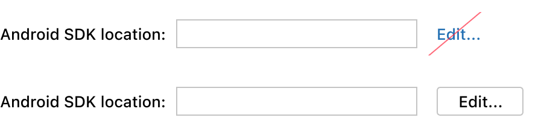

<!-- Copyright 2000-2024 JetBrains s.r.o. and contributors. Use of this source code is governed by the Apache 2.0 license. -->

# Link

<link-summary>UI guidelines on using links.</link-summary>

<tldr>ActionLink, DropDownLink</tldr>


## When to use

Use a regular link for navigation between pages of the same window.


*This option is in the Settings dialog. “Configure servers” opens another page of the same dialog.*


*Do not use a button to navigate to another page of the same window.*

Use an external link for navigation to web resources. See below for the [external link icon](#external-link-icon).


Use a regular or [drop-down link](#drop-down-link) for secondary actions in packed or small UI areas.


*The "Reset" action is a link for two reasons: (1) The action appears only when the default value in the field is changed and reverting to a&nbsp;default is considered a rare scenario. (2) A lightweight link fits better than a button in this busy layout.*


*The "Modify options" drop-down link fits into the top right corner of a busy layout.*

<p>
Do <control>not</control> use links for primary actions or when a UI is not constrained. Use a <a href="button.topic">button</a> or a <a href="drop_down.md">drop-down list</a> instead. These controls can be selected from the keyboard and are bigger and easier to click.</p>




## How to use

### Writing guidelines

Use sentence capitalization.

Add an ellipsis to a button-link if it opens another UI area where input is possible. See examples for the [Button](button.topic).

Do not use words like “navigate” or “click here”. A link already implies navigation or clicking.


When possible, replace “Learn more” and other generic phrases with more informative ones.


### Link as a part of text
A link can be a part of a checkbox or radio button label or of any stand-alone text, like text in an [empty state](empty_state.md) or in [context help](context_help.md).


Make a link the minimum phrase that is enough to understand what will happen without reading the whole text.


### Link in a tree or table
Use a link as a secondary action for some items of a tree or table.


If an action is needed for all items of a tree or table:
* Add an [icon button](icon_button.md) to a toolbar.
* For a list of choices, add a separate table column of drop-down cells (see [Table](table.md#editing-values)).
* If a link in every tree or table line has meaningful formatting, leave it:

*Links in the “Push Commits” window have the format that helps understand the relation between them: “[remote repository] : [branch]”. Moving these links elsewhere would break this meaning.*


### External link icon
Always add the arrow icon for an external link. The icon shows that the user will switch to a browser and lose the current context.


```java
ActionLink externalLink = new ActionLink("External link", event -> {
    BrowserUtil.browse("https://www.jetbrains.com");
});
externalLink.setExternalLinkIcon();
```

An exception is a help topic link in [empty states](empty_state.md). The help icon already hints that this is an external help resource so the arrow icon is unnecessary.


### Drop-down link

Drop-down links show a context menu or a popup. Use `com.intellij.ui.components.DropDownLink` to implement a drop-down link.


## Placement
Lay out button-links as buttons and dropdown-links as combo boxes. See [Layout](layout.md).


## Built-in behavior
A focused link is activated from the keyboard with <shortcut>Space</shortcut>.

