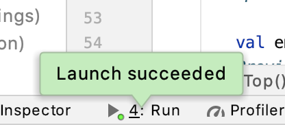
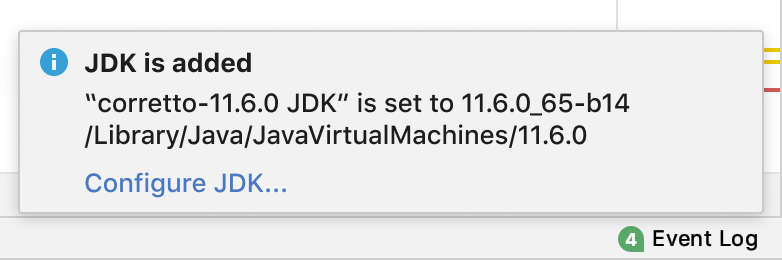

<!-- Copyright 2000-2024 JetBrains s.r.o. and contributors. Use of this source code is governed by the Apache 2.0 license. -->

# Notifications

Notifications inform users about the status of user or system initiated operations. They can have different actions depending on the message.

There are four types of notifications:

- [Alert](alert.md)
- [Banner](banner.md)
- [Balloon](balloon.md)
- [Tool window balloon](tool_window_balloon.md)

## What notification to use

Consider two factors when deciding which notification type to use.

**User action**

 Are the users required to address the notification before they can proceed with current tasks?

  - Required immediately
  - Required, but not immediately
  - Not required

**Context of trigger**

 What initiated the notification? Does the initiation point to a particular context or location?

  - File tab
  - Tool windows
  - Other

Use the following table to determine which notification to use based on the two factors:

<table>
  <tr><td>User action</td>
  <td>Context</td>
  <td>Type</td>
  <td>Examples</td></tr>
  <tr>
    <td>Required immediately
    </td>
    <td>All
    </td>
    <td>Alerts
    </td>
    <td>
      Confirm Restart  
      Opening projects in new window  
      When trying to rename a method, but a conflict is found  
      Need a dependency before using a feature 
      
   </td>
  </tr>
  <tr>
    <td>Required, but not immediately</td>
    <td>
      File tabs  
      Tool windows
    </td>
    <td>Banners</td>
    <td>
      Configuring SDK for your project  
      Requiring a Gradle sync for tools to work properly 
      
    </td>
    </tr>
  <tr>
    <td>Not required</td>
    <td>Tool windows</td>
    <td>Tool Window balloons</td>
    <td>
      Status of task completion  
      When Find Usages is invoked on a method, use a tool window balloon to show the feedback since the results will be found in the Find tool window 
      
    </td>
  </tr>
  <tr>
    <td></td>
    <td>All but file tabs or tool windows</td>
    <td>Sticky balloons</td>
    <td>
      IDE and Plugin Updates
      
    </td>
  </tr>
  <tr>
    <td></td>
    <td></td>
    <td>Timed balloons</td>
    <td>
      Module imported  
      Framework detection
      
    </td>
  </tr>
</table>

**Exception**: If the action is highly recommended, consider using Banners across all files for visibility instead of Sticky balloon.
