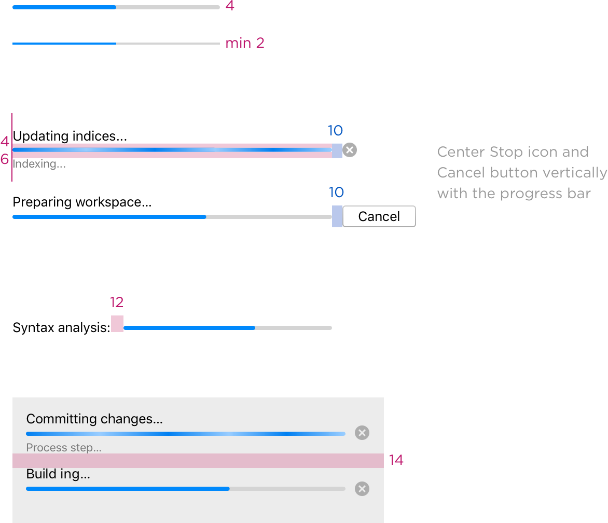

<!-- Copyright 2000-2024 JetBrains s.r.o. and contributors. Use of this source code is governed by the Apache 2.0 license. -->

# Progress Bar

<tldr>JProgressBar</tldr>

A progress bar informs users about the progress of a lengthy operation.

## When to use

Follow the rules for [progress indicators](progress_indicators.md).

## How to use

### Types

Use **determinate** progress bar, if the process duration is known:

Otherwise, use **indeterminate** progress bar:

If an indeterminate process reaches a point where its duration can be determined, switch to a determinate progress bar. For example:

### Process name and details

A progress bar can have a process name and process details. For wording, follow the rules for [progress text]({{site
.baseurl}}/controls/progress_text).

#### Process name

Place a process name above the progress bar:

If the vertical space is limited, place the process name with a colon on the left:

If there are several processes in a group, add a bold header. The header is a noun.

Do **not** show a process name for inline processes:

#### Process details

Place process details under the progress bar in one line:

The length of the comment is limited by the progress bar:

If space is limited,  show percentage completed:

#### In dialog

Use a process name as a dialog header, capitalize the title and remove ellipsis. Process details appear above the progress bar:

#### In status bar

Place a process name under the progress bar in the Status bar:

### Process status

If a process consists of substeps that can fail but do not terminate the process, then use green and red colors to show the intermediate status. For example, show the status of the running tests:

Do **not** color progress bar to show the final result of the task, use [notifications](notification_types.md). In case of success, show notification for the user-initiated tasks, in case of failure — for all tasks.

### Process control

Provide the Cancel button in the progress dialog if the process can be interrupted (see [Loading Project dialog](#in-dialog)). Use the Stop button if interrupting does not return the environment to its previous state.

Use the Stop icon if there are several processes running at the same time in one dialog or there is not enough space for the button (e.g. [Status bar](#in-status-bar)):

Always place the Stop icon on the right next to the progress bar. On hover over the Stop icon, show the “Stop” or “Cancel” comment under the progress bar instead of process details:

If the process takes a long time and can prevent the user from performing tasks, provide an option to pause a process using the Pause button or the Pause icon. Replace process details with the “Pause” comment on hover over the Pause icon:

It is **not** recommended providing an option to pause the process. It is preferable, that the process runs in a background and does not interfere with a user.

If a user pauses the process, show “Paused” under the progress bar. Replace the Pause icon with Resume, show “Resume” under the progress bar and when hovered over the Resume button:

Hide the progress bar as soon as the process completes.

## Sizes and placement

The progress form and sizes are the same in all themes.

