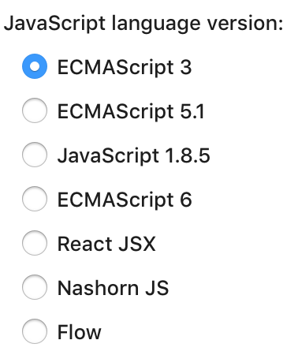
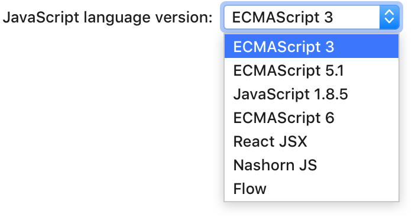
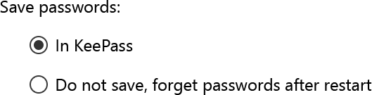
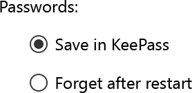

<!-- Copyright 2000-2024 JetBrains s.r.o. and contributors. Use of this source code is governed by the Apache 2.0 license. -->

# Radio Button

<link-summary>UI guidelines on using radio buttons.</link-summary>

<tldr>

**Implementation:** [`JBRadioButton`](%gh-ic%/platform/platform-api/src/com/intellij/ui/components/JBRadioButton.java)

</tldr>


## When to use

Use a radio button group to choose one option from 2 to 4 mutually exclusive options.

Do **not** use radio buttons if:
* Several options in a group can be selected. Use a group of [checkboxes](checkbox.md) instead.
* There are only 2 opposite yes/no options. Use a checkbox instead.


* There are 5 and more options that can be charted on an axis, e.g., time delay. Use a slider instead.

* There are 5 and more options. Use a [drop-down list](drop_down.md):

  | Incorrect                                                  | Correct                                                  |
  |------------------------------------------------------------|----------------------------------------------------------|
  |  |  |

Consider using a [drop-down list](drop_down.md) if:
* The screen space is limited.
* The option might be used less often than other options on the screen.
* There are other drop-down lists in the same group of UI components. A radio button group is more noticeable than a drop-down list so it will look like a more important setting.
* There is a combination of several UI components for one setting:

*The automatic updates setting consists of a checkbox, three lengthy-labeled options in a dropdown and a button.*


## How to use

### Label
A label accompanies each checkbox and is placed next to it.


If a label is long, split it into two lines. Avoid labels that take more than two lines. See recommendations on writing concise labels below.


To implement this, use HTML formatting:

```java
JRadioButton radioButton = new JRadioButton(
    "<html>Show options before adding<br>to version control</html>");
```

### Writing guidelines

Use sentence-style capitalization.

Do not use ending punctuation.

Use the imperative form of verbs.

Do not use negation in labels as it complicates understanding.

<p>Incorrect</p>



<p>Correct</p>



Make labels short and intelligible — see [Writing short and clear text](writing_short.md).


### Group label


Always start a radio button group with a group label. It explains what the options are for.

Use a checkbox or another radio button as a group label if the radio button group needs to be turned on or off.

Use a colon at the end of a group label.


## Sizes and placement

If a radio button group depends on another control, e.g. a checkbox, follow the rules for [dependent colors](layout.md#dependent-controls).
Otherwise, follow the rules for [independent colors](layout.md).

