<!-- Copyright 2000-2024 JetBrains s.r.o. and contributors. Use of this source code is governed by the Apache 2.0 license. -->

# Search field

<tldr>SearchTextField</tldr>

A search field is an input field that helps users locate objects, actions or text in an application.

This article focuses on the search field. See another article for [search results](search_results.md).

## When to use

Use the search field when specific objects are difficult to find at a glance, for example:

* There are many objects, for example, in the VCS Log table or in the Editor with a large file opened.
* Objects aren't in a single location, for example controls are located on different setting pages.

## How to use
### Label and Placeholder

Do **not** add a label to the search field. The magnifying glass icon is self-explanatory.

Incorrect

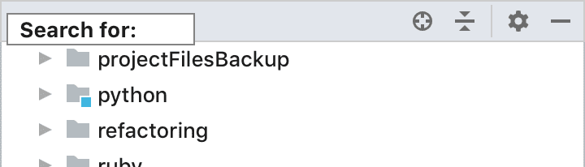

Correct

Mark the replace field with a label or a placeholder when shown together with the search field to distinguish between them:

Provide hints and scope as placeholder text, for example, the placeholder for plugins' search depends on the settings page tab to make it clear that search depends on the tab:

### Icons
#### Search Options

Use icon buttons inside the search field to save space and not to overload the UI and to be able to use them in already packed UI such as the Speed Search popup in trees or lists:

Available option icons:

<table>
    <tr>
        <td>  </td>
        <td> Match case </td>
    </tr>
    <tr>
        <td>  </td>
        <td> Regex </td>
    </tr>
    <tr>
        <td>  </td>
        <td> Words </td>
    </tr>
    <tr>
        <td>  </td>
        <td> In selection </td>
    </tr>
</table>

Change the state of options icons on hover so that it is clear that they are clickable:

Make icon buttons easily accessible with Tab navigation. Option icons should be placed on the right of the search field in the tabbing order. Show a border around the focused option.

Icon buttons should change color when enabled so that it is clear which options are currently enabled:

#### Clear a Search String

Show the clear button <icon src="../../../images/ui/search_field/icons/clear-light.png" /> only when filtering on-screen content. When the button is clicked, clear the search field and restore the content to its default state. Do <strong>not</strong> show the clear button if the search field is empty. 

Do **not** show the clear button when the initial data state is empty or doesn't differ from the result. For example, the close icon is not really useful in the editor search field since matches are highlighted and not filtered:

Incorrect

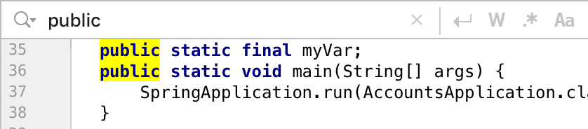

When search can be configured with options, show the clear button on the left of the option buttons. This way, option buttons won't jump when the clear button appears. The separator between the options and the clear button makes it harder to misclick the potentially dangerous clear icon.

#### Multiline Search Strings

Searching for multiline matches can be achieved with a separate New Line action button:

Put the New line action button on the left of the option buttons:

Move the New Line action button below the option buttons when the search field becomes a multi-line one:

Add a vertical separator when the scrollbar appears:

The default shortcut for the New Line action:

<table>
  <tr>
    <td>macOS</td>
    <td><shortcut>⇧⌘⏎</shortcut></td>
  </tr>
  <tr>
     <td>Windows/Linux</td>
     <td><shortcut>Ctrl + Shift + Enter</shortcut></td>
  </tr>
</table>

### Completion

Provide completion for complex searches with filtering by attributes:

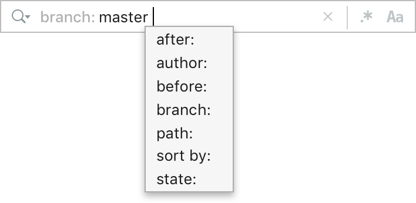

Do **not** use filter attributes as separate controls on the toolbar. Not all of them are needed every time while they take a lot of space and overload the interface. Use completion instead:

Incorrect

Correct

The following syntax is used for attributes:

*   Binary attributes are marked with a number sign (#), for example, _#by-jetbrains_ to show plugins which are developed by JetBrains.

*   Values for open attributes are provided after a colon, for example, _status: disabled_ to show all disabled plugins.

Provide aliases to the main attributes where possible, this way it would be easier for users to find the required filter. For example, the User attribute in the VCS Log search field can have the Author alias.

Show a popup with search attributes when the field gets focus, and after each space character except the space character following an attribute's name. This will make it clear that filtering by attributes is available.

Filter out the completion suggestions as the user types:

Show a popup with values right after the user has entered an attribute.

### Search History

Use the magnifying glass icon with an arrow when search history is available:

And without an arrow when it's not:

Show search history in a popup on clicking on the magnifying glass icon:

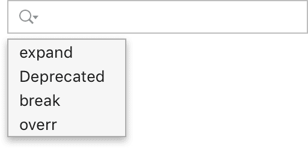

Show context help in the history popup when it is empty:

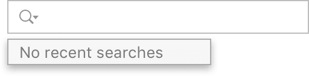

The keyboard shortcut for the History action is <shortcut>Alt + Down</shortcut> on all systems.

Add a search string to history:

*   On Enter for searches that are executed on enter.
*   When the search field loses focus for searches that are executed on any keystroke.

## Sizes and placement
### Placement

Put the search field on top of the on-screen content that is being searched, and align them vertically, for example, the search field in settings is aligned with the filtered settings tree:

Correct

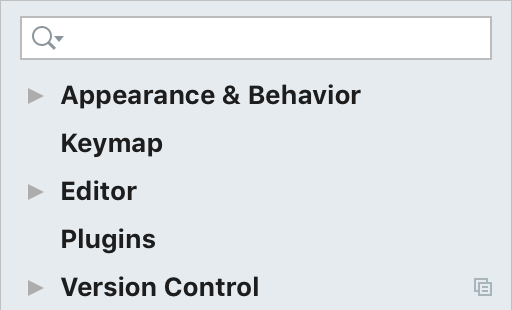

The search field is not aligned with the content on the Keymap settings page, which makes it harder to relate the content and the search string:

Incorrect

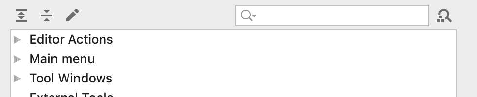

Correct

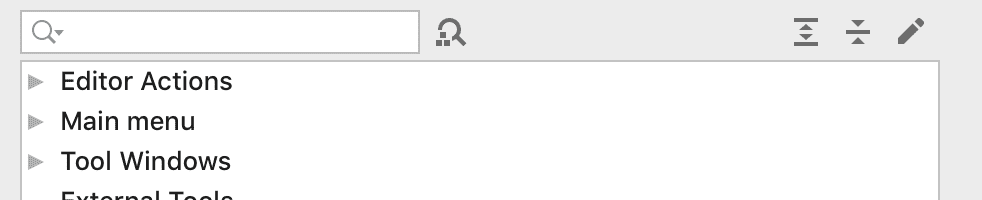

Fit the search field to the popup windows and to a toolbar if it has top borders. This way the overall form looks less complex.

Incorrect

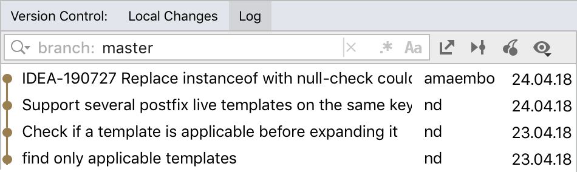

Correct

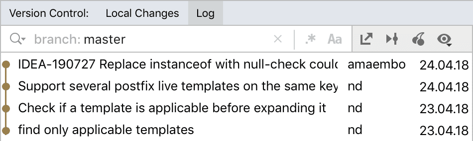

<table>
    <tr>
        <td> 
Incorrect
 </td>
        <td> 
Correct
 </td>
    </tr>
    <tr>
        <td>  </td>
        <td>  </td>
    </tr>
</table>

Show the search field on demand when search is supplementary to other functionality or if space is limited. For example, space in the Project view is limited and too loaded to always show the _Speed Search_ bar:

When searching through content that is not displayed on the screen, put the search field on top of the active frame as a popup. This makes it more prominent and gives space for search results. For example, Search Everywhere is shown on top of the main IDEA frame:

### Sizes

For a search field shown without a toolbar (i.e. _Speed Search_ in trees) the search width could be adjusted on typing to accommodate input:

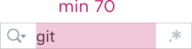

For a search field that is not fitted to a toolbar, set the minimum width to 200:

For a search which is fitted to the toolbar, expand the field to the toolbar width.

Center-align icons and the search string with the one-line search field vertically. Adjust the right and left paddings to the higher search fields:

Save the position of the search and option icons when the search field becomes a multi-line one:

### Spaces

Between the floating search field and on-screen content:

Between history and the search field:

Between search string and completion popup:

Completion popup:

## Style

### Colors and Fonts

For a general search field use the same colors as for an input field.

For a search field that is fitted to the toolbar, use a narrower focus border on macOS. The border width is 2px in that case:

Use the same font for the search string as used for showing the results.

Use the Context help font color for the attributes' names as they are secondary to their values.

