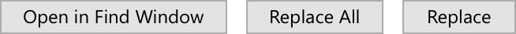
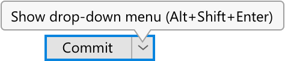
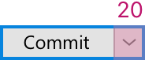
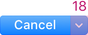

<!-- Copyright 2000-2024 JetBrains s.r.o. and contributors. Use of this source code is governed by the Apache 2.0 license. -->

# Split Button

<tldr>
JBOptionButton
</tldr>

The Split button is a button which has two parts — the main action on the left and a control button which shows a dropdown with less common actions on the right.

## When to use

Use the split button:

When more than 2 related actions are possible but the space is limited and/or packed:
For example, it is useful for the Commit actions group in the Commit dialog:

The Split button is not useful in the Replace popup, since not all actions are related, for example Open in Find Window is not related to the main action. Such actions are hard to find in the drop-down menu:

<table>
<tr>
<td>Incorrect</td>
<td>Correct</td>
</tr>
<tr>
<td>

</td>
<td>
</td>
</tr>

</table>

In the Adjust Code Style dialog only 1 related action is possible and it does not save a lot of space:

<table>
<tr>
<td>Incorrect</td>
<td>Correct</td>
</tr>
<tr>
<td>

</td>
<td>
</td>
</tr>

</table>

To hide actions which are dangerous and uncommon. Dangerous means an action can destroy users’ data and cannot be easily undone. It is less possible to accidentally click an action hidden in a menu.  It is recommended to hide even a single related uncommon dangerous action.
For example, Force Push can override remote commits from other authors and should not be easily available:

If an action is dangerous but common, do not hide it under the split button, use simple buttons. An action should follow the <a href="dangerous_actions.md">principles for dangerous actions</a> behavior.

Do **not** use the Split Button in other cases, use simple [Buttons](button.topic) instead.

## How to use

### Main action

<table style="none">
  <tr>
    <td>Click</td>
    <td>Invoke the main action</td>
  </tr>
</table>

### Control button

<table style="none">
  <tr>
    <td>Click</td>
    <td>
        <ul>
            <li>Show a dropdown menu with secondary actions</li>
            <li>Hide the menu on clicking outside the menu, or on the second click on the right part of the button</li>
        </ul>
    </td>
  </tr>
  <tr>
    <td>Hover</td>
    <td>
        <ul>
            <li>Show a tooltip:
                </li>
            <li>
                The tooltip must not overlap the dropdown menu. Do not show a tooltip under the menu, show it on the opposite side of the button:
                
Correct

                
                
Incorrect

                
            </li>
        </ul>
    </td>
  </tr>
</table>

### Dropdown menu

Place actions related to the main button’s action in the dropdown menu.

Do **not** duplicate the main action in the dropdown menu, otherwise it is confusing how to trigger the main action — with the button or from the menu.

### Reduce split button to simple action buttons

The Split button can be reduced to simple action buttons which are layed out automatically next to each other. This is controlled by the following option in settings:
_Appearance & Behavior > Appearance > Merge buttons in dialogs_

For example, the Commit button reduced to its components (the option is disabled) looks like the following:

## Keyboard navigation & shortcuts

Trigger the **main** action when the [default](button.topic#default) button shortcut is pressed if the split button is the default one.

Open the dropdown menu with the first menu item selected on <shortcut>Alt+Shift+Enter</shortcut>.

Do **not** show the dropdown menu when the button gains focus.

### Focus on the button

<table style="none">
  <tr>
    <td>
<shortcut>Enter \ Ctrl+Enter</shortcut>
</td>
    <td><ul><li>Invoke the default button action</li></ul></td>
  </tr>
  <tr>
    <td>
<shortcut>Space</shortcut>
</td>
    <td><ul><li>Invoke the main action</li></ul></td>
  </tr>
  <tr>
    <td>
<shortcut>Arrow Down</shortcut>
</td>
    <td><ul><li>Show the dropdown menu with secondary actions and move focus to the first item in the menu</li></ul></td>
  </tr>
  <tr>
    <td>
<shortcut>Tab \ Shift + Tab</shortcut>
</td>
    <td><ul><li>Move focus to the control next to the split button and hide the drop-down menu</li></ul></td>
  </tr>
</table>

### Focus in the drop-down menu

<table style="none">
  <tr>
    <td>
<shortcut>Enter \ Space</shortcut>
</td>
    <td>Invoke the selected action</td>
  </tr>
  <tr>
    <td>
<shortcut>Arrow Down \ Up</shortcut>
</td>
    <td>
        <ul>
            <li>Navigate through the elements</li>
            <li>Pressing Up on the top element moves the focus to the bottom element</li>
            <li>Pressing Down on the bottom element moves the focus to the top element</li>
        </ul>
    </td>
  </tr>
  <tr>
    <td>
<shortcut>Esc</shortcut>
</td>
    <td>Close the popup and move the focus to the split button</td>
  </tr>
</table>

## Sizes and placement
Follow the rules for the [simple button](button.topic#sizes-and-placement).

### Button

The width of the split button equals to the width of the main button (follow the rules of the [simple button](button.topic)) plus the width of the drop-down button.

<table>
  <tr>
    <td>
Windows
</td>
    <td>
Mac
</td>
    <td>
Darcula
</td>
  </tr>
  <tr>
    <td></td>
    <td></td>
    <td></td>
  </tr>
</table>

A different width for the split button makes it easier to understand that this button is different from other buttons in the dialog.

### Drop-down menu

Follow the rules for menus with regard to sizes, colors, fonts and spacing.

Menu item height and spacing between the menu and the button:

## Style

Increase line height in the dropdown menu to lessen the chance of choosing the wrong menu item by mistake.

Leave 2px around the separator inactive to lessen the chance of choosing the wrong menu item by mistake:

Align the dropdown with the button left border:

