<!-- Copyright 2000-2024 JetBrains s.r.o. and contributors. Use of this source code is governed by the Apache 2.0 license. -->

# Table

<link-summary>UI guidelines on using tables.</link-summary>

## When to use

Use tables so that users can review, enter or edit uniform sets of data or options. For example:
* <ui-path>Git | Show Git Log</ui-path>
* <ui-path>Settings | Appearance & Behavior | Path Variables</ui-path>
* <ui-path>Settings | Appearance & Behavior | File Colors</ui-path>

Use tables:

* To compare data in a set, for example, in the File Colors table it is convenient to compare file colors with one another and make sure that they are distinguishable:

* 

* To search by all parameters in a data set, for example, in the File History table it is possible to quickly filter the table by the date, author or commit message.

Do **not** use tables:

* For hierarchical structures. Use Tree View instead.

* When there are more than 4 options per entry. Use the Master-Detail layout instead.

* When at least one of the options requires a multi-line control, for example, the Text Area in <ui-path>Settings | Editor | Copyright | Copyright Profiles</ui-path>. Use Master-Detail layout instead:
  

## How to use

### Label

A label is optional for tables.

Add a label if the table content is not obvious from the dialog title or the table header. For example, in the table that lets you configure filters for import and completion per-scope:

Avoid a label if it duplicates the dialog title or the table header. For example, there is no need in a label in the <ui-path>JavaScript | Libraries</ui-path> table since the Settings page title and the table context make it clear what is in the table:

Add a label if the control above can be mistaken for a table header:

Do **not** add a label to explain the table behavior. Use context help instead:

Incorrect

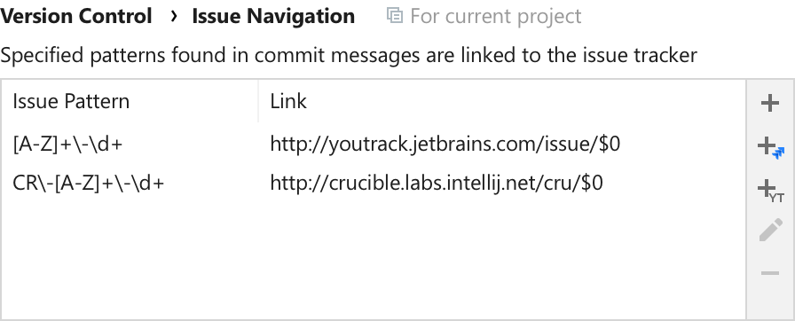

Correct

Follow the rules for the [Input field](input_field.md):

* The label should be short and descriptive.

* A label must be a noun phrase punctuated with a colon.

* Use sentence-style capitalization.

* If a table is disabled, disable the label.

* Make label text selectable.

Always put the label on top of the table.

Do **not** use a Group separator instead of a Table label. A horizontal line is redundant here:

Incorrect

Correct

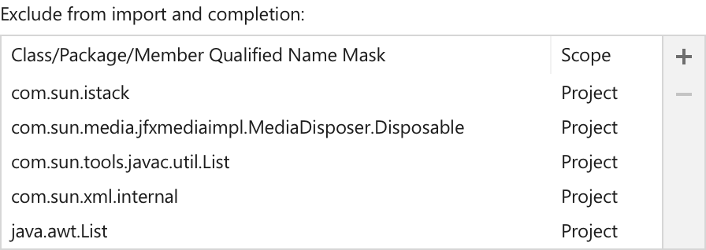

### Header

A table header is the row at the top of the table that helps identify the columns below each of the headers. Follow these rules:

Add a header to a table if table data is non-descriptive or ambiguous. For example, in the Environment Variables table a header is required, since that content of each column is not clear:

Correct

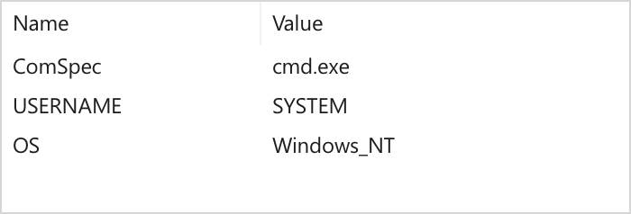

Incorrect

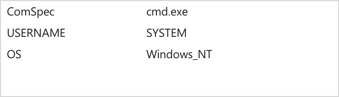

Do **not** use a header if all columns in a table have self-descriptive content, for example, names, dates, color previews, etc. For example, a header in File History is redundant:

Correct

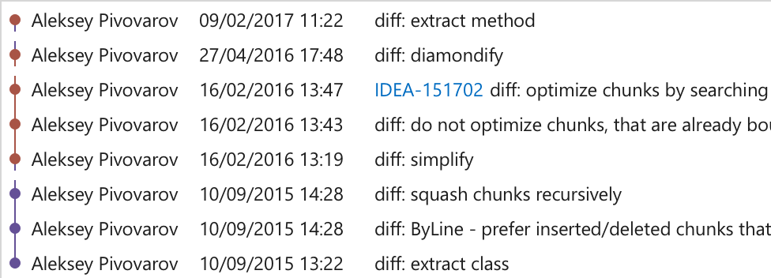

Incorrect

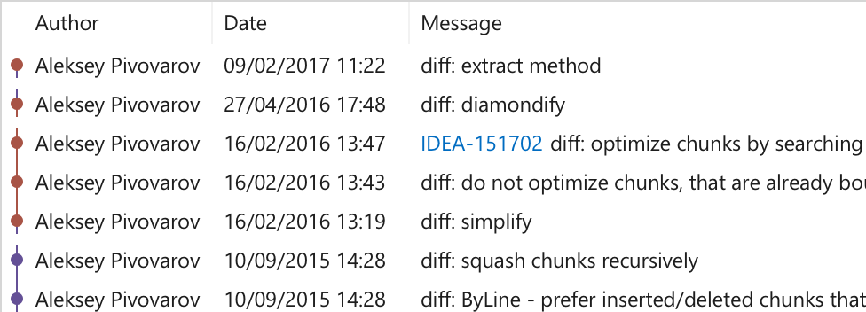

Labels in a header should be short and descriptive. Try to avoid headers which are too long for the content in the rows below. [How to write texts](writing_short.md).

Use nouns and noun phrases.

Use title-case capitalization.

Freeze a headers when scrolling the table. A header provides useful context and should not be hidden.

Align header with the content in the column below:

### Placeholder

A table placeholder is shown when there is no data yet. Always put meaningful text here, do **not** write "Nothing to show".

It is better to add a reason why a table is empty, and an action link to fill it:

See more on empty tables [here](empty_state.md).

### Toolbar

Add a toolbar to provide actions which help manipulate data in the table (add, remove, import, etc.):

Use the `com.intellij.ui.ToolbarDecorator` class to implement such a toolbar. See more on toolbars [here](toolbar.md).

### Zebra striping and inner borders

Zebra striping is alternate highlighting of lines or rows in data tables or forms.

Use stripes if you want to help users distinguish between different data sets. For example, the current branch is highlighted differently from other branches:

Do **not** use stripes In a simple data set as guides to track content between columns. Alternating backgrounds create two distinct layers of focus while the type of data in different rows is the same.

Incorrect

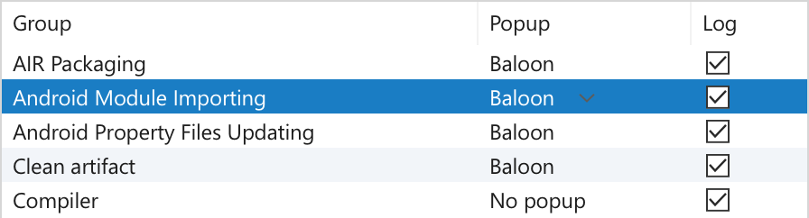

Default line height, <a href="table.md" anchor="sizes-and-placement">proper column width</a> and highlighting rows on mouse hover should provide enough guidance to track content. For example, look at the same table without stripes, with bigger line height and adjusted column width:

Correct

Bigger distance between groups of related information can also help in tracking content. Line height between groups should be increased by 4px for each group level.

For example, look at the File History table grouped by commit, author, and date:

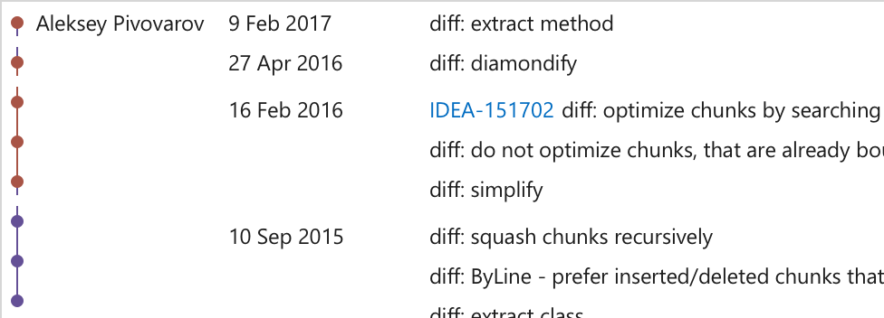

Do **not** add borders between rows or columns, they add unnecessary noise to the table:

Incorrect

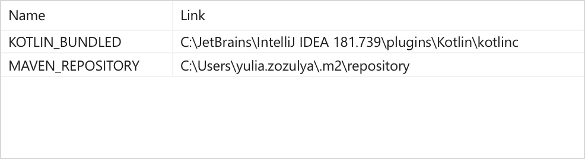

Correct

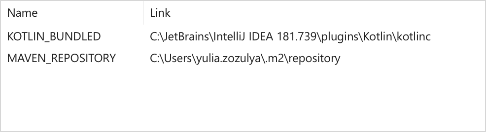

### Interaction

Highlight the hovered row to assist in tracking content across columns:

Change the background to active selection color for the selected row when the table is focused:

and to inactive selection when the focus is on another element:

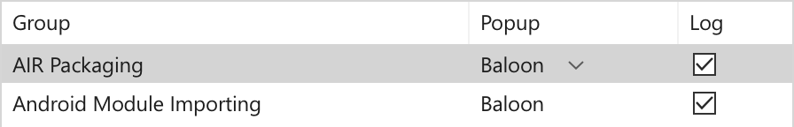

Do <b>not</b> leave the active selection color in the table when the focus switches to some other element. It is otherwise confusing which element is currently active.

Columns in tables should be resizable to allow users set a comfortable column width. Change the mouse cursor to "Horizontal Resize" when hovering the rectangular area between columns. This area is defined by table height and by 2px padding around the columns’ divider. This makes it clear that columns can be resized even in a table without a header:

Double click when the "Horizontal Resize" cursor is activated, should auto resize the column to fit the content.

If column sorting is available, display the sorting state in the column header. If the user clicks on a column that is already sorted, reverse the sorting order and rotate the sorting icon:

Add sorting to a table if the default sorting by one column may be insufficient to scan the data set. For example, in the table above, it is useful to be able to sort both by path and encoding to quickly find all paths with a specific encoding, or to find a specific path in the sorted list.

If columns can be reordered, change the cursor to "Hand" when hovering the table header, and allow changing their order by dragging the table header.

In tables without header show the drag icon on top of the column when hovering it:

Change the cursor to "Hand" on the icon hover:

Allow dragging a column when the cursor is placed anyplace over this column.
This makes it clear that columns can be dragged even if there is no table header.

In disabled table greyed-out text, disable controls and any interaction:

### Editing values

If data in a cell is editable or configurable:

Allow in-place editing of content for text data. It should be possible to activate editing on mouse click:

The line with the edited cell should be selected. The edited cell should have borders and their color should be the same as the color for [Input field](input_field.md) borders.

Allow in-place editing for paths and add the Browse button to the cell:

Show a separate dialog for non-text data, for example, a color chooser for colors.

Do **not** show a separate dialog for editing simple data rows without a compound preview (an example of a compound preview can be found in <ui-path>Settings | Editor | Language Injections</ui-path>). For example, there is no need in a separate dialog in the <ui-path>Settings | Appearance & Behavior | Path Variables</ui-path> table, as all editing could be done in place.

If it’s possible to enumerate less than 15 most likely or valid variants, show a combobox-like configurable with a down-arrow icon and a popup on click:

Show the combo icon only on hover or when the corresponding line is selected. A lot of arrows in one column form their own information layers and attract too much attention.

If there are more than 15 variants, show a completion popup.

Do **not** use a full-size combobox inside tables. It looks inconsistent and has too much details for a table; a simple dropdown icon with the variants popup is enough.

Incorrect

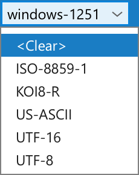

## Sizes and placement

### Sizes
Choose a column width appropriate for the most common values, but no less than **65 px**. Too wide columns make it hard to read data.

Correct

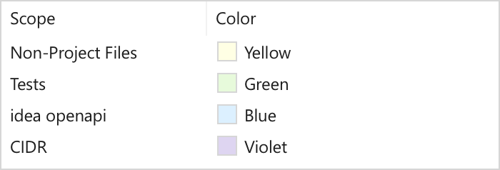

Incorrect

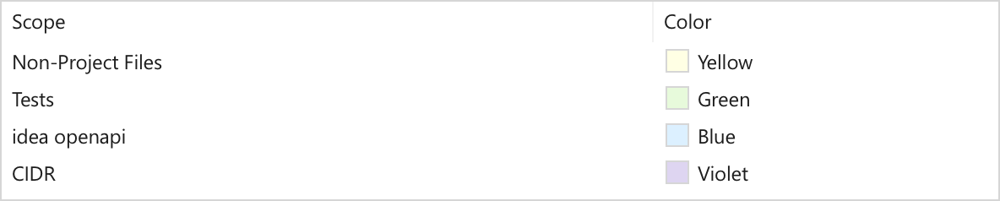

Minimum table width is **350px**. If a table is too narrow after you have adjusted columns width, add space to the rightmost column.

Add space to the rightmost column if you need to align it with other tables in the same window.

If content doesn’t fit a cell’s width, cut the text by the right border:

Do <b>not</b> put ellipsis at the end of a cropped line, as it can be confused with the content. Also, ellipsis can form a separate redundant column when content in the majority of cells in one column doesn’t fit its width.

Do <b>not</b> add a fade-away gradient for cropped text, as it adds too many shades to a table text, and they attract too much attention.

### Placement

Do **not** put vertical elements (for example, diagrams) in the middle of a table, as they prevent users from scanning data easily:

Incorrect

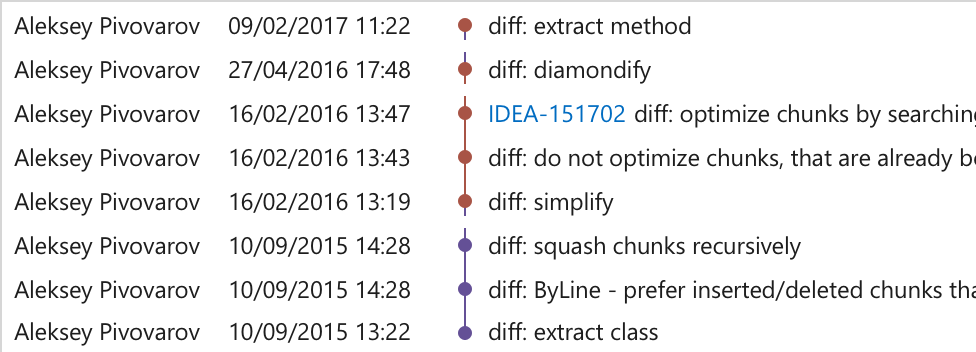

Place them closer to the sides instead:

Correct

Right-align numbers when it is useful to compare them by their length. Left-align all the other content.

For aligning in a dialog with other controls, see [Layout](layout.md).

<!--
### Sizes

<table>
<col width="176.25 px">
  <tr>
    <td>
        
Column width (not including scrollbar)

    </td>
    <td>
        min 65
    </td>
  </tr>
  <tr>
    <td>
        
Table width

    </td>
    <td>
        min 350
    </td>
  </tr>
  <tr>
    <td>
        
Row height

    </td>
    <td>
        font size * 1,8
        (default: 22)
    </td>
  </tr>
  <tr>
    <td>
        
Header height

    </td>
    <td>
        font size * 2,1
        (default: 25)
    </td>
  </tr>
</table>

### Spacing

<table>
<col width="159 px">
  <tr>
    <td>
        
Label

    </td>
    <td>
        
          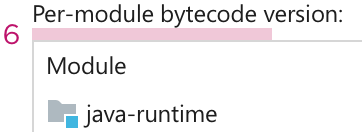

    </td>
  </tr>
  <tr>
    <td>
        
Column content

    </td>
    <td>
        
          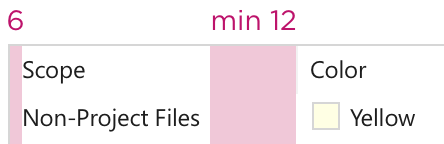

    </td>
  </tr>
  <tr>
    <td>
        
Combo icon

    </td>
    <td>
        
          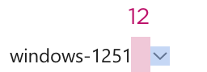

    </td>
  </tr>
  <tr>
    <td>
        
Sorted column

    </td>
    <td>
        
          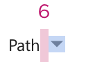

    </td>
  </tr>
</table>
-->

## Style

| IntelliJ |      |
|----------|-------------------------------------------|
| Darcula  |  |
{style=none}
