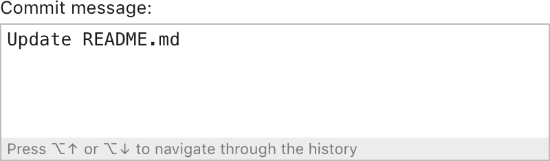

<!-- Copyright 2000-2024 JetBrains s.r.o. and contributors. Use of this source code is governed by the Apache 2.0 license. -->

# Text Area

<link-summary>UI guidelines on using text areas.</link-summary>

<tldr>JBTextArea</tldr>

A text area allows users to enter or edit multi-line text.

## When to use

Use a text area if input is unconstrained and long, or if the newline character is a valid value. Example: commit message or code snippets.

Do **not** use a text area if:

* Input consists of several words. Use an [input field](input_field.md) instead.
* There is not enough space for a text area, or if input is normally short but can occasionally be long or multi-line. Use an [expandable input field](input_field.md#input-field-types) field instead.
* Values are added one by one. Use a [table](table.md) instead.
* Text is read-only. Use a [description text](description_text.md) instead.

## How to use

### Label

Follow the rules for the [input field](input_field.md).

A label is required for all empty text areas. If a text area is prefilled and it’s clear from the context what data it contains, a label can be omitted. For example, the following text area is used to preview file and code templates:

*If new file template is added and the text area is empty, the label is required.*

Do **not** put units on the right of the text area.

Do **not** use a [group header](group_header.md) instead of the text area label. The horizontal
line is redundant here. Use [context help](context_help.md) to explain the field behavior.

Incorrect

Correct

### Placeholder, prefilled values and field focus

Follow the rules for the input field: [placeholder](input_field.md#placeholder), [prefilled
value](input_field.md#prefilled-value), [field focus](input_field.md#field-focus).

### History {id="history_1"}

If the previous user input should be saved, use <shortcut>⌥↑</shortcut> and <shortcut>⌥↓</shortcut> on Mac OS and <shortcut>Alt+Up/Down</shortcut> on Windows and Linux to navigate through the history. If history is available, add a note at the bottom of the input field:

Save the current value, so that the user can return to it while navigating through the history.

### Validation

If the user types an invalid value, highlight the text area with red and show an error message in a tooltip. For more details see [Validation errors](validation_errors.md).

## Size and placement

Recommended sizes:

This is the default size, it can be changed if the dialog is resized.
**Height**. The minimum text area height is 3 lines ~55px, so the user understands that it’s multi-line. The maximum height is not limited and should be appropriate for the most common values.
**Width**. The minimum text area width is 270px. It’s inconvenient to use a narrower field due to frequent line breaks. The maximum width is 80 symbols ~600px, otherwise, it’s hard to read the text.

Size the text area to display an integral number of lines of text:

| Incorrect                                    | Correct                                      |
|----------------------------------------------|----------------------------------------------|
|  |  |

Do **not** resize a text area on input. It will change the position of other controls and they can become hardly discoverable.

If the text is long and does not fit the text area, add [scrollbar](scrollbar.md).

For placement, follow the rules for the [input field](input_field.md).

## Style
Use the same colors as for the [input field](input_field.md).

Do **not** highlight a text area on selection, only if a validation error occurs.

### History

Background: dialog default theme color

Font: Windows, IntelliJ — default, Mac OS 2px smaller than default

