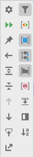
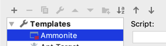
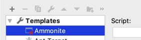
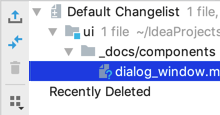
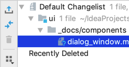

<!-- Copyright 2000-2024 JetBrains s.r.o. and contributors. Use of this source code is governed by the Apache 2.0 license. -->

# Toolbar

<link-summary>UI guidelines on using toolbars.</link-summary>

A toolbar provides quick access to frequently used actions and filters. It appears in dialogs, pop-ups, tool windows, lists, trees, and tables.

## Toolbar items

The following controls can appear on a toolbar:

* [Icon button](icon_button.md): action, toggle, or drop-down

* [Split icon button](split_icon_button.md)

* [Toolbar drop-down list](toolbar_drop_down.md)

* [Search field](search_field.md)

* [Button](button.topic)

* Separator

* Label

* Chevron

## What items to add on toolbar

Put only the most frequently used commands on the toolbar. Rely on usage statistics if it’s available.

If an action is new and it seems to be useful, add it to the corresponding toolbar.
Remove it after several releases if it’s not popular which means it’s used by less than ~5% of users who use this toolbar.

Do **not** put unpopular or well-known commands, like Copy and Paste on the toolbar. Use the main menu or the context menu for such commands.

It’s **not** recommended to add more items than the default toolbar length. Otherwise, the items will be hidden and it will be hard to discover them.

Left align items on a horizontal toolbar and top align on a vertical toolbar.

Group related toolbar icon buttons and separate groups with lines. If there are several unrelated icons, do **not** add separators after each icon.

Label group of icons if it helps to make the icons more clear and if it’s needed to promote the icons. The icons group becomes more visible with the label.

Arrange items inside groups by the frequency of use, from left to right from top to bottom. Rely on statistics.

It is recommended to arrange groups in the following order unless it contradicts the usage statistics. If it does, arrange groups by the frequency of use.

The less frequently used commands can be right aligned.

Do **not** put two toolbars next to each other. One toolbar should be enough for the most popular actions.

| Incorrect                                      | Correct                                        |
|------------------------------------------------|------------------------------------------------|
|  |  |

Make every toolbar action available from the main menu or the context menu.
Toolbars are customizable and can be hidden, so commands should be available from other places as well.

If the default component size changes and there is not enough space for items on a toolbar, hide them under the chevron.

## Visibility and customization

Provide the ability to hide the toolbar in the main window via the toolbar context menu.

Provide commands for invoking the toolbar. Use the main menu for the main window toolbars. Use the pane view settings for toolbars in tool windows.

Provide the ability to customize toolbars in the main window.
To do this, add the toolbar to the list on the <ui-path>Settings | Appearance & Behavior | Menus and Toolbars</ui-path> page and open
it using the <control>Customize Toolbar...</control> action from the toolbar context menu.

## Sizes and placement

The toolbar can be vertical or horizontal.

By default, place the toolbar at the top of the area.

**Exceptions**
Place the toolbar on the left in horizontal tool windows if horizontal space is not limited. A horizontal toolbar will be too wide and will occupy lots of space:

Place the toolbar on the right if it’s not the first toolbar in the pane and it’s rarely used.

Place the toolbar at the bottom on macOS, and on the right on Windows and Linux in [tables](table.md).

*macOS*

*Windows*

The toolbar width is limited by the width of the element it belongs to. For example, by the width of the tool window or the list part in a master-detail layout.

| Incorrect                                           | Correct                                           |
|-----------------------------------------------------|---------------------------------------------------|
|  |  |

Toolbar sizes are the same for all themes:

The toolbar items sizes change together with the application font size proportionally.

## Style

Separate the toolbar from the content with a line from all four sides if it appears in a tool window or a table:

| Incorrect                                           | Correct                                           |
|-----------------------------------------------------|---------------------------------------------------|
|  |  |

Do **not** separate a toolbar with lines if it appears above the list:

