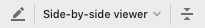
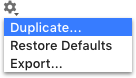
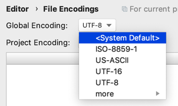
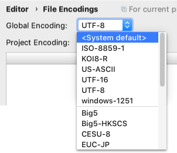
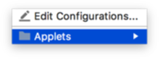
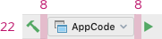
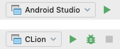

<!-- Copyright 2000-2024 JetBrains s.r.o. and contributors. Use of this source code is governed by the Apache 2.0 license. -->

# Toolbar Drop-Down List

<link-summary>UI guidelines on using toolbar drop-down lists.</link-summary>

<tldr>ComboBoxButton</tldr>

A toolbar drop-down list is a type of button that appears on a horizontal toolbar and shows a list of choices on clicking it.

## When to use

Use toolbar drop-down if a single option should be selected.

If the choices are objects or states.

To select values that are controlled by the toolbar button on the right.

To filter values or change the appearance in the control below:

Use a [toolbar drop-down button](icon_button.md) instead of a drop-down list in the following cases:

* If there is a list of actions:

* The options are secondary and the user won’t change them in most cases.

* Multi-selection is required, for example to group by several attributes.

Do **not** use toolbar drop-down in dialogs, use the [drop-down list](drop_down.md) instead.

| Incorrect                                                       | Correct                                                       |
|-----------------------------------------------------------------|---------------------------------------------------------------|
|  |  |

## How to use

Do **not** add a label to the toolbar drop-down.

For the default value follow the rules for the [drop-down list](drop_down.md#default-value).

Add separators between the toolbar drop-down and icons:

If a drop-down is controlled by buttons, add a border, as separators will break the connection between the controlling icons and the drop-down:

The toolbar drop-down does not get the focus. Highlight it on hover the same way as toolbar icons.

### Menu

#### Control

Open the drop-down menu on clicking anywhere on a drop-down list.
Open the menu down by default. If there is not enough space, open the menu up.

Select the first option when the menu opens.

Move the selection in the menu on pressing the Up and Down arrows or on hovering the cursor over the item.

Filter items in the list on typing:

Close the menu if the user selects an item, clicks outside the menu, presses the Esc key or switches to another app.

Allow single-click activation using mouse: click on a drop-down, the drop-down opens, select an item by hovering, close the drop-down with the new item selected by releasing the mouse button.

#### Menu items

Follow the rules for the [drop-down list](drop_down.md#menu-items).

If it’s necessary to configure options in a toolbar drop-down list, add customization actions at the top or at the bottom of the list and separate them with a line. Use title case capitalization for actions.

A toolbar drop-down list can have submenus.

### Submenu

A submenu is a menu item that shows a list of nested items. A submenu includes a triangular indicator that distinguishes it from other menu items.

Use items submenus to group related options and to show hierarchy:

Show the submenu list on hovering over an item.

If the selection moves with the Up and Down arrow keys, show the submenu list on pressing the Right arrow or the Enter key.

Avoid submenus inside submenus. Submenus hide choices too deep and are difficult to navigate.

## Sizes and placement

Toolbar drop-down sizes are the same for all themes.

The width changes depending on the selected value to save space if the value is short.

For menu sizes see [Drop-down menu](drop_down.md#menu_1).
