<!-- Copyright 2000-2024 JetBrains s.r.o. and contributors. Use of this source code is governed by the Apache 2.0 license. -->

# Tooltip

<link-summary>UI guidelines on using tooltips.</link-summary>

<tldr>

**Implementation:** [`HelpTooltip`](%gh-ic%/platform/platform-api/src/com/intellij/ide/HelpTooltip.java)

</tldr>

A tooltip shows an action name or provides useful information about an action or a setting.


## When to use

There are three types of tooltips:

<table style="none">
  <tr>
    <td>
        <strong>Action </strong><br/>
        Shows an action name or label for icons and unlabeled controls, and a shortcut if available.
    </td>
    <td>
        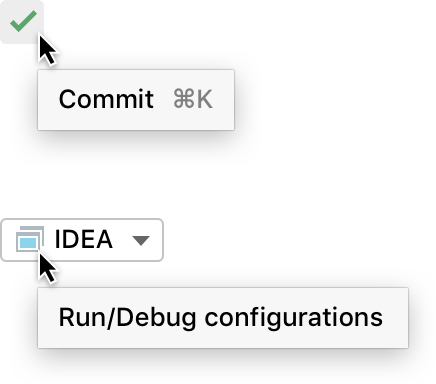
    </td>
  </tr>
  <tr>
    <td>
        <strong>Action help </strong><br/>
        Shows help text for icons and unlabeled controls in addition to an action name or label.
    </td>
    <td>
        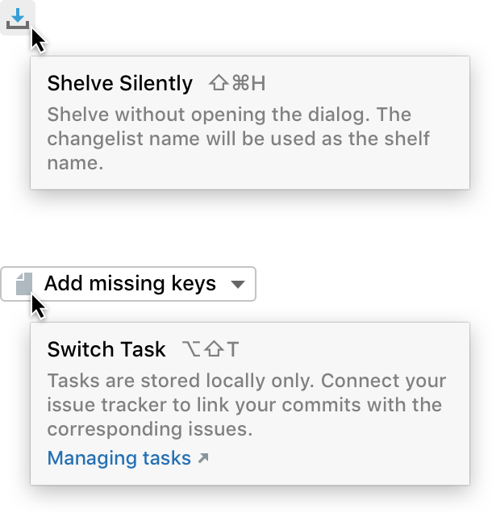
    </td>
  </tr>
  <tr>
    <td>
        <strong>Help</strong><br/>
        Shows help text for all other controls.
    </td>
    <td>
        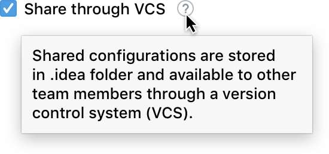
    </td>
  </tr>
</table>


All icons and unlabeled controls should have an **Action** or an **Action help** tooltip.

Use **Action help** and **Help** tooltips according to the [Context help](context_help.md) rules.

## How to use

### Required and optional information

Always show the required information in a tooltip:

<table style="none">
  <tr><td> Tooltip </td>
  <td> Required info </td>
  <td> Optional </td></tr>
  <tr>
    <td>
        Action <br/>
        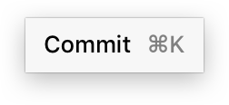
    </td>
    <td>
        Action name
    </td>
    <td>
        Shortcut
    </td>
  </tr>
  <tr>
    <td>
        Action help <br/>
        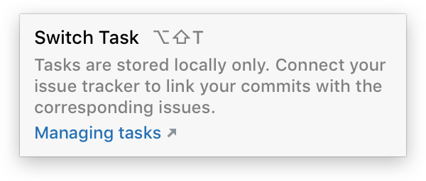
    </td>
    <td>
        Action name <br/>
        Help text
    </td>
    <td>
        Shortcut <br/>
        Link
    </td>
  </tr>
  <tr>
    <td>
        Help <br/>
        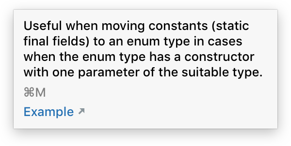
    </td>
    <td>
        Help text <br/>
        <span style="color: #999999">No action name or label because it is already shown in&nbsp;the UI.</span>
    </td>
    <td>
        Shortcut <br/>
        Link
    </td>
  </tr>
</table>

<!--
<p><strong>Implementation</strong></p>

<p>Action</p>

<code-block lang="java">
new HelpTooltip().setTitle("Commit").setShortcut("⌘K").installOn(component);
</code-block>

<p>Action help</p>

<code-block lang="java">
new HelpTooltip().setTitle("Switch Task").setDescription("Tasks are stored locally only. Connect your issue tracker to link your commits with the corresponding issues.").setShortcut("⌥⇧T").setLink("Managing tasks", ()->{}).installOn(component);
</code-block>

<p>Help</p>

<code-block lang="java">
new HelpTooltip().setDescription("Useful when moving constants (static final fields) to an enum type in cases when the enum type has a constructor with one parameter of the suitable type.").setShortcut("⌘M").setLink("Example", ()->{}).installOn(component);
</code-block>

<p><br/></p>
-->

Show a shortcut if an action or a setting has one. Do not show a single shortcut in a tooltip.


Provide a link to a source that can further explain the action or the setting. A link can navigate to a place in the IDE or to an external help article.

| Local link                                                | External link                                           |
|-----------------------------------------------------------|---------------------------------------------------------|
| 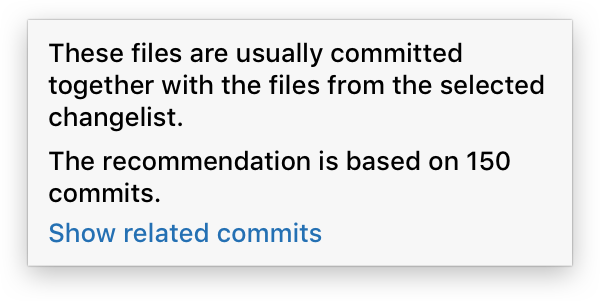 | 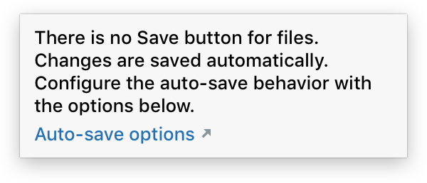 |

Do not show just an action name and a link to a help article. Provide help text so that the user does not need to switch to a web browser.


### Text length and formatting

The text width in an action tooltip is not limited. The text width in a help tooltip is limited by 250 px.

Show no more than 10 lines of help text. If the text does not fit, leave only the essential information and add a link to a help article.

Incorrect:


Correct:


Text style formatting:

* Avoid using style formatting in the help text. Usually, the text is short and no bold or italics are needed.
Incorrect:

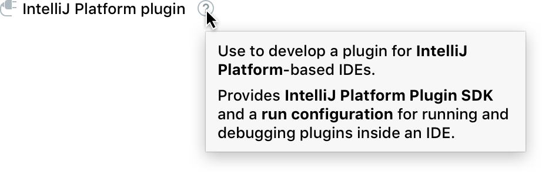

Correct:

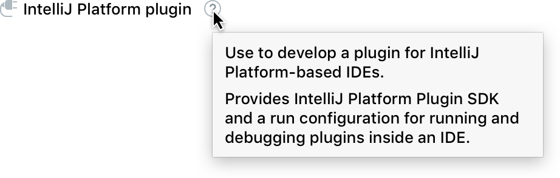

* Use formatting for code, console commands or parameters. Use HTML tags. Enclosing the text in `<html></html>` tags is not needed.

*Editor breadcrumbs*

* Action name, shortcut and link do not allow HTML tagging.

If the help text is longer than 5 lines, separate the text into paragraphs with the `<p>` tag. The `<p>` tag adds vertical space between paragraphs to visually separate them. Do not use the `<br/>` tag as it does not add space.


```java
String LONG_TEXT = "A new overloading method will be created with the new parameter added to this method definition.<p>The method with the old signature will be kept and the call to the new method will be added to it. The necessary value or expression will be passed to the new method call.";
new HelpTooltip().setDescription(LONG_TEXT).installOn(component);
```

### Writing guidelines

Make the help text [short and descriptive](writing_short.md).

In a help tooltip, do not repeat an action or a setting name in the text.


### Question mark icon for help tooltips

Always use the help tooltip with the question mark icon. Without the icon, it is unclear which component has help information.

Always place the question mark icon to the right of the corresponding UI component.

Examples with different controls:

#### Checkbox


#### Tree item


#### Combo box


#### Group header


#### Settings breadcrumbs


#### Stand-alone button not at the bottom of a dialog


**Exception:** do not use the help tooltip with buttons at a dialog’s bottom.
Put the information into the help article that is opened with the question mark button in the bottom left corner.

Incorrect:


## Style

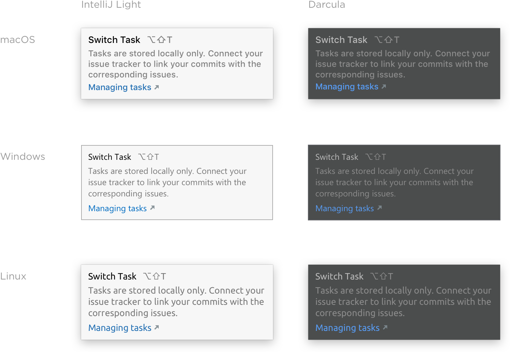

## Built-in behavior

All tooltips appear on hover (not on click), including the help tooltip with the question mark icon.

All tooltips are hidden when the mouse cursor leaves the area that triggers the tooltip.

If the mouse cursor stays in the tooltip trigger area, tooltips are also hidden after a timeout specified in the table below.

<table style="none">
  <tr>
    <td>
        <strong>Tooltip</strong>
    </td>
    <td>
        <strong>Appears after</strong>
    </td>
    <td>
        <strong>Hides after</strong> <br/>
        <span style="color: #999999">If cursor is in the tooltip trigger area</span>
    </td>
  </tr>
  <tr>
    <td>
        Action
    </td>
    <td>
        300 milliseconds <br/>
        <span style="color: #999999">ide.tooltip.initialReshowDelay registry key </span>
    </td>
    <td>
        10 seconds <br/>
        <span style="color: #999999">ide.helptooltip.regular.dismissDelay</span>
    </td>
  </tr>
  <tr>
    <td>
        Action help
    </td>
    <td>
    </td>
    <td>
        30 seconds <br/>
        <span style="color: #999999">ide.helptooltip.full.dismissDelay</span>
    </td>
  </tr>
  <tr>
    <td>
        Help
    </td>
    <td>
    </td>
    <td>
        Never hides
    </td>
  </tr>
</table>


If a tooltip has a link, it is possible to move the mouse cursor over the tooltip. The tooltip does not close automatically when the cursor is over it.

Tooltips are positioned automatically depending on the mouse cursor location.

