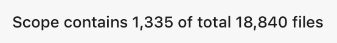
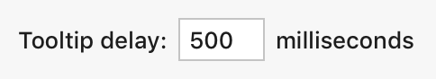
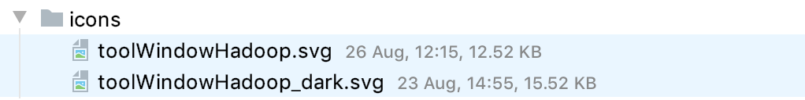
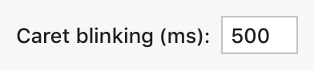
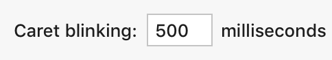
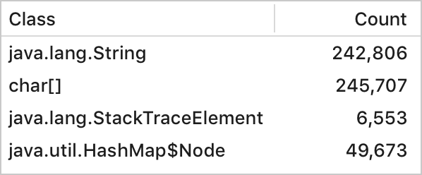
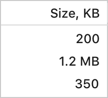
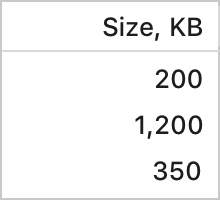
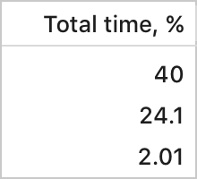
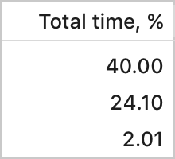

## Numbers
<note>If there is a space between the number and the unit, use a non-breaking space.</note>

 

<table>
<tr>
    <td></td>
    <td> Example </td>
    <td> When and how to use </td>
</tr>
<tr>
    <td>Numbers</td>
    <td>4,255,165.00</td>
    <td>Space is not limited, e.g. Settings dialog
        

    </td>
</tr>
<tr>
    <td>Numbers short</td>
    <td>10.5k 
        3.3M
    </td>
    <td>Space is limited, e.g. in table or lists</td>
</tr>
<tr>
    <td>Percentage</td>
    <td>13%</td>
    <td></td>
</tr>
<tr >
    <td>Ratios</td>
    <td>3 of 10</td>
    <td></td>
</tr>
<tr >
    <td>Ratios short</td>
    <td>3/10</td>
    <td>Space is limited, e.g. in table or lists</td>
</tr>
<tr>
    <td>Currency</td>
    <td>$10</td>
    <td></td>
  </tr>
</table>

## Date and time

By default, the date and time formats are taken from the system settings. The format can be changed on the <ui-path>Settings | Appearance & Behavior | System Settings | Date Formats</ui-path> page.

See the table below to understand in which cases to show date and time.

<table>
<tr><td></td>
<td> Example </td>
<td> When and how to use </td></tr>
<tr>
    <td>Date</td>
    <td>Today 
        05 Jan 
        05 Jan 2017
    </td>
    <td>Omit the time for events if the exact time does not matter, e.g. Annotate panel  
        Use <i>Today</i> and <i>Yesterday</i> for the last two days, use exact date for all other days  
        Do <b>not</b> show the year if it’s within the current calendar year
    </td>
</tr>
<tr>
    <td>Date and time</td>
    <td>Today, 14:04 
        05 Jan, 14:04 
        05 Jan 2019, 14:04
    </td>
    <td>When it is important to know the exact sequence of actions, e.g. Version Control Log</td>
</tr>
<tr>
    <td>Time</td>
    <td>22:49</td>
    <td>Omit date if the event happened today and it’s clear from the context</td>
</tr>
<tr>
    <td>Date and day of week</td>
    <td>Tuesday, 30 August</td>
    <td>Use as headers in timelines, e.g. Event Log. The day of the week helps to quickly understand how long ago was the event  
        Use <i>Today</i> and <i>Yesterday</i> for the last two days, use exact date for all other days
    </td>
</tr>
<tr>
    <td>Approximate time</td>
   <td>A moment ago 
       10 minutes ago 
       2 hours ago
    </td>
    <td>
Use for a single event that happened recently, e.g. in the Status bar:

        

        
Do <b>not</b> use in tables as it’s harder to compare.

        
If more than 12 hours have passed since the event, use Date format

    </td>
</tr>
</table>

*Version Control Log (in IntelliJ IDEA incorrect format is used at the moment)*

*Event Log*

## Duration

<table>
<tr>
<td></td>
<td> Example </td>
<td> When and how to use </td>
</tr>
<tr>
    <td>Period</td>
    <td>10 milliseconds 
        10 seconds 
        10 minutes 
        1 hour
    </td>
    <td>Space is not limited, e.g. Settings dialog
        

    </td>
</tr>
<tr>
    <td>Time-lapse</td>
    <td>1 h 30 m 30 s 
        1 h 30 m 30.035 s 
        1 h 
        1 h 0 m 30 s 
        1 m 30 s 
        05 Jan 2019, 14:04
    </td>
    <td>Use for changing duration. Select units depending on the process type. E.g. Unit tests usually run less than a minute, so show only seconds and milliseconds. Build tasks usually run more than a minute, so show minutes and seconds.  
        Omit hours and seconds that do not provide additional data
</td>
</tr>
<tr>
    <td>Time-lapse condensed <a href="https://en.wikipedia.org/wiki/ISO_8601">ISO 8601 standard</a></td>
    <td>1:30:01.350</td>
    <td>Use when space is limited or to describe a range, e.g. 1:30:01.350 – 1:30:02.350 </td>
</tr>
</table>

## Quantities of data

Use decimal numeral system.

<table>
<tr>
    <td>bits</td>
    <td>10 bits</td>
</tr>
<tr>
    <td>bytes</td>
    <td>10 B</td>
</tr>
<tr>
    <td>kilobytes</td>
    <td>10 KB</td>
</tr>
<tr>
    <td>megabytes</td>
    <td>10 MB</td>
</tr>
<tr>
    <td>gigabytes</td>
    <td>10 GB</td>
</tr>
<tr>
    <td>terabytes</td>
    <td>10 TB</td>
</tr>
</table>

## Units

All numeric values should be given a unit or clearly labeled if they do not have suitable units, e.g. counters.

Select the most convenient units.

<table>
  <tr>
      <td> 
Incorrect
 </td>
      <td> 
Correct
 </td>
  </tr>
  <tr>
      <td>  </td>
      <td>  </td>
  </tr>
</table>

Place units after the input field.

<table>
  <tr>
      <td> 
Incorrect
 </td>
      <td> 
Correct
 </td>
  </tr>
  <tr>
      <td>  </td>
      <td>  </td>
  </tr>
</table>

## Tables

Use the rules below to make it easier to compare numbers in one column.

Right-align numeric values.

Include the unit in the column header if all values share the same unit. Convert each number to use the same unit. If it’s not possible, e.g. the scatter of numbers is too large, include the unit with each value.

<table>
  <tr>
      <td> 
Incorrect
 </td>
      <td> 
Correct
 </td>
  </tr>
  <tr>
      <td>  </td>
      <td>  </td>
  </tr>
</table>

Be consistent with the precision of the significand.

<table>
  <tr>
      <td> 
Incorrect
 </td>
      <td> 
Correct
 </td>
  </tr>
  <tr>
      <td>  </td>
      <td>  </td>
  </tr>
</table>
