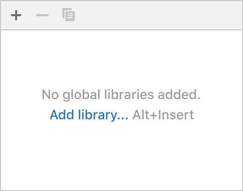
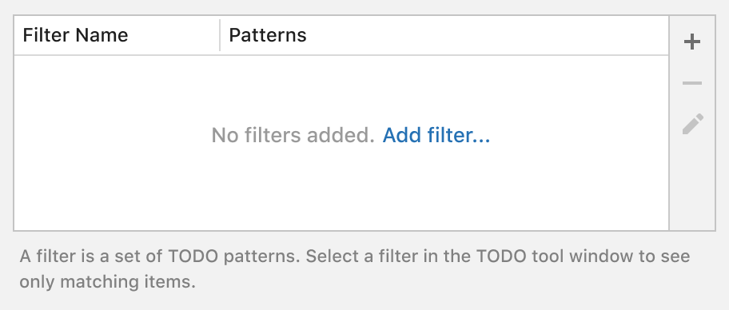
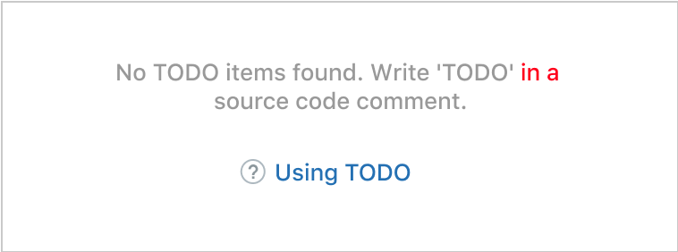
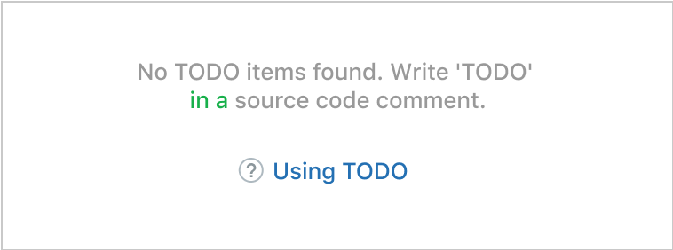

<!-- Copyright 2000-2024 JetBrains s.r.o. and contributors. Use of this source code is governed by the Apache 2.0 license. -->

# Empty State

<link-summary>Providing instructions in an empty UI area on how to fill it with data.</link-summary>

Provide instructions in an empty UI area on how to fill it with data. Empty UI areas described here are:
* [Tool window, list, tree or table](#tool-windows-lists-trees-and-tables)
* [Details area in a master-detail layout](#master-detail-layout)
* Empty search results — TBD

## Tool windows, lists, trees and&nbsp;tables
Instructional text for these UI areas consists of three parts:

### 1. Reason why empty

Explain the current state.

The default pattern is “_No [entity] added._” If _added, created, configured_ or other such verbs act as synonyms in a particular case, use the verb _added_ for consistency.

| Incorrect                                                                                                  | Correct                                                 |
|------------------------------------------------------------------------------------------------------------|---------------------------------------------------------|
|  Avoid "Nothing to show" as it is not informative. |  |

Make the reason descriptive:

Incorrect

*The word mapping introduces a new entity while there are already two in the table header — path and SQL dialect. In the instructions, it is better to use already existing entities to connect them to what users see on the screen.*

Correct

*The word “individual” is used in contrast with the project SQL dialect above the table. The verb specified is used instead of added because, in the table, SQL dialects are not added but selected from a drop-down list in the SQL Dialect column.*

### 2. Actions to fill the area

Required part. An action makes it easier to understand what to start with, instead of searching for the appropriate icon on the toolbar. It can also educate about the shortcut.

Use one or two actions. Three or more actions would make it harder to choose what to start from.

If an action opens a menu, open it at the same position where it would be opened with the corresponding toolbar button. This would explain which toolbar icon opens the menu.

If an action cannot be tied to a link, explain  what to do.

Hide the area's toolbar if it does not have the same action as in the empty state. Usually, all other toolbar actions are not relevant in this case.

Incorrect

### 3. Help topic

**Tool windows:** provide a link to a help topic that explains the functionality. Add the question mark icon in the beginning.

**Tables, trees and lists:** provide instructions according to the [Context help](context_help.md) rules. Smaller UI areas rarely require an in-depth explanation compared to complex tool windows. A short help text should be enough, and it does not require switching contexts.

Incorrect

*Do not use a help topic link in a table and UI areas other than tool windows.*

Correct

*Place an inline help text under the table.*

### Writing guidelines

See [Punctuation](punctuation.md) and [Capitalization](capitalization.md).

Make the reason text short and descriptive. See [Writing short and clear](writing_short.md).

In actions, avoid words that describe physical actions like _press_ or _click_ — they are obvious from how the link works.

Avoid saying _add new_. Just use _add_ because all that is added is new in the context of an empty UI area.

## Master-detail layout
Provide only the action part for the detail area in a master-detail layout. The detail area is filled when an item is selected in the master part. This behavior is obvious and does not need to be explained.

The default pattern for the action is “_Select_ [entity] _to configure_”.

The master area is usually a list or a tree, its empty state instructions should follow the guidelines for lists and trees.

*The “Add Java application configuration” link is a shortcut to creating a new configuration instead of clicking the + button in the toolbar.*

## Sizes and placement
Minimum text width is 40 characters. If an area is too narrow to show the minimum text width, show text in area fields, and if no fields are left, under the area borders.

Use non-breaking spaces in an action name and shortcut, so it is not split into two lines.

Use non-breaking spaces for articles and prepositions in the instructional text.

Incorrect

Correct

The text is center-aligned. If possible, the center for the help topic link should be calculated with an 16 px inset on the left. This helps visually align the help link with the lines above it.

Fields and vertical spaces:

The text should wrap when a UI area’s width changes:

## Style

The link should not be underlined.

In Darcula:

