<!-- Copyright 2000-2024 JetBrains s.r.o. and contributors. Use of this source code is governed by the Apache 2.0 license. -->

# Icons

<link-summary>Guidelines on designing and creating icons.</link-summary>

Follow these guidelines to create a new icon or redesign an existing one for IntelliJ-based products.

> See all icons in the [Icons list](https://jetbrains.design/intellij/resources/icons_list/).
> Use the [IntelliJ Icons Figma plugin](https://www.figma.com/community/plugin/948276470997072333/IntelliJ-Icons)
> to quickly find and use icons in UI mockups.
>
{style="note"}

## Style
A common style unites several icons into a set and makes them recognizable.

Use a flat geometric icon style with straight corners and edges. Flat icons remain legible even in small sizes.

Use flat shapes instead of complex 3D forms:

| Incorrect                                      | Correct                                          |
|------------------------------------------------|--------------------------------------------------|
|  |  |

Use straight corners and lines instead of curves. It’s recommended to use 45° and 90° angles, or 30° and 60° where possible:

| Incorrect                                            | Correct                                                |
|------------------------------------------------------|--------------------------------------------------------|
|  |  |

Icons should be as simple as possible without losing their meaning. Clean and simple icons ensure readability and reduce visual clutter.

<table>
<tr>
    <td> Incorrect </td>
    <td> Correct </td>
</tr>
<tr>
    <td>  </td>
    <td>  </td>
</tr>
<tr>
    <td colspan="2"><em>Reduced the icon to its minimal form, without losing its meaning.</em></td>
</tr>
</table>

## Grid and size
Basically, icons fit into a square artboard. Leave a transparent padding around the perimeter. For default 16px icons, the transparent border is 1px, so the icon’s visible part should be inside the 14px x 14px area.

*14px x 14px is the area where the visible part   of the icon should fit for an 16px icon.*

Content should only go beyond the borders if a [modifier](#modifier) is added, or if additional visual weight is required.

Sizes for other icon sizes can be found in the table below:

<table>

<tr><td> Icon Type </td>
<td> Icons Size </td>
<td> Transparent Border </td></tr>
<tr>
    <td> Gutter, status bar </td>
    <td> 12px x 12px </td>
    <td> — </td>
</tr>
<tr>
    <td> Tool window </td>
    <td> 13px x 13px </td>
    <td> — </td>
</tr>
<tr>
    <td>  Default : toolbar icons, project tree, etc. </td>
    <td> 16px x 16px </td>
    <td> 1px, except for modifier </td>
</tr>
<tr>
    <td> Dialogs </td>
    <td> 32px x 32px </td>
    <td> 2px </td>
</tr>
<tr>
    <td> Logo app icon </td>
    <td> 32px x 32px   64px x 64px   128px x 128px   256px x 256px   512px x 512px </td>
    <td> — </td>
</tr>
</table>

## Basic shapes
Use basic shapes to build icons, such as squares, circles and rectangles. Using a grid and basic shapes ensures consistent visual proportions and placement.

|  _Square 12px x 12px_                        | 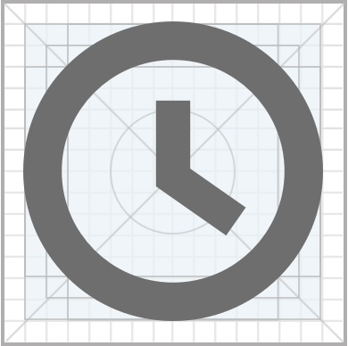 _Circle 14px_                           |
|--------------------------------------------------------------------------------------------|----------------------------------------------------------------------------------------|
|  _Horizontal rectangle 10px x 14px_ |  _Vertical rectangle 14px x 10px_ |
{style=none}

Make sure that icons have the same visual weight. The more filled an icon is, the less space it needs. Following this rule, circles, rhombuses, triangles and other non-square shapes should have larger height and width to be optically balanced with square figures.

*Make the circle diameter 2px bigger than square icons’ height to compensate the visual weight.*

Icons with more details should occupy more space.

*The eye icon is less detailed and occupies less space than a more complex scissors icon.*

Icon weight can often take priority over the basic shape sizing. For more examples on visual weight compensation, see [Optical Effects in User Interfaces](https://medium.muz.li/optical-effects-9fca82b4cd9a).

## Stroke

Use a 2px stroke as the main drawing line. Consistent line weight makes icons cohesive.

<table style="none">
<tr>
    <td width="50%"> </td>
    <td width="50%"> </td>
</tr>
<tr>
    <td><em>Use consistent stroke width.</em></td>
    <td><em>A thinner stroke can be used for subtle tweaks to the&nbsp;legibility of an icon and for optical correction.</em></td>
</tr>
</table>

Align pixels on the X and Y axis and round to the nearest whole pixel, or 0.5px if it’s not possible to align to integer pixels. Aligning icons off the pixel grid will make the icon blurry when it’s rasterized.

> To check what an icon will look like when rasterized use the <ui-path>View | Canvas | Show Pixels on Zoom</ui-path> option <shortcut>Ctrl+P</shortcut> in Sketch,
> <ui-path>View | Pixel Preview</ui-path> <shortcut>Alt+Ctrl+Y</shortcut> in Illustrator.
>
{style="note"}

<table>
<tr>
    <td>Incorrect</td>
    <td>Correct</td>
</tr>
<tr>
    <td width="50%">
         <em> If an icon is positioned off pixels,   it becomes blurry when rasterized.</em> </td>
    <td width="50%">
         <em> Position stokes on integer pixels where possible.</em> </td>
</tr>
</table>

Use the 30°, 45° and 60° angles for diagonal lines as they look sharper than diagonals with other angles.

Round shapes, small details and some letters cannot be aligned to the pixel grid. Make sure that the significant pixels have sufficient saturation.

Reduce the number of anchors, as they increase the size of the image and takes longer to process it.

<table>
<tr>
    <td>Incorrect</td>
    <td>Correct</td>
</tr>
<tr>
    <td width="50%">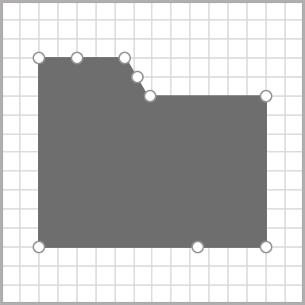
         <em> Unneeded anchors are added.</em> </td>
    <td width="50%">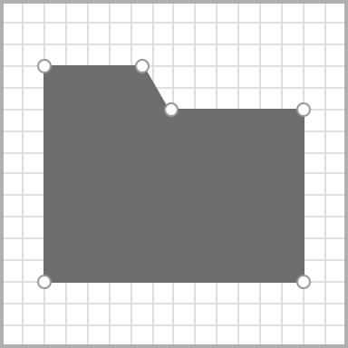
         <em> Use the minimum number of anchors.</em> </td>
</tr>
</table>

## Modifier
A modifier is a small shape added over the base icon.

The default modifier position is the bottom right corner. If the base shape is badly recognizable with a modifier in the bottom right corner, or if several modifiers are needed, the modifier can be placed in other corners.

  <table style="none">
  <tr>
      <td width="50%"> 
           <em> Place the modifier in the left corner   if the base shape is badly recognizable   with the modifier in the right corner.</em> </td>
      <td width="50%"> 
           <em> Place the modifier in the left corner   if there are several modifiers.</em> </td>
  </tr>
  </table>

A modifier size is from 6px to 9px, depending on the shape weight.  Leave a 1-2px spacing between the modifier and the main shape, to make the modifier clearly visible.

*Modifier sizes*

## Arrows
General rules for arrows: arrowhead is a filled triangle with a 90° pointing angle, a 2px body ends in a square stroke. An arrow’s orientation is horizontal, vertical, 45° or round.

*Basic arrow icons*

Unfilled arrowhead can be used if there is only one arrow on an icon to reduce excessive visual weight, for example, for navigation arrows, such as back and forward, up and down.

<table style="none">
<tr>
    <td width="50%"> </td>
    <td width="50%"> 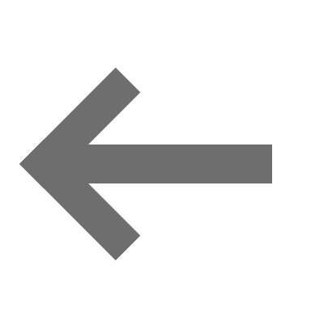</td>
</tr>
<tr>
    <td><em> 90° arrowhead and 2px square stroke body.</em></td>
    <td><em> Back arrow with unfilled arrowhead to compensate visual weight.</em></td>
</tr>
</table>

Do **not** use other arrow styles, for example unfilled arrows or arrows with thinned tails.

Incorrect

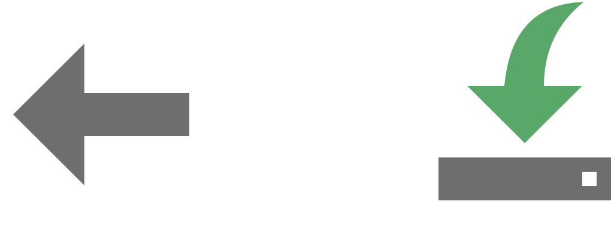

## Color
Do not use color as the only differentiator between icons (except for the [Noun icon](#noun-icons)) because some people do not distinguish colors. Make sure that icons are easily distinguishable by their shape.

Do not use gradients or shadows.

### Action icons

An action icon is an icon that triggers an action. It usually appears on toolbars and in dialogs.
There are 5 colors in the actions icons palette. Dark version is for Darcula theme.

[//]: # (<note>Download a <a href="../../../images/ui/icons/Icons template.sketch" download>Sketch file</a> with the&nbsp;color palette.</note>)

[//]: # (FIXME: colors are wrong, dark are rendered)

<table>
    <tr>
        <td>
            
             
            
<b>Red</b>

#DB5860

        </td>
        <td>
            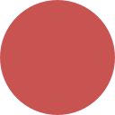
             
            
<b>Red dark</b>

#C75450

        </td>
    </tr>
    <tr>
        <td>
            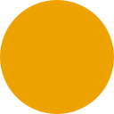
             
            
<b>Yellow</b>

#EDA200

        </td>
        <td>
            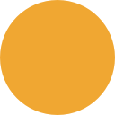
             
            
<b>Yellow dark</b>

#F0A732

        </td>
    </tr>
    <tr>
        <td>
            
             
            
<b>Green</b>

#59A869

        </td>
        <td>
            
             
            
<b>Green dark</b>

#499C54

        </td>
    </tr>
    <tr>
        <td>
            
             
            
<b>Blue</b>

#389FD6

        </td>
        <td>
            
             
            
<b>Blue dark</b>

#3592C4

        </td>
    </tr>
    <tr>
        <td>
            
             
            
<b>Grey</b>

#6E6E6E

        </td>
        <td>
            
             
            
<b>Grey dark</b>

#AFB1B3

        </td>
    </tr>

</table>

Use these colors according to the following rules:
1. By default, action icons are grey and monochromatic:
    

2. If an icon falls into one of the categories below, use the corresponding color:

    <table style="none">
        <tr>
            <td width="50%"> <b>Green</b> 
Positive actions: run, create
  </td>
            <td width="50%"> <b>Red</b> 
Destructive actions: stop, remove, force
  </td>
        </tr>
        <tr>
            <td> <b>Blue</b> 
Accent color to highlight popular icons based on usage statistics, highlight small elements in complex icons
   </td>
            <td> <b>Yellow</b> 
Warning actions: attract attention to the places (e.g. code) that can be optimized or improved
   </td>
        </tr>
    </table>

3. Preserve colors in icons combinations. If an icon is colored in its full size, it should have the same color when reduced.
    

4. Use green and red colors for paired icons. Color helps distinguish between similar icons faster.
    

5. Use grey color for tool window icons. Icons are placed on the perimeter of the IDE, so they should not attract too much attention and distract users.
    

### Status icons

Color is a great way to provide status information. Use status icons that are already present in the IDE repository:

If you need a new icon, color it according to its semantics. Make sure that the status icons are easily distinguishable by their form, as many colorblind people find it difficult to distinguish between red and green.

### Noun icons

A noun icon is an icon that appears in the tree view to mark different file types. It helps to locate items in the list faster and does not trigger an action.

The palette for noun icons is wider, because there are lots of icons in one set:

<table style="none">
    <tr>
        <td>
            
             
            
<b>Grey</b>

#9AA7B0

        </td>
        <td>
            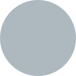
             
            
<b>Grey 80%</b>

#9AA7B0 op. 80%

        </td>
        <td>
            
             
            
<b>Grey 60%</b>

#9AA7B0 op. 60%

        </td>
    </tr>
    <tr>
        <td>
            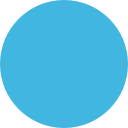
             
            
<b>Blue</b>

#40B6E0

        </td>
        <td>
            
             
            
<b>Blue 70%</b>

#40B6E0 op. 70%

        </td>
        <td>
            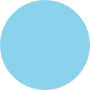
             
            
<b>Blue 60%</b>

#40B6E0 op. 60%

        </td>
    </tr>
    <tr>
        <td>
            
             
            
<b>Green</b>

#62B543

        </td>
        <td>
            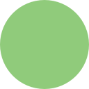
             
            
<b>Green 70%</b>

#62B543 op. 70%

        </td>
        <td>
            
             
            
<b>Green 60%</b>

#62B543 op. 60%

        </td>
    </tr>
    <tr>
        <td>
            
             
            
<b>Yellow</b>

#F4AF3D

        </td>
        <td>
            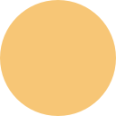
             
            
<b>Yellow 70%</b>

#F4AF3D op. 70%

        </td>
        <td>
            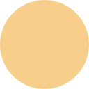
             
            
<b>Yellow 60%</b>

#F4AF3D op. 60%

        </td>
    </tr>
    <tr>
        <td>
            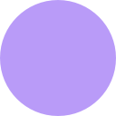
             
            
<b>Purple</b>

#B99BF8

        </td>
        <td>
            
             
            
<b>Purple 70%</b>

#B99BF8 op. 70%

        </td>
        <td>
            
             
            
<b>Purple 60%</b>

#B99BF8 op. 60%

        </td>
    </tr>
    <tr>
        <td>
            
             
            
<b>Pink</b>

#F98B9E

        </td>
        <td>
            
             
            
<b>Pink 70%</b>

#F98B9E op. 70%

        </td>
        <td>
            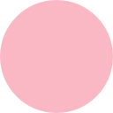
             
            
<b>Pink 60%</b>

#F98B9E op. 60%

        </td>
    </tr>
    <tr>
        <td>
            
             
            
<b>Red</b>

#F26522

        </td>
        <td>
            
             
            
<b>Red 70%</b>

#F26522 op. 70%

        </td>
        <td>
            
             
            
<b>Red 60%</b>

#F26522 op. 60%

        </td>
    </tr>
    <tr>
        <td>
            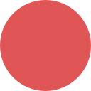
             
            
<b>Red status</b>

#E05555

        </td>
        <td>
            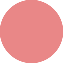
             
            
<b>Red status 70%</b>

#E05555 op. 70%

        </td>
    </tr>
    <tr>
        <td>
            
             
            
<b>Yellow dark</b>

#D9A343

        </td>
    </tr>
    <tr>
        <td>
            
             
            
<b>Green Android</b>

#A4C639

        </td>
    </tr>
    <tr>
        <td>
            
             
            
<b>Black text</b>

#231F20 op. 70%

        </td>
    </tr>
</table>

Select colors for new icons based on existing colors and users’ habits.

Use colors with 60% opacity and grey 80% for big parts, like folder icons:

Transparent icons are used in both light and dark themes, so in most cases there’s only one version.

Use colors with 70% opacity for medium size elements that occupy about half of an icon, like file type icons:

Use colors without opacity for small elements, like modifiers.

## Font

To make a new icon with a letter, reuse letters from existing icons. If there's no suitable letter in existing icons, use a common sans-serif font like Arial or Open Sans.

## Export Icons

> Install the [Svgo-compressor plugin](https://www.sketchapp.com/extensions/plugins/svgo-compressor/) in Sketch to optimize icons before save.
>
{style="note"}

Use the SVG format for icons files. Use camelCase capitalization for icon names:

<path>iconName.svg</path>

If an icon is not the same in the dark theme, then also create:

<path>iconName_dark.svg</path>
