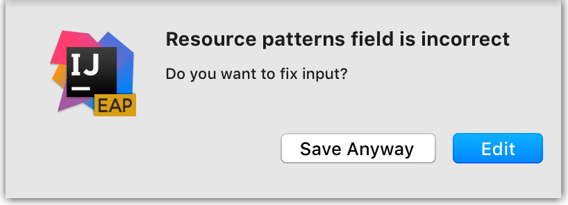
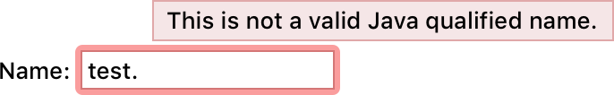
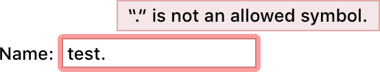

Validation is the process of checking the values specified by the user, and displaying the errors that are found.

An error can appear in a **tooltip**:


Or **inline**, above the confirmation buttons:


## Principles

<p>
Always try not to let the user enter invalid data. To achieve this:
</p>

Use controls that are constrained to valid values. For example, use a combo box or a slider instead of the input field.

Limit the characters users can enter. For example, if only numbers are supported in a field, and this is obvious to the user, ignore input of letters instead of showing an error:

If it’s not obvious that only numbers can be entered, allow to enter any sign and perform validation.


Provide a default value if possible. Even if the user decides to change the default value, it gives a clue on the expected input format.

Write instructions and examples on how to fill a form using [сontext help](context_help.md).

If it’s not possible to limit input, try to show an error as soon as possible so that the user can quickly return and fix it.


## Validation types and usage

<table style="both">

<tr>
  <td> </td>
  <td> What to validate </td>
  <td> Validation type </td>
  <td> Format </td>
</tr>
<tr>
    <td><p>1</p></td>
    <td> Non-allowed characters
         Too big or long values
    </td>
    <td> Immediately on input </td>
    <td> Tooltip </td>
</tr>
<tr>
    <td><p>2</p></td>
    <td> Non-allowed values in dialogs.
         For example, an existing file name, a value that does not match the pattern, or a value that’s too small
    </td>
    <td> On sending the form or on focus loss </td>
    <td> Tooltip </td>
</tr>
<tr>
    <td><p>3</p></td>
    <td> Empty required fields in dialogs </td>
    <td> Disable the confirmation button or check on sending the form </td>
    <td> Tooltip </td>
</tr>
<tr>
    <td><p>4</p></td>
    <td> Non-allowed or empty values in the main window  </td>
    <td> On Enter or focus loss </td>
    <td> Tooltip </td>
</tr>
<tr>
    <td><p>5</p></td>
    <td> Remote connection  </td>
    <td> On sending the form </td>
    <td> Tooltip or inline </td>
</tr>
<tr>
    <td><p>6</p></td>
    <td> Complex values in multi-page dialogs </td>
    <td> On reopening the form or when the values are used </td>
    <td> Tooltip, inline or notification </td>
</tr>
</table>


### 1. Non-allowed characters or too big values

If a non-allowed character is entered, or the maximum input size or value is exceeded, validate it immediately on input.

#### How it works {id="how-it-works_1"}

The field is highlighted with red and the error appears in the tooltip.


If the maximum value is exceeded, specify what values are allowed (e.g. a range for numeric values, or the number of symbols):


Hide the error when the incorrect symbol is deleted.

#### Implementation {id="implementation_1"}

```java
// Fields initializers
private JTextField myPort = new JTextField();
private static final String MESSAGE = "The port number should be between 0 and 65535";
// Components initialization
new ComponentValidator(project).withValidator(() -> {
  String pt = myPort.getText();
  if (StringUtil.isNotEmpty(pt)) {
    try {
      int portValue = Integer.parseInt(pt);
      if (portValue >= 0 && portValue <= 65535) {
        return null;
      }
      else {
        return new ValidationInfo(MESSAGE, myPort);
      }
    }
    catch (NumberFormatException nfe) {
      return new ValidationInfo(MESSAGE, myPort);
    }
  }
  else {
    return null;
  }
}).installOn(myPort);
myPort.getDocument().addDocumentListener(new DocumentAdapter() {
  @Override
  protected void textChanged(@NotNull DocumentEvent e) {
    ComponentValidator.getInstance(myPort).ifPresent(v -> v.revalidate());
  }
});
```


### 2. Non-allowed values in dialogs

A non-allowed value is a value that can be checked only when fully entered. For example, an existing file name, value that does not match the pattern or a value that’s too small/short.

If a non-allowed value is entered, validate it on focus loss or on sending the form, depending on what happens faster.

Do **not** validate non-allowed values on input, it will interrupt the user.

Do **not** validate empty fields on focus loss. Users should be able to fill the form in a random order, so do not interrupt them.


#### How it works {id="how-it-works_2"}

On sending the form, the field is highlighted in red and the error tooltip appears.


If validated on focus loss, highlight the field in light-red. Do not return focus to the field with the error automatically.


The error tooltip appears when the invalid field gets the focus or on hovering over the field.

When the user changes the value, the tooltip disappears and error highlighting is replaced with the regular focus:


When the focus is returned to the field with an error, use validation on input. Otherwise, it can be unclear for the user how to initiate validation.

#### Implementation {id="implementation_2"}
Add `andStartOnFocusLost()` call on `ComponentValidator` before installing it on a component:

```java
new ComponentValidator(getDisposable()).withValidator(...).
    andStartOnFocusLost().installOn(component);
```

### 3. Empty required fields in dialogs

#### Simple form
If a form is simple, move the focus to the first required field and disable the confirmation button until all required fields have been filled. It is clear from the form behavior that input is required, showing validation messages is redundant.


#### Complex form

If a form is complex, always enable the confirmation button. Otherwise, it can be hard to understand what should be done to complete the form.

Complex forms are:

* Forms with more than 3 input fields or combo boxes.
* Forms with at least one control (checkbox, table, and so on) apart from an input field and a combo box.

**Never** validate empty required fields on input or focus loss. Users should be able to fill the form in a random order, so do not interrupt them.

#### How to use

Validation is performed when the user clicks the confirmation button (for example, the “Add” button).

Highlight all invalid fields, move the focus to the first invalid field and show the tooltip.


Hide the tooltip and the red highlighting when the user starts editing the invalid value or entering symbols into the empty required field.

Show the error tooltip for the next field when it gets the focus, hover or the user clicks the “Add” button one more time.

#### Implementation {id="implementation_3"}

By default, `DialogWrapper` disables "OK" button until all fields that participate in validation
    become valid. Explicitly enable "OK" button for each input field:

```java
new ValidationInfo("The host cannot be reached", myHostField)
    .withOkEnabled();
```

### 4. Non-allowed or empty values in the main window

If a non-allowed or an empty value is entered into a field that’s within the Properties view, for example, in UI Designers like the Android Studio Layout Editor, validate it on pressing Enter or focus loss.

#### How it works

On Enter, the field is highlighted with red and the error tooltip appears.


If validated on focus loss, the field is highlighted with light-red. The focus is not returned to the field automatically.

Hide the field highlighting and the tooltip when the user fixes the invalid value.


### 5. Remote connection

If validation is slow or attempts are limited, for example, due to connection to a remote server, validate values on sending the form.

If it’s not possible to detect the fields with errors, show the error message inline under the fields:


An inline error only appears on clicking the confirmation button. The dialog is resized to fit the error message. Do **not** leave an empty space for the error in advance.

Hide the error messages once any field related to the error is edited. Set the dialog to its original size when the error disappears.

#### Implementation {id="implementation_4"}

`ValidationInfo` for messages in inline area is created with `null` component:

```java
new ValidationInfo("The host cannot be reached. " +
                   "Check the address and credentials.");
```

### 6. Complex values in multi-page dialogs

If a value is complex, for example, a list of values, a regexp, or a value copied from another place, and it appears in a multi-page dialog, such as Settings, Project Structure or Run Configurations, show a dialog informing the user about an error on clicking the confirmation button.

For example, in a complex Resource patterns field


show the following dialog on pressing the confirmation button:



It should be possible to close the Settings dialog and save the entered data if the user wants to fix the values later or needs additional data outside of the modal Settings dialog.

If an invalid field is not empty, highlight it on reopening the Settings dialog or report the error when the entered data is used.


## Tooltip

<p>
An error tooltip appears in two cases:
</p>

If the field with an error gets focus:


If the field loses focus, hide the tooltip and highlight the field with light-red:


On hover over the field or the element with an error:


Show the tooltip above the field and move it 40px right, so that the controls above it are not overlapped.
If there is an important info above the field, the tooltip can be shown on the right.


## Error message text

An error message describes the problem and provides the way to solve it if it’s not clear from the problem description.


*It’s clear how to fix the error from the error description.*


*The way to solve the problem is provided.*

Describe the problem in terms of target users’ actions or goals, not in terms of the program’s architecture.

<table style="header-column">
    <tr>
        <td> <p>Incorrect</p> </td>
        <td> Invalid Git Executable. Error running "git.exe". File not found: "git.exe".</td>
    </tr>
    <tr>
        <td> <p>Correct</p> </td>
        <td> Cannot run "git.exe". The file is not found.</td>
    </tr>
</table>

Provide specific names, locations, and values of the objects involved:

<table style="header-column">
    <tr>
        <td> <p>Incorrect</p> </td>
        <td>  </td>
    </tr>
    <tr>
        <td> <p>Correct</p> </td>
        <td>  </td>
    </tr>
</table>


For a period at the end of an error message, see [Punctuation](punctuation.md#period).

Make the error message short and descriptive. See [Writing short and clear](writing_short.md).

Examples of common errors and corresponding error messages:

<table>
<tr>
    <td> Error type </td>
    <td> Error message </td>
</tr>
<tr>
    <td> Empty required field </td>
    <td> Specify the port number </td>
</tr>
<tr>
    <td> Incorrect symbol </td>
    <td> “/” is not an allowed symbol </td>
</tr>
<tr>
    <td> Incorrect value </td>
    <td> The port number should be between XXX and XXXX<br /><br />
         The file name should be at least 4 symbols <br /><br />
         The name is already in use <br /><br />
         The username or password is incorrect
    </td>
</tr>
<tr>
    <td> Incorrect format </td>
    <td> The email format should be xxx@xxx.com </td>
</tr>
<tr>
    <td> Missing file </td>
    <td> The file is not found </td>
</tr>
</table>

Use encouraging tone:

<table>
<tr>
  <td> Use </td>
  <td> Do not use </td>
</tr>
<tr>
    <td> Problem </td>
    <td> Error, failure </td>
</tr>
<tr>
    <td> Unable </td>
    <td> Failed to </td>
</tr>
<tr>
    <td> Incorrect </td>
    <td> Illegal, invalid, bad </td>
</tr>
<tr>
    <td> Should be </td>
    <td> Must </td>
</tr>
</table>


## Warning


A warning informs the user that something is configured incorrectly, but does not prevent them from applying the changes.

A warning can appear on input, focus loss, or on reopening a filled form. For example, make the empty field Target name as warning on reopening:


The warning can be shown:

In a tooltip for a specific field. Follow the rules for [the error tooltip](tooltip.md).

```java
new ValidationInfo("Target name is not specified", myNameField)
    .asWarning();
```

On the form under the controls. Show the message with the yellow warning icon.


 On the "Problems" page in complex multipage dialogs. Show warnings and fix options:


*Problems page in the Project Structure dialog.*


Mark all navigation elements for areas that contain warnings with yellow icons.

Update the problems counter when a problem is detected. When all problems have been fixed, do not show the “Problems” tab.

On a particular page, highlight the element that contains a warning in yellow or add warning icon next to it.


## UI elements with validation errors

### Input field


Add a red light bulb on the right side of the input field if an action to fix the error is available:


### Combo box


### Tables and lists


When the field in a table loses focus, show an error icon. An error tooltip appears on mouse hover or when the line gets focus:


Use a warning icon for warnings:


#### Implementation


```java
JTextField cellEditor = new JTextField();
cellEditor.putClientProperty(DarculaUIUtil.COMPACT_PROPERTY, Boolean.TRUE);
cellEditor.getDocument().addDocumentListener(new DocumentAdapter() {
    @Override
    protected void textChanged(@NotNull DocumentEvent e) {
      Object op = cellEditor.getText().contains(".") ? "error": null;
      cellEditor.putClientProperty("JComponent.outline", op);
    }
});
TableColumn col0 = table.getColumnModel().getColumn(0);
col0.setCellEditor(new DefaultCellEditor(cellEditor));
col0.setCellRenderer(new DefaultTableCellRenderer() {
    @Override
    public Dimension getPreferredSize() {
      Dimension size = super.getPreferredSize();
      Dimension editorSize = cellEditor.getPreferredSize();
      size.height = Math.max(size.height, editorSize.height);
      return size;
    }
});
```


### Trees and lists

Add an error or warning icon on the right side of the invalid line.


### Multi-page dialog

If validation in a multipage form can be performed only on clicking the confirmation button, then:
* Use red highlighting for navigation elements such as tabs, menu and list items for areas that contain errors so that the user can quickly locate the error.
* Open the first page with an error or stay on the opened page if it has errors on clicking the confirmation button.


## Avoid mistakes

Do not show an error in a message box. Users are pulled out of the context, they need to close the dialog and locate the invalid field.


Do not allow to click "OK" button if a form contains empty required fields. For this, the Cancel button should be used, and the OK button should be disabled. Otherwise, if users accidentally leave the field empty, they can expect that the value was entered correctly.


Do not show error message inside the empty required field. It looks like a prefilled field, not like an error message.


Do not underline the field label. It looks like a spell error and poorly visible.


Do not shake a form and show an error with a delay. A shaking form is distracting and time-consuming.


Do not show an error immediately after opening a form. It distracts the user from filling the form.


Do not allow to submit the form with the error. When the form is opened again, the value is reset, so users don’t know
 if they entered incorrect data.


## Insets and colors


<!--
### Error colors
<table>
<col width="20%">
<col width="20%">
<col width="20%">
<col width="20%">
<td> </td>
<td> Mac OS </td>
<td> Windows </td>
<td> IntelliJ </td>
<td> Darcula </td>
<tr>
    <td> Tooltip background </td>
    <td> #F5E6E7 </td>
    <td> #F5E6E7 </td>
    <td> #F5E6E7 </td>
    <td> #593D41 </td>
</tr>
<tr>
    <td> Tooltip border </td>
    <td> #E0A8A9 </td>
    <td> #E0A8A9 </td>
    <td> #E0A8A9 </td>
    <td> #73454B </td>
</tr>
<tr>
    <td> Focused field highlighting </td>
    <td> #F53B3B, op. 50% </td>
    <td> #F57D7D </td>
    <td> #E53E4D </td>
    <td> #8B3C3C </td>
</tr>
<tr>
    <td> Not focused field highlighting </td>
    <td> #F7BCBC, op. 50% </td>
    <td> #EECACA </td>
    <td> #EBBCBC </td>
    <td> #725252 </td>
</tr>
<tr>
    <td> Error text color </td>
    <td> #FF0000 </td>
    <td> #FF0000 </td>
    <td> #FF0000 </td>
    <td> #FF5261 </td>
</tr>
</table>


### Warning colors

<table>
<col width="20%">
<col width="20%">
<col width="20%">
<col width="20%">
<td> </td>
<td> Mac OS </td>
<td> Windows, IntelliJ </td>
<td> Darcula </td>
<tr>
    <td> Tooltip background </td>
    <td> #F5F0E6 </td>
    <td> #F5F0E6 </td>
    <td> #594E32 </td>
</tr>
<tr>
    <td> Tooltip border </td>
    <td> #E0CEA8 </td>
    <td> #E0CEA8 </td>
    <td> #78550B </td>
</tr>
<tr>
    <td> Focused field highlighting </td>
    <td> #EEB23E, op. 50% </td>
    <td> #E1A336 </td>
    <td> #AD7A0F </td>
</tr>
<tr>
    <td> Not focused field highlighting </td>
    <td> #FFDC92, op. 50% </td>
    <td> #EAD2A1 </td>
    <td> #6F531F </td>
</tr>
<tr>
    <td> Warning text color </td>
    <td> #E77D00 </td>
    <td> #E77D00 </td>
    <td> #DC9B2F </td>
</tr>
</table>
-->
