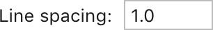
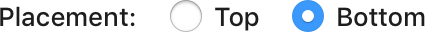
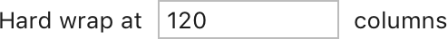

Use the following rules for labels and description texts in IntelliJ user interfaces. For punctuation in numbers and times, see [Data formats](data_formats.md).

## Ellipsis
End an action name with an ellipsis if it opens a dialog where input is required or possible. An ellipsis helps users understand if an action is immediate or additional interaction is to follow.

This rule applies to actions in the following controls: <a href="button.topic">button</a>, <a href="link.md">link</a>, <a href="menu.md">menu item</a>.

Examples:

<table style="none">
<tr>
    <td>
        <i>Save All</i> 
        <i>Build Project</i>
    </td>
    <td>
        Happens immediately, no ellipsis
    </td>
</tr>
<tr>
    <td>
        <i>Import Settings…</i> 
        <i>Export to HTML…</i>
    </td>
    <td>
        Opens dialogs that require input
    </td>
</tr>
<tr>
    <td>
        <i>Project Structure…</i>
    </td>
    <td>
        Opens a complex dialog where input is not required but possible
    </td>
</tr>
<tr>
    <td>
        <i>Tip of the Day</i> 
        <i>About IntelliJ IDEA</i>
    </td>
    <td>
        Opens dialogs that just show information, no input is either required or possible
    </td>
</tr>
</table>

Use an ellipsis at the end of a truncated text if there is no scrollbar and this is not a table column, see [truncation in table columns](table.md#sizes-and-placement). Provide a way to show the full text, for example, expand the control or show a tooltip on hover.

*A notification can be expanded to show the full text.*

Use an ellipsis with verbs describing an ongoing process, for example,  Searching… See more examples in [Progress text](progress_text.md).

Use the ellipsis character … (U+2026 in Unicode). Do not use three separate “dot” characters.

## Period
Do **not** put a period at the end of a single sentence, even if it is a complete sentence.

If a text consists of several sentences, put a period after each sentence.

Do **not** put a period at the end of an IDE action.

*The empty text consists of two sentences but the second one is an IDE action so it should not have a period.*

Note that links that are not IDE actions can have a period in the end.

## Comma

Use a comma:

Before a conjunction in a list of three or more items (the Oxford or serial comma).

<i>Border for a text field, combo box, or spinner</i>

Between symbols in series.

<i>Use the following characters: &, $, ., and *</i>

## Colon
Use a colon after labels for inputs and radio button / checkbox groups.

Do **not** use a colon if a label and text inside the input element make a phrase.

## Contractions
Generally, do not use contractions.

<i>Path can’t be found → Path cannot be found</i>

Use contractions only if the action name has 4 and more words, and the contracted word does not affect the meaning significantly.

<i>What’s New in IntelliJ IDEA</i>

*Don’t* or *Do not*:
* Always contract in the phrase *Don’t [some verb] again*. The phrase is common, and the meaning is easily recognized.
  
* In other cases, do not contract. The full form reduces chances that the relevant meaning might be missed.

<i>Don’t send → Do not send</i> 
<i>Do not save, forget passwords after restart</i>

## Quotation marks
Use single quotation marks by default.

<note>Use a straight single quotation mark ' U+0027. Do not use opening and closing quotation marks ‘ ’ U+2018, U+2019.</note>

<i>Indexing library 'KotlinJavaRuntime' 
Error parsing '.mvn/maven.config' 
Add 'root=true' to the beginning of the file 
Show 'Scratches and Consoles' in the Project view</i>

Do not use quotation marks for keyboard key names.

<i>Type an expression and press <b>'</b>Enter<b>'</b> → press Enter</i>

Do not use double quotation marks.

## Question marks
Use only in alerts when asking for confirmation.

<i>A file with this name already exists. Do you want to overwrite it?</i>

Avoid in other cases.

<i>Forgot password? → Remind password</i>

## Exclamation points
Do not use. Exclamation points can cause the sentence tone to be interpreted as aggressive, condescending, or overly informal.
