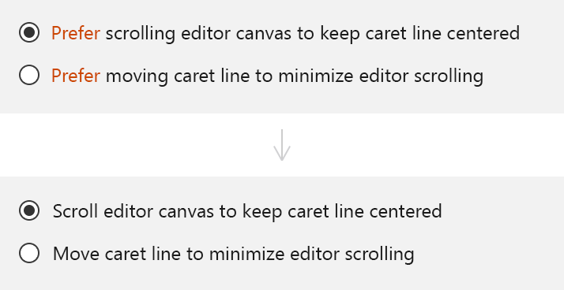
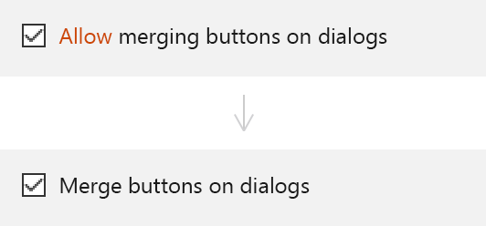
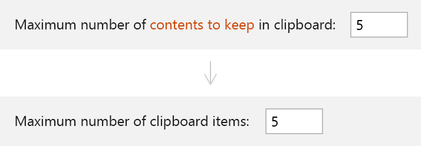
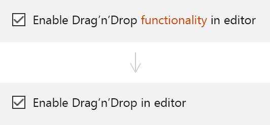

<!-- Copyright 2000-2024 JetBrains s.r.o. and contributors. Use of this source code is governed by the Apache 2.0 license. -->

# Writing Short and Clear

<link-summary>Tips on writing short and clear UI texts.</link-summary>

Texts in user interfaces should be short and clear. Short texts save reading time. Clear texts lead to fewer mistakes. Editing methods described below can help with that.

## Use simple constructions

Use simple verb forms. Prefer present tense.

Use simple sentences: one idea per sentence.

Avoid passive voice.

This way the same meaning can be expressed with less words. Compare:

<i>Those resources that are available locally</i> → <i>Local resources</i>

<i>Maven has to use</i> → <i>Maven uses</i>

<i>The use of a secure connection is required</i> → <i>Use secure connection</i>

## Remove or elaborate generic words

Words like general, advanced, and options do not add useful information and can be removed with no harm to the meaning:

*No meaning is lost after removing group headers "General" and "Options".*

Some generic words cannot be removed. They can appear in actionable elements like buttons, checkboxes or links. Or removing a group header could break a dialog layout. In such cases, use a more informative label instead:

*The link "Learn more" does not explain what useful information could be there for the user to click it.*

## Remove obvious objects and actions
Remove verbs that explain the function of a UI control:

*Text boxes are made for input — an explicit instruction "specify" duplicates the meaning expressed by the text field. Additional information can be given under the field — see [Context help](context_help.md).*

<table style="none">
  <tr>
     <td> <em> A selected radio button means its option is "preferred". </em> </td>
      <td> <em> A checked checkbox means its feature is "allowed". </em> </td>
  </tr>
</table>

Remove words with a meaning that is already expressed in the label:
<table style="none">
    <tr>
       <td> 
            <em> The clipboard’s purpose is to keep information so the infinitive "to keep" is implying the obvious and can be removed.</em> </td>
       <td> 
            <em> The word “functionality” is already implied by "Drag’n’Drop" and can be removed. </em> </td>
    </tr>
</table>

## Do not address the user
A user interface is for a person who uses it. Addressing this person is unnecessary because they by default perceive the text they see as for them:

*The whole phrase after the comma is not needed because its meaning is already expressed by the verb "configure".*

## Remove duplicates
If the repeating word appears in element labels, move it to the beginning. Finding a setting becomes faster as you scan only meaningful words:

Remove duplicates in meaning:

<table>
<tr>
<td> Before </td>
<td> After </td>
<td></td>
</tr>
<tr>
    <td> Help improve IntelliJ IDEA  by&nbsp;sending anonymous usage statistics to JetBrains s.r.o.  </td>
    <td> Help improve IntelliJ IDEA </td>
    <td>  The purpose of the header is to attract attention. The&nbsp;shorter and clearer header does that better.  </td>
</tr>
<tr>
    <td>  if you want to help make IntelliJ IDEA better  </td>
    <td> Allow sending anonymous usage statistics to JetBrains s.r.o. </td>
    <td>  “Help make IntelliJ IDEA better” is already expressed in the message header. The body text now explains how the user can do that.  </td>
</tr>
<tr>
    <td>  more...  </td>
    <td> Terms and conditions </td>
    <td> The link more... does not tell what is behind it — unclear for the user why to click it.</td>
</tr>
</table>

<table>
<tr>
<td> Removed </td>
<td> </td>

</tr>
<tr>
    <td>  click I agree </td>
    <td>  The verb "click" is obvious from context: you cannot do much with a link other than click.  </td>
</tr>
<tr>
    <td>  click...&nbsp;I&nbsp;don’t agree otherwise  </td>
    <td>  The link "I don’t agree" duplicates the notification “Close” button which appears on hover.  </td>
</tr>
<tr>
    <td>  </td>
    <td>  The icon is not needed because the message is purely informative, not an error or a warning. Texts are information by default, there is no need to specify that meaning explicitly.  </td>
</tr>
</table>

## Translate from tech to human
When you make a feature, you know how it works from the inside and can describe it from the implementation point of view:

A person not familiar with implementation details won’t know what the Automatic indent options detector is, why file’s indent options have been overwritten and what indent size=2 means. Translated to the “human” language, the message reads:

Always write UI text from a user’s perspective. Avoid technical terms, jargon and descriptions of inner logic that a user might not know.

## Write for first-time users

After writing a UI text, imagine seeing it for the first time and try to understand what might be unclear or confusing. Then correct if necessary.

*For a first-time user, Enable File Colors enables or disables the other two options (but it does not).*

*Rewritten: now all options are equal.*

More examples:

*Before: The title can be read as “Auto-insert when only one checkbox is on” making you ask how does it work when both checkboxes are on. After: Replacing choice with completion option makes the title unambiguous.*

*Before: What do smart Home and End keys do? What do they do if they are not smart? After: Added text explains what the options do so that the reader can make an informed choice.*

## Examples

<table>

<tr>
<td> Before </td>
<td> After </td>
<td></td>
</tr>

<tr>
    <td> Project name Project SDK Project language level </td>
    <td> Project name SDK Language level </td>
    <td>  "Project" can be left only for the first field. All others will be understood as project settings because they appear in the same group of UI elements.  </td>
</tr>
<tr>
    <td> This path is used to store </td>
    <td> This path stores </td>
    <td>  Simple verb form  </td>
</tr>
<tr>
    <td> store all project compilation results </td>
    <td> stores project compilation output </td>
    <td>  “all” is extra because it is implied by default. “results” is another word for “output” — having different words for the same meaning complicates understanding.  </td>
</tr>
<tr>
    <td> A directory corresponding to each module is created under this path. This directory contains two subdirectories... </td>
    <td> It has a separate directory for each module, with the Production and Test subdirectories. </td>
    <td>  “is created” is not relevant to the meaning of this phrase. “two” is obvious from context: you see that there are two subdirectories because only two are named.  </td>
</tr>
</table>

<table>
<tr>
<td> Moved </td>
<td> Moved </td></tr>
<tr>
    <td> This [field name] is default for all project modules. A module specific [field name] can be configured for each of the modules is required. </td>
    <td>  This phrase is repeated for all fields. Can be shown only once at the bottom of the dialog. </td>
</tr>
</table>

<table>
<tr>
<td> Before </td>
<td> After </td>
<td></td>
</tr>
<tr>
    <td> visits the remote repositories and checks for&nbsp;updates </td>
    <td> checks remote repositories for updates </td>
    <td>  “Checks” already includes the meaning of&nbsp;“visits”.  </td>
</tr>
<tr>
    <td> When you switch to offline mode </td>
    <td> In the offline mode </td>
    <td>  The action “switched” is not relevant for the meaning of this phrase. Also, an unnecessary reference to the user — “you”.  </td>
</tr>
<tr>
    <td> Maven has to use </td>
    <td> Maven uses </td>
    <td>  Not relevant that a technology must do something, enough to say it just works this&nbsp;way.  </td>
</tr>
<tr>
    <td> those resources that are&nbsp;available locally  </td>
    <td> local resources </td>
    <td>  </td>
</tr>
<tr>
    <td> reports about the problems if something is missing  </td>
    <td> reports if something is&nbsp;missing </td>
    <td>  </td>
</tr>
</table>

<table>
<tr>
<td> Removed </td>
<td> </td>
</tr>
<tr>
    <td> The offline mode is helpful when you need to work offline </td>
    <td>  The phrase does not explain when the offline mode is helpful. It should either be elaborated or removed.  </td>
</tr>
<tr>
    <td>  or when your network connection is slow  </td>
    <td>  Only one of possible uses for the offline mode and an obvious one. Can be removed for a more concise text.  </td>
</tr>
</table>
