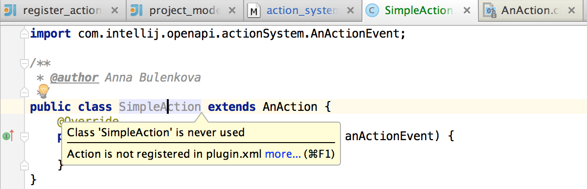

IntelliJ Action System.
==========
This tutorial is meant to give general information about the IntelliJ IDEA Action System and lead you through a series of steps
which show how to create, register, and customize custom actions and action groups.
Action system provides an option to handle certain events in a desired way. Action can either be simply a response to some state,
or be bound to UI element and could be invoked on demand. These UI elements include main menu, context menus and toolbars.

----------------

**TODO - links to source**

#Working with custom actions.
An action is technically a class, derived from the [AnAction] (https://github.com/JetBrains/intellij-community/blob/master/platform/editor-ui-api/src/com/intellij/openapi/actionSystem/AnAction.java)
class.
To update the state of the action, the method AnAction.update() is periodically called by IDEA.
The object of type [AnActionEvent] (https://github.com/JetBrains/intellij-community/blob/ff16ce78a1e0ddb6e67fd1dbc6e6a597e20d483a/platform/editor-ui-api/src/com/intellij/openapi/actionSystem/AnActionEvent.java)
passed to this method carries the information about the current context for the action,
and in particular, the specific presentation which needs to be updated.

##Creating actions.
To create a new we need to extend
[AnAction] (https://github.com/JetBrains/intellij-community/blob/master/platform/editor-ui-api/src/com/intellij/openapi/actionSystem/AnAction.java)
class:

    public class SimpleAction extends AnAction {
    }

The only method of an inheritor of
[AnAction] (https://github.com/JetBrains/intellij-community/blob/master/platform/editor-ui-api/src/com/intellij/openapi/actionSystem/AnAction.java)
which needs to be overridden is ```public void actionPerformed(AnActionEvent anActionEvent);```
, and it should contain a part of code to be executed after the action has been invoked.

    public class SimpleAction extends AnAction {
        @Override
        public void actionPerformed(AnActionEvent anActionEvent) {
        }
    }

##Registering actions.
To register a newly created action, <action> attribute should be added to the <actions> section of the plugin configuration file
[plugin.xml] (). IntelliJ IDEA has an embedded inspection that spots unregistered actions.


To register the action and set up it's attributes press ***Alt + Enter*** while the caret is placed on the action's declaration.


Fill the "New Action" form to set up action's parameters such as: action's name and description, a UI component the action is bound to,
visual position of the menu item the action is bound to, and a shortcut for invoking the action.
In our case the action will be available in the Tools Menu, it will be placed on top, and will have no shortcuts.


After filling the "New Action" form and applying the changes *<actions>* section of our
[plugin.xml]()
file will look like this:

    <actions>
      <!-- Add your actions here -->
        <action id="org.jetbrains.tutorials.actions.SimpleAction" class="org.jetbrains.tutorials.actions.SimpleAction"
                text="Simple Action" description="IntelliJ Action System Demo">
            <add-to-group group-id="ToolsMenu" anchor="first"/>
        </action>
    </actions>

Full list of action's attributes can also be set manually in
[plugin.xml]()
configuration file like the following code sample shows:

      <actions>
        <!-- Add your actions here -->
        <!-- The <action> element defines an action to register.
        The mandatory "id" attribute specifies an unique identifier for the action.
        The mandatory "class" attribute specifies the full-qualified name of the class implementing the action.
        The mandatory "text" attribute specifies the text of the action (tooltip for toolbar button or text for menu item).
        The optional "use-shortcut-of" attribute specifies the ID of the action whose keyboard shortcut this action will use.
        The optional "description" attribute specifies the text which is displayed in the status bar when the action is focused.
        The optional "icon" attribute specifies the icon which is displayed on the toolbar button or next to the menu item. -->
          <action id="org.jetbrains.tutorials.actions.SimpleAction" class="org.jetbrains.tutorials.actions.SimpleAction"
                  text="Simple Action" description="IntelliJ Action System Demo">
              <!-- The <keyboard-shortcut> node specifies the keyboard shortcut for the action. An action can have several keyboard shortcuts.
              The mandatory "first-keystroke" attribute specifies the first keystroke of the action. The key strokes are specified according to the regular Swing rules.
              The optional "second-keystroke" attribute specifies the second keystroke of the action.
              The mandatory "keymap" attribute specifies the keymap for which the action is active. IDs of the standard keymaps are defined as
              constants in the com.intellij.openapi.keymap.KeymapManager class. -->
              <keyboard-shortcut first-keystroke="control alt A" second-keystroke="C" keymap="$default"/>
              <!-- The <mouse-shortcut> node specifies the mouse shortcut for the action. An action can have several mouse shortcuts.
              The mandatory "keystroke" attribute specifies the clicks and modifiers for the action. It is defined as a sequence of words separated by spaces:
              "button1", "button2", "button3" for the mouse buttons; "shift", "control", "meta", "alt", "altGraph" for the modifier keys;
              "doubleClick" if the action is activated by a double-click of the button.
              The mandatory "keymap" attribute specifies the keymap for which the action is active. IDs of the standard keymaps are defined as
              constants in the com.intellij.openapi.keymap.KeymapManager class. -->
              <mouse-shortcut keystroke="control button3 doubleClick" keymap="$default"/>
              <!-- The <add-to-group> node specifies that the action should be added to an existing group. An action can be added to several groups.
              The mandatory "group-id" attribute specifies the ID of the group to which the action is added.
              The group must be implemented by an instance of the DefaultActionGroup class.
              The mandatory "anchor" attribute specifies the position of the action in the group relative to other actions. It can have the values
              "first", "last", "before" and "after".
              The "relative-to-action" attribute is mandatory if the anchor is set to "before" and "after", and specifies the action before or after which
              the current action is inserted. -->
              <add-to-group group-id="ToolsMenu" anchor="first"/>
          </action>
      </actions>

After performing the steps described above we need to compile and run the plugin to the the newly created action available as a Tools Menu item.


-----------

#How to make an action available and visible?

You need to override

    AnAction.update

Default implementation of this method does nothing.
Override this method to provide the ability to dynamically change action's
state and(or) presentation depending on the context (For example
when your action state depends on the selection you can check for
selection and change the state accordingly).
This method can be called frequently, for instance, if an action is added to a toolbar, it will be updated twice a second.
This means that this method is supposed to work really fast,
no real work should be done at this phase.
For example, checking selection in a tree or a list,
is considered valid, but working with a file system is not.
If you cannot understand the state of
the action fast you should do it in the [AnActionEvent] (https://github.com/JetBrains/intellij-community/blob/ff16ce78a1e0ddb6e67fd1dbc6e6a597e20d483a/platform/editor-ui-api/src/com/intellij/openapi/actionSystem/AnActionEvent.java)
method and notify
the user that action cannot be executed if it's the case.
Parameter e carries information on the invocation place and data available

    public class SimpleAction extends AnAction {
        @Override
        public void actionPerformed(@NotNull AnActionEvent anActionEvent) {
        }

        @Override
        public void update(@NotNull AnActionEvent e) {
            //Make action visible and available only when project is defined
            final Project project = e.getProject();
            boolean isAvailable = project != null;
            e.getPresentation().setVisible(isAvailable);
            e.getPresentation().setEnabled(isAvailable);
        }
    }
[Link to source code] (https://github.com/JetBrains/intellij-sdk/blob/master/code_samples/plugin_sample/src/org/jetbrains/plugins/sample/SimpleAction.java)

-------------

#How to create a custom group of actions?

If some part of the functionality requires to implement several actions or actions are simply too many and overload the menu
they can be joined into groups. In this case the group will be available as a top-level menu item, action will be represented as drop-down menu items.
Grouping can be done by placing <group> attribute into
[plugin.xml] (https://github.com/JetBrains/intellij-sdk/blob/master/code_samples/plugin_sample/META-INF/plugin.xml)
file. In most of the cases you simply need to leave "class" attribute of the <group> undefined; in this case an instance of
[DefaultActionGroup] (https://github.com/JetBrains/intellij-community/blob/master/platform/platform-api/src/com/intellij/openapi/actionSystem/DefaultActionGroup.java)
will be created and filled with actions defined within it.

    <group id="DummyDefaultActionGroup" text="Default action group">
        <action class="GroupedToDefaultAction" id="PluginSample.GroupedToDefaultAction"/>
    </group>
See
[GroupedToDefaultAction.java] (https://github.com/JetBrains/intellij-sdk/blob/master/code_samples/plugin_sample/src/org/jetbrains/plugins/sample/actions/GroupedToDefaultAction.java)

If set of actions, which need to be put into a group, is defined dynamically depending on the context,
a custom action group can be created by setting *class* attribute. The class itself, like
[DummyActionGroup] (https://github.com/JetBrains/intellij-sdk/blob/master/code_samples/plugin_sample/src/org/jetbrains/plugins/sample/DummyActionGroup.java)
in this example, should be derived from
[ActionGroup] (https://github.com/JetBrains/intellij-community/blob/master/platform/editor-ui-api/src/com/intellij/openapi/actionSystem/ActionGroup.java)
and its
[getChildren()](https://github.com/JetBrains/intellij-sdk/blob/master/code_samples/plugin_sample/src/org/jetbrains/plugins/sample/DummyActionGroup.java)
method should return an array of
[actions] (https://github.com/JetBrains/intellij-sdk/blob/master/code_samples/plugin_sample/src/org/jetbrains/plugins/sample/GroupedAction.java)
belonging to this group.

    <!-- The <group> element defines an action group. <action>, <group> and <separator> elements defined within it are automatically included in the group.
    The mandatory "id" attribute specifies an unique identifier for the action.
    The optional "class" attribute specifies the full-qualified name of the class implementing the group. If not specified,
    com.intellij.openapi.actionSystem.DefaultActionGroup is used.
    The optional "text" attribute specifies the text of the group (text for the menu item showing the submenu).
    The optional "description" attribute specifies the text which is displayed in the status bar when the group is focused.
    The optional "icon" attribute specifies the icon which is displayed on the toolbar button or next to the group.
    The optional "popup" attribute specifies how the group is presented in the menu. If a group has popup="true", actions in it
    are placed in a submenu; for popup="false", actions are displayed as a section of the same menu delimited by separators. -->
    <group class="DummyActionGroup" id="DummyActionGroup" text="Action Group"
           description="Illustration of an action group"
           icon="icons/testgroup.png" popup="true">
        <action id="PluginSample.GroupedAction" class="GroupedAction"
                text="Grouped Action" description="An action in the group"/>
        <!-- The <separator> element defines a separator between actions. It can also have an <add-to-group> child element. -->
        <separator/>
        <group id="ActionSubGroup"/>
        <!-- The <reference> element allows to add an existing action to the group. The mandatory "ref" attribute specifies the ID of the action to add. -->
        <reference ref="EditorCopy"/>
        <add-to-group group-id="MainMenu" relative-to-action="HelpMenu" anchor="before"/>
    </group>

--------------

#AnActionEvent
[AnActionEvent.java] (https://github.com/JetBrains/intellij-community/blob/master/platform/editor-ui-api/src/com/intellij/openapi/actionSystem/AnActionEvent.java)
contains the information necessary to execute or update an
[action] (https://github.com/JetBrains/intellij-community/blob/master/platform/editor-ui-api/src/com/intellij/openapi/actionSystem/AnAction.java),
such as
[DataContext] (https://github.com/JetBrains/intellij-community/blob/master/platform/editor-ui-api/src/com/intellij/openapi/actionSystem/DataContext.java),
[Project] (https://github.com/JetBrains/intellij-community/blob/master/platform/core-api/src/com/intellij/openapi/project/Project.java),
and other instances related to the action execution environment.

-------------

#DataContext
Class
[DataContext.java] (https://github.com/JetBrains/intellij-community/blob/master/platform/editor-ui-api/src/com/intellij/openapi/actionSystem/DataContext.java)
allows an action to retrieve information about the context in which it was invoked.
It's only method

```@Nullable Object getData(@NonNls String dataId);```

returns an object corresponding to the specified data identifier. Some of the supported
data identifiers are defined in class
[PlatformDataKeys.java] (https://github.com/JetBrains/intellij-community/blob/master/platform/platform-api/src/com/intellij/openapi/actionSystem/PlatformDataKeys.java)