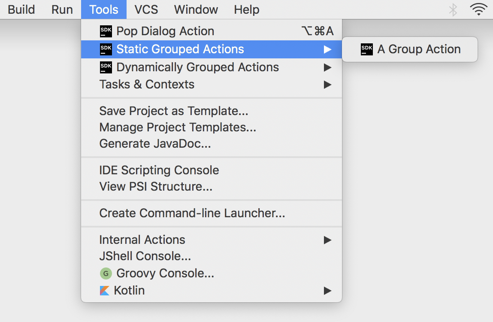
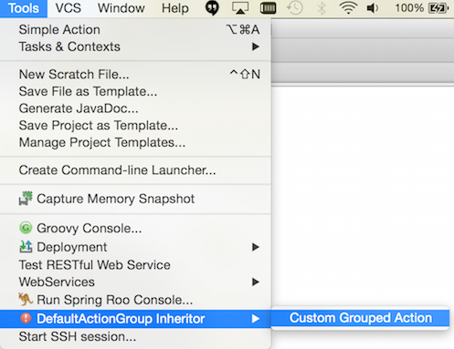

IntelliJ Action System.
==========
This tutorial is meant to give general information about the IntelliJ IDEA Action System and lead you through a series of steps
which show how to create, register, and customize custom actions and action groups.
Action system provides an option to handle certain events in a desired way. Action can either be simply a response to some state,
or be bound to UI element and could be invoked on demand. These UI elements include main menu, context menus and toolbars.

----------------

**TODO - links to source**

#Working with custom actions.
An action is technically a class, derived from the [AnAction] (https://github.com/JetBrains/intellij-community/blob/master/platform/editor-ui-api/src/com/intellij/openapi/actionSystem/AnAction.java)
class.
To update the state of the action, the method AnAction.update() is periodically called by IDEA.
The object of type [AnActionEvent] (https://github.com/JetBrains/intellij-community/blob/ff16ce78a1e0ddb6e67fd1dbc6e6a597e20d483a/platform/editor-ui-api/src/com/intellij/openapi/actionSystem/AnActionEvent.java)
passed to this method carries the information about the current context for the action,
and in particular, the specific presentation which needs to be updated.

-------------

##Creating actions.
To create a new we need to extend
[AnAction] (https://github.com/JetBrains/intellij-community/blob/master/platform/editor-ui-api/src/com/intellij/openapi/actionSystem/AnAction.java)
class:

```java
public class SimpleAction extends AnAction {
}
```

The only method of an inheritor of
[AnAction] (https://github.com/JetBrains/intellij-community/blob/master/platform/editor-ui-api/src/com/intellij/openapi/actionSystem/AnAction.java)
which needs to be overridden is ```public void actionPerformed(AnActionEvent anActionEvent);```
, and it should contain a part of code to be executed after the action has been invoked. In this case the action does nothing.

```java
public class SimpleAction extends AnAction {
    @Override
    public void actionPerformed(AnActionEvent anActionEvent) {
    }
}
```

-------------

##Registering actions.
To register a newly created action, <action> attribute should be added to the <actions> section of the plugin configuration file
[plugin.xml] (). IntelliJ IDEA has an embedded inspection that spots unregistered actions.


To register the action and set up it's attributes press ***Alt + Enter*** while the caret is placed on the action's declaration.


Fill the "New Action" form to set up action's parameters such as: action's name and description, a UI component the action is bound to,
visual position of the menu item the action is bound to, and a shortcut for invoking the action.
In our case the action will be available in the Tools Menu, it will be placed on top, and will have no shortcuts.


After filling the "New Action" form and applying the changes *<actions>* section of our
[plugin.xml]()
file will look like this:

```xml
<actions>
  <!-- Add your actions here -->
    <action id="org.jetbrains.tutorials.actions.SimpleAction" class="org.jetbrains.tutorials.actions.SimpleAction"
            text="Simple Action" description="IntelliJ Action System Demo">
        <add-to-group group-id="ToolsMenu" anchor="first"/>
    </action>
</actions>
```

Full list of action's attributes can also be set manually in
[plugin.xml]()
configuration file like the following code sample shows:

```xml
<actions>
    <!-- Add your actions here -->
    <!-- The <action> element defines an action to register.
    The mandatory "id" attribute specifies an unique identifier for the action.
    The mandatory "class" attribute specifies the full-qualified name of the class implementing the action.
    The mandatory "text" attribute specifies the text of the action (tooltip for toolbar button or text for menu item).
    The optional "use-shortcut-of" attribute specifies the ID of the action whose keyboard shortcut this action will use.
    The optional "description" attribute specifies the text which is displayed in the status bar when the action is focused.
    The optional "icon" attribute specifies the icon which is displayed on the toolbar button or next to the menu item. -->
      <action id="org.jetbrains.tutorials.actions.SimpleAction" class="org.jetbrains.tutorials.actions.SimpleAction"
              text="Simple Action" description="IntelliJ Action System Demo">
          <!-- The <keyboard-shortcut> node specifies the keyboard shortcut for the action. An action can have several keyboard shortcuts.
          The mandatory "first-keystroke" attribute specifies the first keystroke of the action. The key strokes are specified according to the regular Swing rules.
          The optional "second-keystroke" attribute specifies the second keystroke of the action.
          The mandatory "keymap" attribute specifies the keymap for which the action is active. IDs of the standard keymaps are defined as
          constants in the com.intellij.openapi.keymap.KeymapManager class. -->
          <keyboard-shortcut first-keystroke="control alt A" second-keystroke="C" keymap="$default"/>
          <!-- The <mouse-shortcut> node specifies the mouse shortcut for the action. An action can have several mouse shortcuts.
          The mandatory "keystroke" attribute specifies the clicks and modifiers for the action. It is defined as a sequence of words separated by spaces:
          "button1", "button2", "button3" for the mouse buttons; "shift", "control", "meta", "alt", "altGraph" for the modifier keys;
          "doubleClick" if the action is activated by a double-click of the button.
          The mandatory "keymap" attribute specifies the keymap for which the action is active. IDs of the standard keymaps are defined as
          constants in the com.intellij.openapi.keymap.KeymapManager class. -->
          <mouse-shortcut keystroke="control button3 doubleClick" keymap="$default"/>
          <!-- The <add-to-group> node specifies that the action should be added to an existing group. An action can be added to several groups.
          The mandatory "group-id" attribute specifies the ID of the group to which the action is added.
          The group must be implemented by an instance of the DefaultActionGroup class.
          The mandatory "anchor" attribute specifies the position of the action in the group relative to other actions. It can have the values
          "first", "last", "before" and "after".
          The "relative-to-action" attribute is mandatory if the anchor is set to "before" and "after", and specifies the action before or after which
          the current action is inserted. -->
          <add-to-group group-id="ToolsMenu" anchor="first"/>
      </action>
</actions>
```

After performing the steps described above we need to compile and run the plugin to the the newly created action available as a Tools Menu item:


-----------

##Performing an action.
In order to make the action do something we need to implement it's ```public void actionPerformed(AnActionEvent anActionEvent);``` method.
In the following example action invokes a dialog that shows information about a selected Project View Item and has no icon and any pre-selected default option:

```java
@Override
public void actionPerformed(AnActionEvent anActionEvent) {
    Object navigatable = anActionEvent.getData(CommonDataKeys.NAVIGATABLE);
    if (navigatable != null) {
        Messages.showDialog(navigatable.toString(), "Selected Element:", new String[]{"OK"}, -1, null);
    }
}
```

-----------

##Setting up action's visibility and availability.

To manipulate with action's visibility and availability we need to override it's ```public void update(@NotNull AnActionEvent e);```

Default implementation of this method does nothing.
Override this method to provide the ability to dynamically change action's
state and(or) presentation depending on the context.

```java
public class SimpleAction extends AnAction {
    @Override
    public void actionPerformed(AnActionEvent anActionEvent) {
    //...
    }

    @Override
    public void update(AnActionEvent anActionEvent) {
    }
}
```

The following code sample illustrates how to make the action visible and available only when the following conditions are met:
there's a project available and there's an item you can navigate to selected in the project view pane:

```java
public class SimpleAction extends AnAction {
    @Override
    public void actionPerformed(AnActionEvent anActionEvent) {
    //...
    }

     @Override
     public void update(AnActionEvent anActionEvent) {
         final Project project = anActionEvent.getData(CommonDataKeys.PROJECT);
         if (project == null)
             return;
         Object navigatable = anActionEvent.getData(CommonDataKeys.NAVIGATABLE);
         anActionEvent.getPresentation().setEnabledAndVisible(navigatable != null);
     }
}
```

Parameter anActionEvent carries information on the invocation place and data available.

**Note** This method can be called frequently, for instance, if an action is added to a toolbar, it will be updated twice a second.
This means that this method is supposed to work really fast, no real work should be done at this phase.
For example, checking selection in a tree or a list, is considered valid, but working with a file system is not.
If you cannot understand the state of the action fast you should do it in the
[AnActionEvent] (https://github.com/JetBrains/intellij-community/blob/ff16ce78a1e0ddb6e67fd1dbc6e6a597e20d483a/platform/editor-ui-api/src/com/intellij/openapi/actionSystem/AnActionEvent.java)
method and notify the user that action cannot be executed if it's the case.

-------------

After compiling and running the plugin project and invoking the action, the dialog will pop up:


-------------

#Groupping actions.

If some part of the functionality requires to implement several actions or actions are simply too many and overload the menu they can be joined into groups.
In this case the group will be available as a top-level menu item, action will be represented as drop-down menu items.

##Creating simple action groups.
Grouping can be done by extending adding *<group>* attribute to *<actions>*
[plugin.xml]()
file.

```xml
<actions>
    <group id="SimpleGroup" text="Custom Action Group" popup="true">
    </group>
</actions>
```

##Binding action groups to UI component.
The following sample shows how to place a custom action group on top of the editor popup menu:

```xml
<actions>
    <group id="SimpleGroup" text="Custom Action Group" popup="true">
        <add-to-group group-id="EditorPopupMenu" anchor="first"/>
    </group>
</actions>
```

##Adding actions to the group.
To create an action we need to extend
[AnAction.java]()
class:

```java
public class GroupedAction extends AnAction {
    @Override
    public void update(AnActionEvent event) {
        event.getPresentation().setEnabledAndVisible(true);
    }

    @Override
    public void actionPerformed(AnActionEvent event) {
        //Does nothing
    }
}
```

And then the actions needs to be registered in the newly created group:

```xml
<action>
    <group id="SimpleGroup" text="Custom Action Group" popup="true">
        <add-to-group group-id="EditorPopupMenu" anchor="first"/>
            <action class="org.jetbrains.tutorials.actions.GroupedAction" id="org.jetbrains.tutorials.actions.GroupedAction"
                      text="Grouped Action" description="Grouped Action Demo">
            </action>
    </group>
</actions>
```

After performing the steps described above the action group nad it's content will be available in the editor popup menu:



##Working with DefaultActionGroup.
In some cases we need to implement some specific behaviour of a group of actions dependently on the context.
The steps below are meant to show how to make a group of actions available and visible if a certain condition is met and how to set up a group icon dynamically.
In our case the condition is: an instance of the editor is available.

###Extending DefaultActionGroup.
[DefaultActionGroup.java]()
is a default implementations of
[ActionGroup.java]
and used to add children actions and separators between them to a group.
This class is used if a set of actions belonging to the group is fixed, which is the majority of all the cases.

Firstly, [DefaultActionGroup.java] should be derived:

```java
public class CustomDefaultActionGroup extends DefaultActionGroup {
    @Override
    public void update(AnActionEvent event) {
    }
}
```

###Registering action group.
As in case with the simple action group, the inheritor of
[DefaultActionGroup.java]()
should be declared in
[plugin.xml]()
file:

```xml
<actions>
    <group id="CustomDefaultActionGroup" class="org.jetbrains.tutorials.actions.CustomDefaultActionGroup" popup="true"
           text="DefaultActionGroup Inheritor" description="Default Action Group Demo">
        <add-to-group group-id="ToolsMenu" anchor="last"/>
  </group>
</actions>
```

###Creating an action.
[AnAction.java]()
needs to be extended:

```java
public class CustomGroupedAction extends AnAction {
    @Override
    public void actionPerformed(AnActionEvent anActionEvent) {
        //Does nothing
    }
}
```

###Adding actions to the group.
Action's class should be registered in
[plugin.xml]()
:

```xml
<actions>
    <group id="CustomDefaultActionGroup" class="org.jetbrains.tutorials.actions.CustomDefaultActionGroup" popup="true"
         text="DefaultActionGroup Inheritor" description="Default Action Group Demo">
        <add-to-group group-id="ToolsMenu" anchor="last"/>
        <action class="org.jetbrains.tutorials.actions.CustomGroupedAction" id="CustomGroupedAction"
                  text="Custom Grouped Action" description="Custom Grouped Action Demo"/>
    </group>
</actions>
```

###Providing specific behaviour for the group.
In this case we override ```public void update(AnActionEvent event);``` method to make the group visible as a *Tools* menu item,
however, it will be enabled only if there's an instance of the editor available. Also a custom icon is set up:

```java
public class CustomDefaultActionGroup extends DefaultActionGroup {
    @Override
    public void update(AnActionEvent event) {
        Editor editor = event.getData(CommonDataKeys.EDITOR);
        event.getPresentation().setVisible(true);
        event.getPresentation().setEnabled(editor != null);
        event.getPresentation().setIcon(AllIcons.General.Error);
    }
}
```

After compiling and running the code sample above, *Tools* menu item should contain an extra group of action with a user-defined icon:



#Action groups with variable actions set
If a set of actions belonging to a custom actions group ot they properties may vary dependently on the context,
we need to extend
[ActionGroup.java]().

