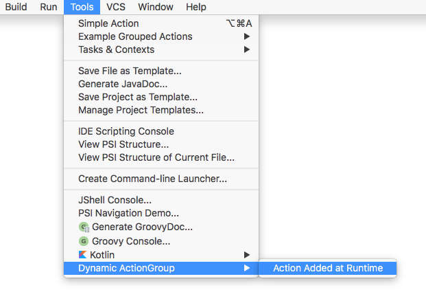

If some part of the functionality requires to implement several actions or actions are simply too many and overload the menu they can be joined into groups.
In this case the group will be available as a top-level menu item, action will be represented as drop-down menu items.

### 2.1. Creating simple action groups

Grouping can be done by extending adding *\<group\>* attribute to *\<actions\>*
[plugin.xml](https://github.com/JetBrains/intellij-sdk/blob/master/code_samples/register_actions/META-INF/plugin.xml)
file.

```xml
<actions>
    <group id="SimpleGroup" text="Custom Action Group" popup="true">
    </group>
</actions>
```

### 2.2. Binding action groups to UI component

The following sample shows how to place a custom action group on top of the editor popup menu:

```xml
<actions>
    <group id="SimpleGroup" text="Custom Action Group" popup="true">
        <add-to-group group-id="EditorPopupMenu" anchor="first"/>
    </group>
</actions>
```

### 2.3. Adding actions to the group

To create an action we need to extend
[AnAction.java](https://github.com/JetBrains/intellij-community/blob/master/platform/editor-ui-api/src/com/intellij/openapi/actionSystem/AnAction.java)
class:

```java
public class GroupedAction extends AnAction {
    @Override
    public void update(AnActionEvent event) {
        event.getPresentation().setEnabledAndVisible(true);
    }

    @Override
    public void actionPerformed(AnActionEvent event) {
        //Does nothing
    }
}
```

And then the actions needs to be registered in the newly created group:

```xml
<action>
    <group id="SimpleGroup" text="Custom Action Group" popup="true">
        <add-to-group group-id="EditorPopupMenu" anchor="first"/>
            <action class="org.jetbrains.tutorials.actions.GroupedAction" id="org.jetbrains.tutorials.actions.GroupedAction"
                      text="Grouped Action" description="Grouped Action Demo">
            </action>
    </group>
</actions>
```

After performing the steps described above the action group nad it's content will be available in the editor popup menu:


### 2.4. Working with DefaultActionGroup

In some cases we need to implement some specific behaviour of a group of actions dependently on the context.
The steps below are meant to show how to make a group of actions available and visible if a certain condition is met and how to set up a group icon dynamically.
In our case the condition is: an instance of the editor is available.

### 2.5. Extending DefaultActionGroup

[DefaultActionGroup.java](https://github.com/JetBrains/intellij-community/blob/master/platform/platform-api/src/com/intellij/openapi/actionSystem/DefaultActionGroup.java)
is a default implementations of
[ActionGroup.java](https://github.com/JetBrains/intellij-community/blob/master/platform/editor-ui-api/src/com/intellij/openapi/actionSystem/ActionGroup.java)
and used to add children actions and separators between them to a group.
This class is used if a set of actions belonging to the group is fixed, which is the majority of all the cases.

Firstly,
[DefaultActionGroup.java](https://github.com/JetBrains/intellij-community/blob/master/platform/platform-api/src/com/intellij/openapi/actionSystem/DefaultActionGroup.java)
should be derived:

```java
public class CustomDefaultActionGroup extends DefaultActionGroup {
    @Override
    public void update(AnActionEvent event) {
    }
}
```

### 2.6. Registering action group

As in case with the simple action group, the inheritor of
[DefaultActionGroup.java](https://github.com/JetBrains/intellij-community/blob/master/platform/platform-api/src/com/intellij/openapi/actionSystem/DefaultActionGroup.java)
should be declared in
[plugin.xml](https://github.com/JetBrains/intellij-sdk/blob/master/code_samples/register_actions/META-INF/plugin.xml)
file:

```xml
<actions>
    <group id="CustomDefaultActionGroup" class="org.jetbrains.tutorials.actions.CustomDefaultActionGroup" popup="true"
           text="DefaultActionGroup Inheritor" description="Default Action Group Demo">
        <add-to-group group-id="ToolsMenu" anchor="last"/>
  </group>
</actions>
```

### 2.7. Creating an action

[AnAction.java](https://github.com/JetBrains/intellij-community/blob/master/platform/editor-ui-api/src/com/intellij/openapi/actionSystem/AnAction.java)
needs to be extended:

```java
public class CustomGroupedAction extends AnAction {
    @Override
    public void actionPerformed(AnActionEvent anActionEvent) {
        //Does nothing
    }
}
```

### 2.8. Adding actions to the group

Action's class should be registered in
[plugin.xml](https://github.com/JetBrains/intellij-sdk/blob/master/code_samples/register_actions/META-INF/plugin.xml)
:

```xml
<actions>
    <group id="CustomDefaultActionGroup" class="org.jetbrains.tutorials.actions.CustomDefaultActionGroup" popup="true"
         text="DefaultActionGroup Inheritor" description="Default Action Group Demo">
        <add-to-group group-id="ToolsMenu" anchor="last"/>
        <action class="org.jetbrains.tutorials.actions.CustomGroupedAction" id="CustomGroupedAction"
                  text="Custom Grouped Action" description="Custom Grouped Action Demo"/>
    </group>
</actions>
```

### 2.9. Providing specific behaviour for the group

In this case we override ```public void update(AnActionEvent event);``` method to make the group visible as a *Tools* menu item,
however, it will be enabled only if there's an instance of the editor available. Also a custom icon is set up:

```java
public class CustomDefaultActionGroup extends DefaultActionGroup {
    @Override
    public void update(AnActionEvent event) {
        Editor editor = event.getData(CommonDataKeys.EDITOR);
        event.getPresentation().setVisible(true);
        event.getPresentation().setEnabled(editor != null);
        event.getPresentation().setIcon(AllIcons.General.Error);
    }
}
```

After compiling and running the code sample above, *Tools* menu item should contain an extra group of action with a user-defined icon:


### 2.10. Action groups with variable actions set

If a set of actions belonging to a custom actions group may vary dependently on the context,
we need to work with
[ActionGroup.java](https://github.com/JetBrains/intellij-community/blob/master/platform/editor-ui-api/src/com/intellij/openapi/actionSystem/ActionGroup.java).
In this case set of actions to be grouped can be dynamically defined.

### 2.11. Creating variable action group

To create a group of actions with a variable actions set we extend
[ActionGroup.java](https://github.com/JetBrains/intellij-community/blob/master/platform/editor-ui-api/src/com/intellij/openapi/actionSystem/ActionGroup.java)
first:
```java
public class BaseActionGroup extends ActionGroup {
}
```

### 2.12. Registering variable action group

To register the group *\<group\>* attribute needs to be placed in the *\<actions\>* section of
[plugin.xml](https://github.com/JetBrains/intellij-sdk/blob/master/code_samples/register_actions/META-INF/plugin.xml):

```xml
<actions>
    <group id="BaseActionGroup" class="org.jetbrains.tutorials.actions.BaseActionGroup" popup="true"
              text="ActionGroup Demo" description="Extending AnAction Demo">
        <add-to-group group-id="ToolsMenu" anchor="first"/>
    </group>
</actions>
```
**Note**: Since the set of actions is defined dynamically no action definitions should be placed in
[plugin.xml](https://github.com/JetBrains/intellij-sdk/blob/master/code_samples/register_actions/META-INF/plugin.xml).
If *\<group\>* attribute contains any static action definition an exception will be thrown.
For statically defined group of action use
[DefaultActionGroup.java](https://github.com/JetBrains/intellij-community/blob/master/platform/platform-api/src/com/intellij/openapi/actionSystem/DefaultActionGroup.java)

### 2.13. Accessing children actions

An array of children actions should be returned by the method ```public AnAction[] getChildren(AnActionEvent anActionEvent);``` of the a created group:

```java
public class BaseActionGroup extends ActionGroup {
    @NotNull
    @Override
    public AnAction[] getChildren(AnActionEvent anActionEvent) {
        return new AnAction[0];
    }
}
```

### 2.14. Adding children actions to the group

To make the group contain actions a non-empty array of
[AnAction.java](https://github.com/JetBrains/intellij-community/blob/master/platform/editor-ui-api/src/com/intellij/openapi/actionSystem/AnAction.java)
elements should be returned:

```java
public class BaseActionGroup extends ActionGroup {
    @NotNull
    @Override
    public AnAction[] getChildren(AnActionEvent anActionEvent) {
        return new AnAction[]{new MyAction()};
    }
    class MyAction extends AnAction {
        public MyAction() {
           super("Dynamically Added Action");
        }
        @Override
        public void actionPerformed(@NotNull AnActionEvent anActionEvent) {
        }
    }
}
```

After providing an implementation of
[AnAction.java](https://github.com/JetBrains/intellij-community/blob/master/platform/editor-ui-api/src/com/intellij/openapi/actionSystem/AnAction.java)
and making it return a non-empty array of action Tools Menu should contain an extra group of action:


