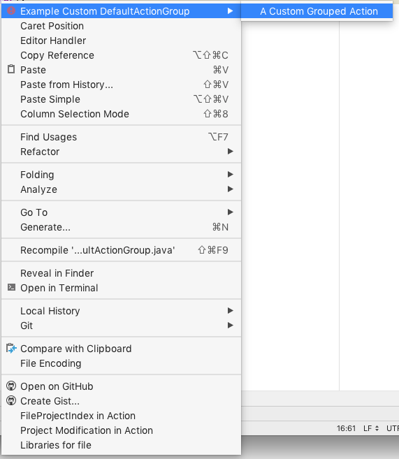

If an implementation requires several actions, or there are simply too many actions that overload the menu, they can be joined into groups.

### 2.1. Simple action groups

In this case the group will be available as a top-level menu item, and actions will be represented as drop-down menu items.

#### 2.1.1. Creating simple action groups

Grouping can be done by adding a `<group>` element to the `<actions>` section in
[plugin.xml](https://github.com/JetBrains/intellij-sdk-docs/blob/master/code_samples/register_actions/resources/META-INF/plugin.xml).
Note this example has no `class` attribute in the `<group>` element because we want the IntelliJ Platform framework to 
supply a default implementation class for the group. Section 2.2 discusses using specialized implementations. The `id` attribute
must be unique, so incorporating the plugin ID or package name is encouraged. This allows reuse of the group with a different `id`.

```xml
<actions>
    <group id="org.jetbrains.tutorials.actions.GroupedActions" text="Example Grouped Actions" popup="true">
    </group>
</actions>
```

#### 2.1.2. Binding action groups to UI components

The following sample shows how to use an `<add-to-group>` element to place a custom action group relative to 
an entry in the **Tools** menu. Note the attribute `relative-to-action` references `SimpleAction`, which is not a native IntelliJ menu entry. 
Rather `SimpleAction` is defined in the same 
[plugin.xml](https://github.com/JetBrains/intellij-sdk-docs/blob/master/code_samples/register_actions/resources/META-INF/plugin.xml) file
as part of this sample plugin.

```xml
<actions>
     <group id="org.jetbrains.tutorials.actions.GroupedActions" text="Example Grouped Actions" popup="true">
      <add-to-group group-id="ToolsMenu" anchor="after" relative-to-action="org.jetbrains.tutorials.actions.SimpleAction"/>
    </group>
</actions>
```

#### 2.1.3. Creating an action for the simple action group

To create an action we need to extend the
[AnAction.java](upsource:///platform/editor-ui-api/src/com/intellij/openapi/actionSystem/AnAction.java)
class. This example uses [SimplePopDialogAction](../../code_samples/register_actions/src/org/jetbrains/tutorials/actions/SimplePopDialogAction.java)
action class, which pops a simple dialog to give users feedback when a menu item is chosen. See the [working with custom actions](working_with_custom_actions.md)
documentation for more information about this class.

####  2.1.4. Adding an action to the simple action group

Now the `SimplePopDialogAction` needs to be registered in the newly created group. Note the `id` attribute is set to
something unique, and different from, the fully qualified `class` attribute in the `<group>` element. A unique `id` supports reuse of 
action classes in more than one menu or group.

```xml
<group id="org.jetbrains.tutorials.actions.GroupedActions" text="Example Grouped Actions" popup="true">
  <add-to-group group-id="ToolsMenu" anchor="after" relative-to-action="org.jetbrains.tutorials.actions.SimpleAction"/>
  <action class="org.jetbrains.tutorials.actions.SimplePopDialogAction" 
    id="org.jetbrains.tutorials.actions.SimpleGroupedAction" text="A Grouped Action" description="Grouped Action Demo">
  </action>
</group>
```

After performing the steps described above the action group and its content will be available in the **Tools** menu:


    
  
### 2.2. Implementing custom action group classes

In some cases we need to implement some specific behaviour of a group of actions depending on the context.
The steps below show how to make a group of actions available and visible if certain conditions are met.
In this case the condition is having an instance of an editor is available. This condition is needed because the custom
action group will be added to an IntelliJ menu that is only enabled for editing.

#### 2.2.1. Extending DefaultActionGroup

[DefaultActionGroup.java](upsource:///platform/platform-api/src/com/intellij/openapi/actionSystem/DefaultActionGroup.java)
is an implementation of
[ActionGroup.java](upsource:///platform/editor-ui-api/src/com/intellij/openapi/actionSystem/ActionGroup.java).
The `DefaultActionGroup` is used to add child actions and separators between them to a group.
This class is used if a set of actions belonging to the group does not change at runtime, which is the majority of all the cases.
(See section 2.3 for groups with variable child actions at runtime.)

First, we create we create the class [CustomDefaultActionGroup](../../code_samples/register_actions/src/org/jetbrains/tutorials/actions/CustomDefaultActionGroup.java) 
that extends [DefaultActionGroup.java](upsource:///platform/platform-api/src/com/intellij/openapi/actionSystem/DefaultActionGroup.java):

```java
package org.jetbrains.tutorials.actions;
public class CustomDefaultActionGroup extends DefaultActionGroup {
    @Override
    public void update(AnActionEvent event) {
      // Enable/disable depending on whether user is editing...
    }
}
```

#### 2.2.2. Registering the custom action group

As in the case with the simple action group, the action `<group>` should be declared in the *`<actions>`* section of 
[plugin.xml](https://github.com/JetBrains/intellij-sdk-docs/blob/master/code_samples/register_actions/resources/META-INF/plugin.xml)
file. Note:
  * The presence of the `class` attribute in the `<group>` element, which tells the IntelliJ Platform framework to
  use `CustomDefaultActionGroup` rather than the default implementation.
  * The `<add-to-group>` element specifies adding the group in the first position of the existing `EditorPopupMenu`.

```xml
<actions>
    <group id="org.jetbrains.tutorials.actions.ExampleCustomDefaultActionGroup" 
        class="org.jetbrains.tutorials.actions.CustomDefaultActionGroup" popup="true"
        text="Example Custom DefaultActionGroup" description="Custom DefaultActionGroup Demo">
      <add-to-group group-id="EditorPopupMenu" anchor="first"/>
    </group>
</actions>
```

#### 2.2.3. Creating an action

For simplicity the `SimplePopDialogAction` action class will be reused.


#### 2.2.4. Adding actions to the group

As in Section 2.1.4, the `SimplePopDialogAction` action is
added as an `<action>` element in the `<group>` element. Note:
  * The `class` attribute in the `<group>` element has the same fully qualified name as used in Section 2.1.4.
  * The `id` attribute is unique to distinguish it from the use of the `SimplePopDialogAction` class in (Section 2.1.4) `GroupedActions`.
   
```xml
<actions>
    <group id="org.jetbrains.tutorials.actions.ExampleCustomDefaultActionGroup" 
        class="org.jetbrains.tutorials.actions.CustomDefaultActionGroup" popup="true"
        text="Example Custom DefaultActionGroup" description="Custom DefaultActionGroup Demo">
      <add-to-group group-id="EditorPopupMenu" anchor="first"/>
      <action class="org.jetbrains.tutorials.actions.SimplePopDialogAction" id="org.jetbrains.tutorials.actions.CustomGroupedAction"
              text="A Custom Grouped Action" description="Custom Grouped Action Demo"/>
    </group>
</actions>
```

#### 2.2.5. Providing specific behaviour for the group

In this case we override the `DefaultActionGroup.update(AnActionEvent event)` method to make the group visible only 
if there's an instance of the editor available. Also a custom icon is set up:

```java
public class CustomDefaultActionGroup extends DefaultActionGroup {
  @Override
  public void update(AnActionEvent event) {
    // Enable/disable depending on whether user is editing
    Editor editor = event.getData(CommonDataKeys.EDITOR);
    event.getPresentation().setEnabled(editor != null);
    // Always make visible.
    event.getPresentation().setVisible(true);
    // Take this opportunity to set an icon for the menu entry.
    event.getPresentation().setIcon(AllIcons.General.Error);
  }
}
```

After compiling and running the code sample above, and opening a file in the editor and right-clicking,
the **Editing** menu will popup containing an new group of actions in the first position. The new group 
will also have an icon:


  

### 2.3. Action groups with a variable actions set

If a set of actions belonging to a custom actions group will vary depending on the context, the group must extend 
[ActionGroup.java](upsource:///platform/editor-ui-api/src/com/intellij/openapi/actionSystem/ActionGroup.java).
In this case set of actions to be grouped are dynamically defined.

#### 2.3.1. Creating variable action group

To create a group of actions with a variable number of actions we extend
`ActionGroup.java` to make the [DynamicActionGroup](../../code_samples/register_actions/src/org/jetbrains/tutorials/actions/DynamicActionGroup.java) class:

```java
public class DynamicActionGroup extends ActionGroup {
}
```

#### 2.3.2. Registering a variable action group

To register the dynamic menu group, a `<group>` attribute needs to be placed in the `<actions>` section of
[plugin.xml](https://github.com/JetBrains/intellij-sdk-docs/blob/master/code_samples/register_actions/resources/META-INF/plugin.xml).
Note that when enabled this group will appear as the last entry in the **Tools** menu:

```xml
<actions>
    <group id="org.jetbrains.tutorials.actions.DynamicActionGroup" class="org.jetbrains.tutorials.actions.DynamicActionGroup" popup="true"
           text="Dynamic ActionGroup" description="Dynamic ActionGroup Demo">
      <add-to-group group-id="ToolsMenu" anchor="last"/>
    </group>
</actions>
```
*Note*: If a`<group>` element's `class` attribute names a class derived from `ActionGroup`, then any static `<action>` declarations in the `<group>`
will throw an exception. For a statically defined group of actions use `DefaultActionGroup.java`.

#### 2.3.3. Adding child actions to the group

To add actions to the `DynamicActionGroup`, a non-empty array of
`AnAction` instances should be returned from the `DynamicActionGroup.getChildren(AnActionEvent)` method. Here again we reuse the 
`SimplePopDialogAction` action class.

```java
public class DynamicActionGroup extends ActionGroup {
  @NotNull
  @Override
  public AnAction[] getChildren(AnActionEvent anActionEvent) {
    return new AnAction[]{ new SimplePopDialogAction( "Action Added at Runtime",
                                                      "Dynamic Action Demo",
                                                      null)};
  }
}
```

After providing the implementation of `DynamicActionGroup` and making it return a non-empty array of actions, the last position in the **Tools** Menu will contain a new group of actions:


