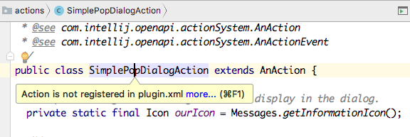
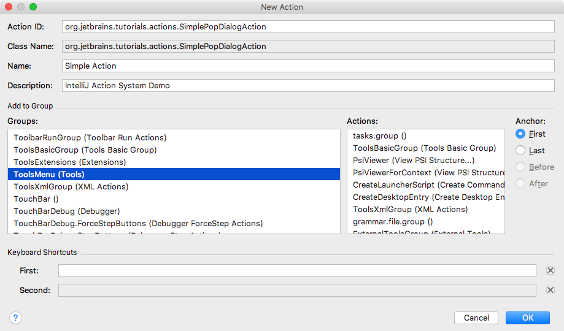
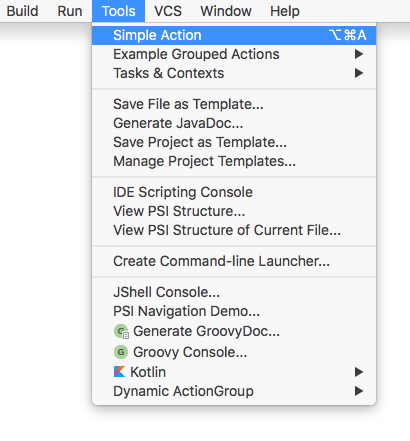
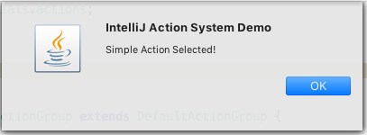

<!-- Copyright 2000-2020 JetBrains s.r.o. and other contributors. Use of this source code is governed by the Apache 2.0 license that can be found in the LICENSE file. -->

## Introduction
Plugins can add actions to existing IDE menus and toolbars, as well as add new menus and toolbars. 
The IntelliJ Platform calls the actions of plugins in response to user interactions with the IDE. 
However, the actions of a plugin must first be defined and registered with the IntelliJ Platform. 

Using the SDK code sample `action_basics`, this tutorial illustrates the steps to create an action for a plugin. 

* bullet list
{:toc}

## Creating a Custom Action
Custom actions extend the abstract class [`AnAction`](upsource:///platform/editor-ui-api/src/com/intellij/openapi/actionSystem/AnAction.java). 
Classes that extend it should override `AnAction.update()`, and must override `AnAction.actionPerformed()`. 
* The `update()` method implements the code that enables or disables an action.
* The `actionPerformed()` method implements the code that executes when an action is invoked by the user.

As an example, [`PopupDialogAction`](https://github.com/JetBrains/intellij-sdk-docs/blob/master/code_samples/action_basics/src/main/java/org/intellij/sdk/action/PopupDialogAction.java) overrides `AnAction` for the `action_basics` code sample.

```java
public class PopupDialogAction extends AnAction {
   
  @Override
  public void update(AnActionEvent e) {
    // Using the event, evaluate the context, and enable or disable the action.
  }
  
  @Override
  public void actionPerformed(@NotNull AnActionEvent e) {
    // Using the event, implement an action. For example, create and show a dialog.
  }
  
}
```

> **WARNING** `AnAction` classes do not have class fields of any kind. This restriction prevents memory leaks.
For more information about why, see [Action Implementation](/basics/action_system.md#action-implementation). 

At this stage, `update()` implicitly defaults always to enable this action.
The implementation of `actionPerformed()` does nothing.
These methods fully implemented in [Developing the AnAction Methods](#developing-the-anaction-methods) below.

Before fleshing out those methods, to complete this minimal implementation, `PopupDialogAction` must be registered with the IntelliJ Platform.

## Registering a Custom Action
Actions are registered by declaring them in code or by declaring them in the `<actions>` section of a plugin configuration (`plugin.xml`) file. 
This section describes using IDE tooling - the New Action Form - to add a declaration to the `plugin.xml` file, and then tuning registration attributes manually.
A more comprehensive explanation of action registration is available in the [Action Registration](/basics/action_system.md#registering-actions) section of this guide.

### Registering an Action with the New Action Form
IntelliJ IDEA has an embedded inspection that spots unregistered actions. 
Verify the inspection is enabled at **Settings/Preferences \| Editor \| Inspections \| Plugin DevKit \| Code \| Component/Action not registered**. 
Here is an example for this stage of the `PopupDialogAction` class:

{:width="600px"}

To register `PopupDialogAction` and set up its basic attributes press ***Alt + Shift + Enter***.
Fill out the **New Action** form to set up the parameters for `PopupDialogAction`: 

{:width="800px"}

The fields of the form are:
* _Action ID_ - Every action must have a unique ID.
  If the action class is used in only one place in the IDE UI, then the class FQN is a good default for the ID.
  Using the action class in multiple places requires mangling the ID, such as adding a suffix to the FQN, for each ID.
* _Class Name_ - The FQN implementation class for the action.
  If the same action is used in multiple places in the IDE UI, the implementation FQN can be reused with a different _Action ID_.
* _Name_ - The text to appear in the menu.
* _Description_ - Hint text to be displayed.
* _Add to Group_ - The action group - menu or toolbar - to which the action is added.
  Clicking in the list of groups and typing invokes a search, such as "ToolsMenu." 
* _Anchor_ - Where the menu action should be placed in the **Tools** menu relative to the other actions in that menu.  

In this case, `PopupDialogAction` would be available in the **Tools** menu, it would be placed at the top, and would have no shortcuts.

After finishing the **New Action** form and applying the changes, the `<actions>` section of the plugin's `plugins.xml` file
would contain:

```xml
  <actions>
    <action id="org.intellij.sdk.action.PopupDialogAction" class="org.intellij.sdk.action.PopupDialogAction" 
          text="Pop Dialog Action" description="SDK action example">
      <add-to-group group-id="ToolsMenu" anchor="first"/>
    </action>
  </actions>
```

The `<action>` element declares the _Action ID_ (`id`,) _Class Name_ (`class`,) _Name_ (`text`,) and _Description_ from the **New Action** form.
The `<add-to-group>` element declares where the action will appear and mirrors the names of entries from the form. 

This declaration is adequate, but adding more attributes is discussed in the next section.

### Setting Registration Attributes Manually
An action declaration can be added manually to the `plugin.xml` file.
An exhaustive list of declaration elements and attributes is presented in [Registering Actions in plugin.xml](/basics/action_system.md#registering-actions-in-pluginxml).
Attributes are added by selecting them from the **New Action** form, or by editing the registration declaration directly in the plugin.xml file.

The `<action>` declaration for `PopupDialogAction` in the `action_basics` [plugin.xml](https://github.com/JetBrains/intellij-sdk-docs/blob/master/code_samples/action_basics/src/main/resources/META-INF/plugin.xml) file.
It also contains an attribute for an [`Icon`](/reference_guide/work_with_icons_and_images.md) and encloses elements declaring text overrides, keyboard and mouse shortcuts, and to which menu group the action should be added.

The full declaration is:

```xml
    <action id="org.intellij.sdk.action.PopupDialogAction" class="org.intellij.sdk.action.PopupDialogAction"
            text="Action Basics Plugin: Pop Dialog Action" description="SDK action example" icon="SdkIcons.Sdk_default_icon">
      <override-text place="MainMenu" text="Pop Dialog Action"/>
      <keyboard-shortcut first-keystroke="control alt A" second-keystroke="C" keymap="$default"/>
      <mouse-shortcut keystroke="control button3 doubleClick" keymap="$default"/>
      <add-to-group group-id="ToolsMenu" anchor="first"/>
    </action>
```

#### Using Override-Text for an Action
By using the `override-text` element introduced in 2020.1 of the IntelliJ Platform, the action text can be different depending on the context of where the action appears: menu, toolbar, etc.
The example above uses this element to ensure the shorter text "Pop Dialog Action" is shown anywhere the action appears in the Main Menu structure.
Otherwise, the default, more explanatory text "Action Basics Plugin: Pop Dialog Action" is shown.
For more information, see [Setting the Override-Text Element for an Action](/basics/action_system.md#setting-the-override-text-element-for-an-action)

## Testing the Minimal Custom Action Implementation
After performing the steps described above, compile and run the plugin to see the newly created action available as a Tools Menu item, which is within the context of the Main Menu:

{:width="350px"}

To see the alternate, more verbose text declared by the `override-text` element, use **Help \| Find Action...** and search for "Pop Dialog Action".
The search shows the verbose menu text in a context outside of the Main Menu:

{:width="500px"}

Selecting the action from the menu, keyboard/mouse shortcuts, or Find Action won't do anything at this point because the implementations are empty.
However, it confirms the new entry appears at **Tools \| Pop Dialog Action** and **Help \| Find Action...**.

## Developing the `AnAction` Methods
At this point, the new action `PopupDialogAction` is registered with the IntelliJ Platform and functions in the sense that  `update()` and `actionPerformed()` are called in response to user interaction with the IDE Tools menu.
However, neither method implements any code to perform useful work.

This section describes adding useful code to these methods.
The `update()` method defaults to always enable the action, which is satisfactory for intermediate testing.
So `actionPerformed()` will be developed first.

### Extending the `actionPerformed()` Method
Adding code to the `PopupDialogAction.actionPerformed()` method makes the action do something useful. 
The code below gets information from the `anActionEvent` input parameter and constructs a message dialog.
A generic icon, and the `dlgMsg` and `dlgTitle` attributes from the invoking menu action are displayed.
However, code in this method could manipulate a project, invoke an inspection, change the contents of a file, etc.

For demonstration purposes the `AnActionEvent.getData()` method tests if a [`Navigatable`](upsource:///platform/core-api/src/com/intellij/pom/Navigatable.java) object is available. 
If so, information about the selected element is added to the dialog. 

See [Determining the Action Context](/basics/action_system.md#determining-the-action-context) for more information about accessing information from the `AnActionEvent` input parameter. 

```java
  @Override
  public void actionPerformed(@NotNull AnActionEvent event) {
    // Using the event, create and show a dialog
    Project currentProject = event.getProject();
    StringBuffer dlgMsg = new StringBuffer(event.getPresentation().getText() + " Selected!");
    String dlgTitle = event.getPresentation().getDescription();
    // If an element is selected in the editor, add info about it.
    Navigatable nav = event.getData(CommonDataKeys.NAVIGATABLE);
    if (nav != null) {
      dlgMsg.append(String.format("\nSelected Element: %s", nav.toString()));
    }
    Messages.showMessageDialog(currentProject, dlgMsg.toString(), dlgTitle, Messages.getInformationIcon());
  }
```

### Extending the `update()` Method
Adding code to `PopupDialogAction.update()` gives finer control of the action's visibility and availability.
The action's state and(or) presentation can be dynamically changed depending on the context. 

> **WARNING** This method needs to _execute very quickly_. For more information about this constraint, see the warning in [Overriding the AnAction.update Method](/basics/action_system.md#overriding-the-anactionupdate-method).

In this example, the `update()` method relies on a `Project` object being available. 
This requirement means the user must have at least one project open in the IDE for the `PopupDialogAction` to be available.
So the `update()` method disables the action for contexts where a `Project` object isn't defined.

The availability (enabled and visible) is set on the `Presentation` object.
Setting both the enabled state and visibility produces consistent behavior despite possible host menu settings, as discussed in [Grouping Actions](/basics/action_system.md#grouping-actions).

```java
  @Override
  public void update(AnActionEvent e) {
    // Set the availability based on whether a project is open
    Project project = e.getProject();
    e.getPresentation().setEnabledAndVisible(project != null);
  }
```

The `update()` method does not check to see if a `Navigatable` object is available before enabling `PopupDialogAction`. 
This check is unnecessary because using the `Navigatable` object is opportunistic in `actionPerformed()`. 
See [Determining the Action Context](/basics/action_system.md#determining-the-action-context) for more information about accessing information from the `AnActionEvent` input parameter. 

### Other Method Overrides
A constructor is overridden in `PopupDialogAction`, but this is an artifact of reusing this class for a dynamically created menu action.
Otherwise, overriding constructors for `AnAction` is not required.

## Testing the Custom Action
After compiling and running the plugin project and invoking the action, the dialog will pop up:

{:width="800px"}
