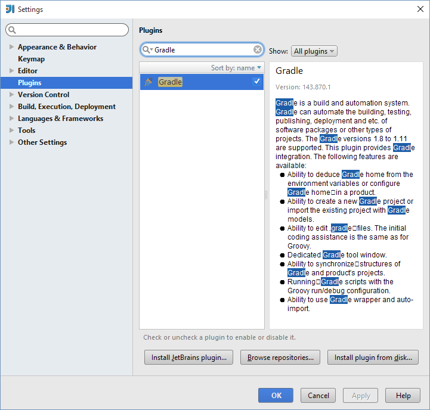
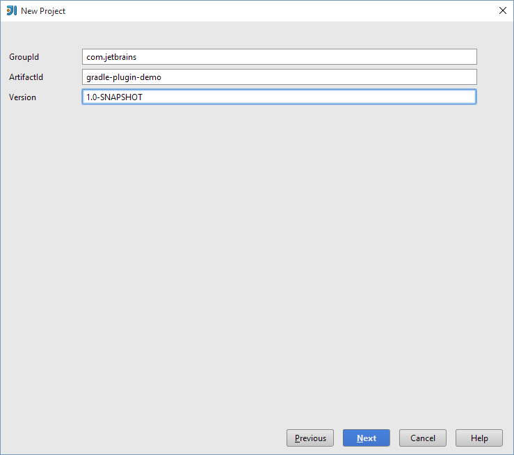
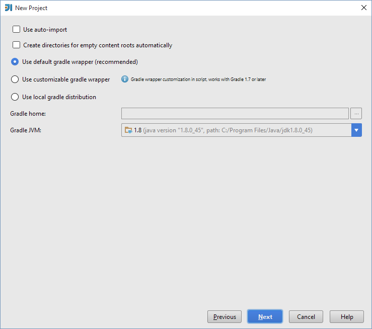
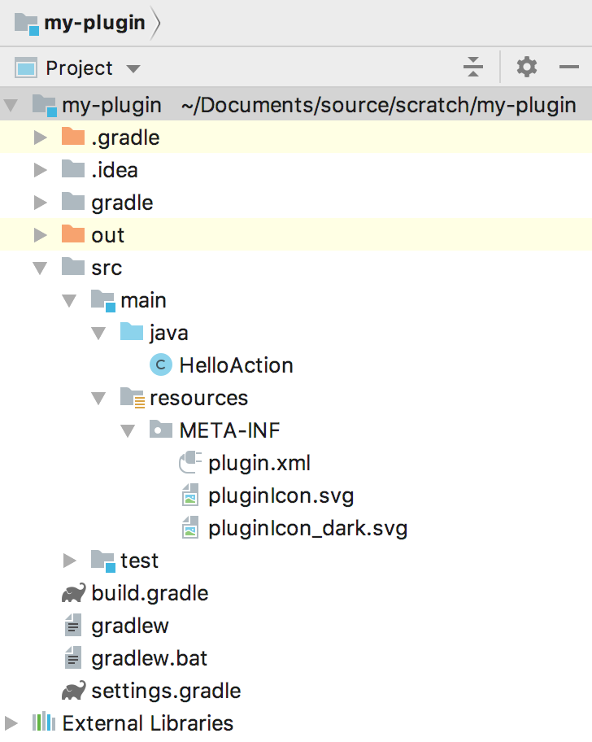
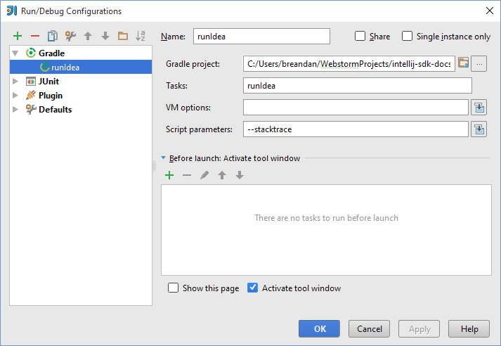
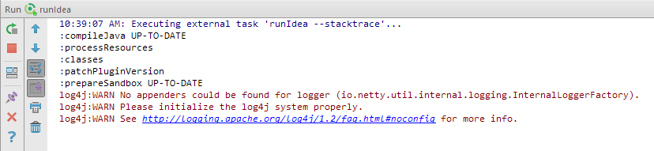

Adding Gradle build support to an IntelliJ Platform Plugin requires a recent distribution to the Gradle build system and IntelliJ IDEA (Community or Ultimate).

### 1.0. Download and install Gradle

Download and install Gradle, following the instructions provided in the [Gradle User Guide](https://docs.gradle.org/current/userguide/installation.html). 

### 1.1. Download and install IntelliJ IDEA

Download and install either IntelliJ IDEA Ultimate or the IntelliJ IDEA Community Edition.

### 1.2. Ensure the Gradle plugin is enabled

The [Gradle plugin](https://plugins.gradle.org/plugin/org.jetbrains.intellij) is required if you want to add a [Gradle Run Configuration](https://www.jetbrains.com/idea/help/create-run-debug-configuration-for-gradle-tasks.html) to IntelliJ IDEA. You can verify the Gradle plugin is enabled by visiting **Settings \| Plugins \| Gradle**.



### 1.3. Add Gradle support to an existing plugin 

There are two ways to add Gradle support to an existing project. Both will require adding a `build.gradle` file under the root directory, with at least the following contents:

```groovy
buildscript {
    repositories {
        mavenCentral()
    }
}

plugins {
    id "org.jetbrains.intellij" version "0.0.20"
}

apply plugin: 'idea'
apply plugin: 'org.jetbrains.intellij'
apply plugin: 'java'

intellij {
    version 'IC-14.1.4' //IntelliJ IDEA dependency 
    plugins 'coverage' //Bundled plugin dependencies
    pluginName 'plugin_name_goes_here'
}

group 'org.jetbrains'
version '1.2' // Plugin version
```

To add Gradle support to an existing project, copy the above Gradle build script into your `build.gradle` file, and with the Gradle executable on your system `PATH`, execute the following commands on your system's command line:

```
gradle cleanIdea
gradle runIdea
```

This will clean any existing IntelliJ IDEA configuration files and generate a new Gradle build configuration recognized by IntelliJ IDEA. Once your project refreshes, you should be able to view the Gradle tool window displayed under **View \| Tool Windows \| Gradle**. This indicates that IntelliJ IDEA recognizes the Gradle facet.

### 1.4. Add Gradle support from scratch

The second method to add Gradle support is by creating a new project from scratch in IntelliJ IDEA and copying over any existing sources. This may be the preferred option in case Gradle is not able to convert an existing project. To do so, create a new project in IntelliJ IDEA by opening **File \| New... \| Project**, and select Gradle from the dialog box: 


The Project Creation Wizard will now guide you through the Gradle project creation process. You will need to specify a Group ID, Artifact ID, and Version:



Finally, make sure Gradle is using the correct JVM. This should be the same version as the corresponding 64- or 32-bit Gradle distribution from [Step 1.0](#download-and-install-gradle):



Now, add the above script to your `build.gradle` file, overwriting any existing contents.

### 1.5. Running a simple plugin

Create the following directory structure:



```java

```

```java

```

Add a new Gradle Run Configuration, configured like so:
 


Launch the new Gradle Run Configuration. From the Run Window, the following output should be visible.



Finally, when the IDE launches, there should be a new menu to the right of the **Help** menu. Your plugin is now configured on Gradle.

[Top](/tutorials/build_system.md)