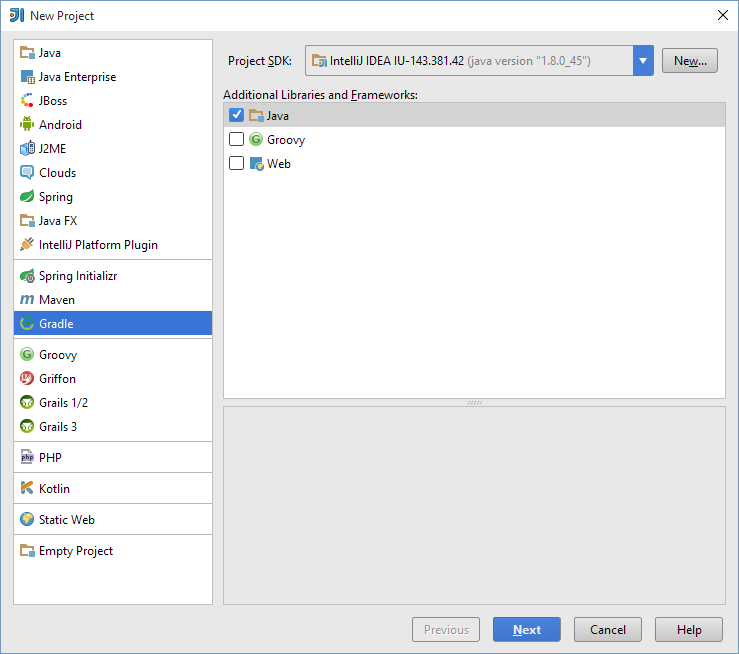
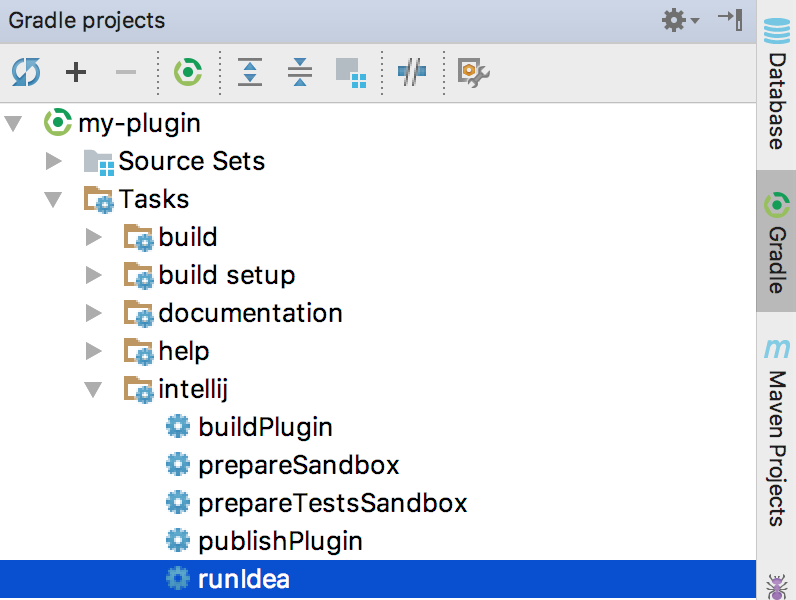

<!-- Copyright 2000-2020 JetBrains s.r.o. and other contributors. Use of this source code is governed by the Apache 2.0 license that can be found in the LICENSE file. -->

Gradle is the preferred solution for creating IntelliJ Platform plugins.
The IntelliJ IDEA Ultimate and Community editions bundle the necessary plugins to support Gradle-based development.
These IntelliJ IDEA plugins are _Gradle_ and _Plugin DevKit_, which are enabled by default.
To verify these plugins are installed and enabled, see the help section about [Managing Plugins](https://www.jetbrains.com/help/idea/managing-plugins.html).

> **TIP** [IntelliJ Platform Plugin Template](https://github.com/JetBrains/intellij-platform-plugin-template) makes it easier to create and maintain your IDE plugins, having the Gradle plugin already integrated and CI covered with GitHub Actions.

> **WARNING** When adding additional repositories to your Gradle build script, make sure to always use HTTPS protocol.

* bullet list
{:toc}

## Creating a Gradle-Based IntelliJ Platform Plugin with New Project Wizard
Creating new Gradle-based IntelliJ Platform plugin projects is performed using the [New Project Wizard](https://www.jetbrains.com/help/idea/gradle.html#project_create_gradle).
The Wizard creates all the necessary project files based on a few template inputs.

Before creating a new Gradle project, familiarize yourself with the help topic [Creating a new Gradle project](https://www.jetbrains.com/help/idea/getting-started-with-gradle.html#create_gradle_project), which is a tutorial for creating general Gradle projects in IntelliJ IDEA.
This page emphasizes the steps in the process for creating IntelliJ Platform plugin projects that are Gradle-based.

> **WARNING** Please note that Gradle 6.1 has a [known bug](https://github.com/gradle/gradle/issues/11966) that prevents using it for developing plugins, please upgrade to 6.1.1 or later.

Launch the [New Project Wizard](https://www.jetbrains.com/help/idea/gradle.html#project_create_gradle).
It guides you through the Gradle project creation process with two screens.

### New Project Configuration Screen
On the first screen, the type of project is configured:
* From the _project type_ pane on the left, choose _Gradle_.
* Specify the _Project SDK_ based on the **Java 8** JDK. 
  This SDK will be the default JRE used to run Gradle, and the JDK version used to compile the plugin Java sources.
* In the _Additional Libraries and Frameworks_ panel, select _Java_ and _IntelliJ Platform Plugin_.
  These settings will be used for the remainder of this tutorial.

Optionally:
  * To include support for the Kotlin language in the plugin, check the _Kotlin/JVM_ box (circled in green below).
    This option can be selected with or without the _Java_ language. See [Kotlin for Plugin Developers](/tutorials/kotlin.md) for more information.
  * To create the `build.gradle` file as a Kotlin build script (`build.gradle.kts`) rather than Groovy, check the _Kotlin DSL build script_ box (circled in magenta below).

Then click _Next_:

{:width="800px"}

### Project Naming/Artifact Coordinates Screen
Expand _Artifact Coordinates_ section and specify a [GroupId, ArtifactId, and Version](https://www.jetbrains.com/help/idea/gradle.html#project_create_gradle) using [Maven naming](https://maven.apache.org/guides/mini/guide-naming-conventions.html) conventions.
* _GroupId_ is typically a Java package name, and it is used for the Gradle property `project.group` value in the project's `build.gradle` file.
  For this example, enter `com.your.company`.
* _ArtifactId_ is the default name of the project JAR file (without version).
  It is also used for the Gradle property `rootProject.name` value in the project's `settings.gradle` file.
  For this example, enter `my_gradle_plugin`.
* _Version_ is used for the Gradle property `project.version` value in the `build.gradle` file. 
  For this example, enter `1.0`.

The _Name_ field is synced automatically with the specified _ArtifactId_.

Specify the path for the new project in _Location_ and click _Finish_ to continue and generate the project. 


### Components of a Wizard-Generated Gradle IntelliJ Platform Plugin
For the [example](#creating-a-gradle-based-intellij-platform-plugin-with-new-project-wizard) `my_gradle_plugin`, the New Project Wizard creates the following directory content:

```text
my_gradle_plugin
├── build.gradle
├── gradle
│   └── wrapper
│       ├── gradle-wrapper.jar
│       └── gradle-wrapper.properties
├── gradlew
├── gradlew.bat
├── settings.gradle
└── src
    ├── main
    │   ├── java
    │   └── resources
    │       └── META-INF
    │           └── plugin.xml
    └── test
        ├── java
        └── resources
```

* The default IntelliJ Platform `build.gradle` file (see next paragraph).
* The Gradle Wrapper files, and in particular the `gradle-wrapper.properties` file, which specifies the version of Gradle to be used to build the plugin.
  If needed, the IntelliJ IDEA Gradle plugin downloads the version of Gradle specified in this file.
* The `settings.gradle` file, containing a definition of the `rootProject.name`.
* The `META-INF` directory under the default `main` [SourceSet](https://docs.gradle.org/current/userguide/java_plugin.html#sec:java_project_layout) contains the plugin [configuration file](/basics/plugin_structure/plugin_configuration_file.md).


The generated `my_gradle_plugin` project `build.gradle` file:

```groovy
  plugins {
      id 'java'
      id 'org.jetbrains.intellij' version '0.4.21'
  }
  
  group 'com.your.company'
  version '1.0' 
  sourceCompatibility = 1.8
  
  repositories {
      mavenCentral()
  } 
  dependencies {
      testImplementation group: 'junit', name: 'junit', version: '4.12'
  }
  
  // See https://github.com/JetBrains/gradle-intellij-plugin/
  intellij {
      version '2020.1'
  }
  patchPluginXml {
      changeNotes """
        Add change notes here.<br>
        <em>most HTML tags may be used</em>"""
  }
```

* Two plugins to Gradle are explicitly declared:
  * The [Gradle Java](https://docs.gradle.org/current/userguide/java_plugin.html) plugin.
  * The [gradle-intellij-plugin](https://github.com/JetBrains/gradle-intellij-plugin/).
* The _GroupId_ from the Wizard [Project Naming/Artifact Coordinates Screen](#project-namingartifact-coordinates-screen) is the `project.group` value.
* The _Version_ from the Wizard [Project Naming/Artifact Coordinates Screen](#project-namingartifact-coordinates-screen) is the `project.version` value.
* The `sourceCompatibility` line is injected to enforce using Java 8 JDK to compile Java sources.
* The only comment in the file is a link to the [README.md](https://github.com/JetBrains/gradle-intellij-plugin/blob/master/README.md) for the gradle-intellij-plugin, which is a reference for its configuration DSL.
* The value of the Setup DSL attribute `intellij.version` specifies the version of the IntelliJ Platform to be used to build the plugin.
  It defaults to the version of IntelliJ IDEA that was used to run the New Project Wizard.
* The value of the Patching DSL attribute `patchPluginXml.changeNotes` is set to a place holder text.


#### Plugin Gradle Properties and Plugin Configuration File Elements
The Gradle properties `rootProject.name` and `project.group` will not, in general, match the respective [plugin configuration file](/basics/plugin_structure/plugin_configuration_file.md) `plugin.xml` elements `<name>` and `<id>`.
There is no IntelliJ Platform-related reason they should as they serve different functions.

The `<name>` element (used as the plugin's display name) is often the same as `rootProject.name`, but can be more explanatory.

The `<id>` value must be a unique identifier over all plugins, typically a concatenation of the specified _GroupId_ and _ArtifactId_.
Please note that it is impossible to change the `<id>` of a published plugin without losing automatic updates for existing installations.

## Adding Gradle Support to an Existing DevKit-Based IntelliJ Platform Plugin
Converting a [DevKit-based](/basics/getting_started/using_dev_kit.md) plugin project to a Gradle-based plugin project can be done using the New Project Wizard to create a Gradle-based project around the existing DevKit-based project: 
* Ensure the directory containing the DevKit-based IntelliJ Platform plugin project can be fully recovered if necessary.
* Delete all the artifacts of the DevKit-based project:
  * `.idea` directory
  * `[modulename].iml` file
  * `out` directory
* Arrange the existing source files within the project directory in Gradle [SourceSet](https://docs.gradle.org/current/userguide/java_plugin.html#sec:java_project_layout) format. 
* Use the New Project Wizard as though creating a [new Gradle project](#creating-a-gradle-based-intellij-platform-plugin-with-new-project-wizard) from scratch.
* On the [Project Naming/Artifact Coordinates Screen](#project-namingartifact-coordinates-screen) set the values to:
  * _GroupId_ to the existing package in the initial source set.
  * _ArtifactId_ to the name of the existing plugin.
  * _Version_ to the same as the existing plugin.
  * _Name_ to the name of the existing plugin. 
    (It should be pre-filled from the _ArtifactId_)
  * Set the _Location_ to the directory of the existing plugin.
* Click _Finish_ to create the new Gradle-based plugin.
* [Add more modules](https://www.jetbrains.com/help/idea/gradle.html#gradle_add_module) using Gradle [_Source Sets_](https://www.jetbrains.com/help/idea/gradle.html#gradle_source_sets) as needed.


## Running a Simple Gradle-Based IntelliJ Platform Plugin
Gradle projects are run from the IDE's Gradle Tool window.

### Adding Code to the Project
Before running [`my_gradle_project`](#components-of-a-wizard-generated-gradle-intellij-platform-plugin), some code could be added to provide simple functionality.
See the [Creating Actions](/tutorials/action_system/working_with_custom_actions.md) tutorial for step-by-step instructions for adding a menu action. 

### Executing the Plugin 
Open the Gradle tool window and search for the `runIde` task: 
* If it’s not in the list, hit the [Refresh](https://www.jetbrains.com/help/idea/jetgradle-tool-window.html#1eeec055) button at the top of the Gradle window. 
* Or [Create a new Gradle Run Configuration](https://www.jetbrains.com/help/idea/create-run-debug-configuration-gradle-tasks.html).
  
{:width="398px"}
   
Double-click on the _runIde_ task to execute it.
See the IntelliJ IDEA help for more information about [Working with Gradle tasks](https://www.jetbrains.com/help/idea/gradle.html#96bba6c3).

Finally, when `my_gradle_plugin` launches in the IDE development instance, there should be a new menu under the **Tools** menu. 
