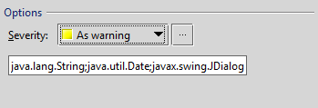
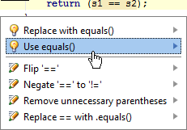

<!-- Copyright 2000-2020 JetBrains s.r.o. and other contributors. Use of this source code is governed by the Apache 2.0 license that can be found in the LICENSE file. -->

The IntelliJ Platform provides tools designed for static code analysis called _code inspections_, which help the user maintain and clean up code without actually executing it.
Custom code inspections can be implemented as IntelliJ Platform plugins.
Examples of the plugin approach are the IntelliJ Platform SDK code samples [inspection_basics](https://github.com/JetBrains/intellij-sdk-docs/tree/master/code_samples/inspection_basics) and [comparing_references_inspection](https://github.com/JetBrains/intellij-sdk-docs/tree/master/code_samples/comparing_references_inspection).
In addition, the comparing_references_inspection code sample demonstrates implementing a unit test.

You can also create custom inspections through the IntelliJ IDEA user interface.
See [Code Inspection](https://www.jetbrains.com/idea/webhelp/code-inspection.html) and [Creating Custom Inspections](https://www.jetbrains.com/idea/help/creating-custom-inspections.html) for more information. 

## Creating an Inspection Plugin

The [comparing_references_inspection](https://github.com/JetBrains/intellij-sdk-docs/tree/master/code_samples/comparing_references_inspection) code sample adds a new inspection to the **Java | Probable Bugs** group in the [Inspections list](https://www.jetbrains.com/help/idea/inspections-settings.html).
The inspection reports when the `==` or `!=` operator is used between Java expressions of reference types.  
It illustrates the components for a custom inspection plugin:
* Describing an [inspection](#plugin-configuration-file) in the plugin configuration file. 
* Implementing a [local inspection class](#inspection-implementation-java-class) to inspect Java code in the IntelliJ Platform-based IDE editor.
* Creating a [visitor](#visitor-implementation-class) to traverse the `PsiTree` of the Java file being edited, inspecting for problematic syntax.
* Implementing a [quick fix](#quick-fix-implementation) class to correct syntax problems by altering the `PsiTree` as needed.
  Quick fixes are displayed to the user like [intentions](code_intentions.md).
* Implementing an [inspection preferences panel](#inspection-preferences-panel) to display information about the inspection.
* Writing an HTML [description](#inspection-description) of the inspection for display in the inspection preferences panel.
* Optionally, create a [unit test](#inspection-unit-test) for the plugin.

Although the IntelliJ Platform SDK code samples illustrate implementations of these components, it is often useful to see examples of inspections implemented in the _intellij_community_ code base.
This process can help find inspection descriptions and implementations based on what is visible in the IDE UI.
The overall approach works for inspections aimed at other languages as well. 
* Find an existing inspection that is similar to the one you want to implement in the **Preferences | Editor | Inspections** panel.
  Note the display name of the inspection.
  For example, the Java/Probable Bugs inspection "Object comparison using '==', instead of 'equals()'" is very similar to `comparing_references_inspection`.
* Use the display name text as the [target for a search](https://www.jetbrains.com/help/idea/finding-and-replacing-text-in-project.html) within the _intellij_community_ project.
  This will identify a bundle file if the display name is localized.
  If it is not localized, the search finds either the plugin configuration (`plugin.xml`) file where it is an attribute in the inspection description, or the Java implementation file where it provided by an overridden method.
* In the case of localization, copy the key from the bundle file identified by the search.
  * Use the key text as the target for a search within the _intellij_community_ project.
    This search locates the plugin configuration file that describes the inspection.
  * From the inspection description entry find the `implementationClass` attribute value.
* Use the `implementationClass` text as the [target of a class search](https://www.jetbrains.com/help/idea/searching-everywhere.html#Searching_Everywhere.xml) in the _intellij_community_ codebase to find the Java implementation file.

## Creating an Inspection
The [comparing_references_inspection](https://github.com/JetBrains/intellij-sdk-docs/tree/master/code_samples/comparing_references_inspection) code sample reports when the `==` or `!=` operators are used between Java expressions of reference types.
The user can apply a quick fix to change `a==b` to `a.equals(b)`, or `a!=b` to `!a.equals(b)`.
  
The details of the `comparing_references_inspection` implementation illustrate the components of an inspection plugin.

### Plugin Configuration File
The `comparing_references_inspection` is described as a `<localInspection>` type within the `<extensions>` elements in the `comparing_references_inspection` plugin configuration ([`plugin.xml`](https://github.com/JetBrains/intellij-sdk-docs/tree/master/code_samples/comparing_references_inspection/src/main/resources/META-INF/plugin.xml)) file.
Under the hood, inspection types are described as an `<extensionPoint>` in [`LangExtensionPoints.xml`](upsource:///platform/platform-resources/src/META-INF/LangExtensionPoints.xml):
* The `localInspection` type is used for inspections that operate on one file at a time, and also operate as the user edits the file.
* The `globalInspection` type is used for inspections that operate across multiple files, and the associated fix might, for example, refactor code between files.
* The `inspectionToolProvider` type is not deprecated but `localInspection` is preferred.

The minimum inspection description must contain the `implementationClass` attribute.
As shown in the `comparing_references_inspection` plugin configuration file, other attributes can be defined in the `localInspection` element, either with or without localization. 
In most cases, it is simplest to define the attributes in the plugin configuration file because the underlying parent classes handle most of the class responsibilities based on the configuration file description.
Note that some attributes are not displayed to the user, so they are never localized.

As an alternative, inspections can define all of the attribute information (except `implementationClass`) by overriding methods in the inspection implementation class.

### Inspection Implementation Java Class  
Inspection implementations for Java files, like [`ComparingReferencesInspection`](https://github.com/JetBrains/intellij-sdk-docs/tree/master/code_samples/comparing_references_inspection/src/main/java/org/intellij/sdk/codeInspection/ComparingReferencesInspection.java), are often based on the Java class [`AbstractBaseJavaLocalInspectionTool`](upsource:///java/java-analysis-api/src/com/intellij/codeInspection/AbstractBaseJavaLocalInspectionTool.java).
The `AbstractBaseJavaLocalInspectionTool` implementation class offers methods to inspect Java classes, fields, and methods.

More generally, `localInspection` types are based on the class [`LocalInspectionTool`](upsource:///platform/analysis-api/src/com/intellij/codeInspection/LocalInspectionTool.java).
Examining the class hierarchy for `LocalInspectionTool` shows that the IntelliJ Platform provides many child inspection classes for a variety of languages and frameworks.
One of these classes is a good basis for a new inspection implementation, but a bespoke implementation can also be based directly on `LocalInspectionTool`.

The primary responsibilities of the inspection implementation class are to provide:
* A `PsiElementVisitor` object to traverse the `PsiTree` of the file being inspected.
* A `LocalQuickFix` class to change the syntax of an identified problem.
* A `JPanel` to be displayed in the _Inspections_ dialog.

Note that if an inspection's description in the plugin configuration file defines only the implementation class, then the other attribute information has to be supplied by overriding methods in the Java implementation.

The `ComparingReferencesInspection` class defines two `String` fields:
* `QUICK_FIX_NAME` defines the string users see when prompted to apply the quick fix.
* `CHECKED_CLASSES` holds a list of class names of interest to the inspection.

The overridden `ComparingReferencesInspection` methods are discussed in the sections below.

### Visitor Implementation Class
The visitor class evaluates whether elements of the file's `PsiTree` are of interest to an inspection.

The `ComparingReferencesInspection.buildVisitor()` method creates an anonymous visitor class based on [`JavaElementVisitor`](upsource:///java/java-psi-api/src/com/intellij/psi/JavaElementVisitor.java) to traverse the `PsiTree` of the Java file being edited, inspecting for suspect syntax.
The anonymous class overrides three methods in particular. 
* `visitReferenceExpression()` to prevent any duplicate visitation of reference-type expressions.
* `visitBinaryExpression()`, which does all the heavy lifting.
  It is called to evaluate a `PsiBinaryExpression`, and it checks to see if the operands are `==` or `!=`, and if the operands are classes relevant to this inspection.
* `isCheckedType()` evaluates the `PsiType` of the operands to determine if they are of interest to this inspection.

### Quick Fix Implementation
The quick fix class acts much like an intention, allowing the user to change the portion of `PsiTree` highlighted by the inspection.
A quick fix is invoked when the inspection highlights a `PsiElement` of interest and the user elects to make a change.

The `ComparingReferencesInspection` implementation uses the nested class `CriQuickFix` to implement a quick fix based on [`LocalQuickFix`](upsource:///platform/analysis-api/src/com/intellij/codeInspection/LocalQuickFix.java).
The `CriQuickFix` class gives a user the option to change the use of `a == b` and `a != b` expression to `a.equals(b)` and `!a.equals(b)` respectively.

The heavy lifting is done in `CriQuickFix.applyFix()`, which manipulates the `PsiTree` to convert the expressions.
The change to the `PsiTree` is accomplished by the usual approach to modification:
* Getting a `PsiElementFactory`.
* Creating a new `PsiMethodCallExpression`.
* Substituting the original left and right operands into the new `PsiMethodCallExpression`.
* Replacing the original binary expression with the `PsiMethodCallExpression`.

### Inspection Preferences Panel
The inspection preferences panel is used to display information about the inspection.

The panel created by `ComparingReferencesInspection.createOptionsPanel()` just defines a single `JTextField` to display in a `JPanel`.
This `JPanel` gets added to the default IntelliJ Platform _Inspections Preferences_ dialog when the `comparing_references_inspection` short name is selected.
The `JTextField` allows editing of the `CHECKED_CLASSES` field while displayed in the panel.

Note that the IntelliJ Platform provides most of the UI displayed in the _Inspections Preferences_ panel.
As long as the inspection attributes and inspection description are defined correctly, the IntelliJ Platform displays the information in the _Inspections Preferences_ UI.

### Inspection Description
The inspection description is an HTML file. 
The description is displayed in the upper right panel of the _Inspections Preferences_ dialog when an inspection is selected from the list.
  
Implicit in using [`LocalInspectionTool`](upsource:///platform/analysis-api/src/com/intellij/codeInspection/LocalInspectionTool.java) in the class hierarchy of the inspection implementation means following some conventions.
* The inspection description file is expected to be located under `<plugin root dir>/resources/inspectionDescriptions/`.
  If the inspection description file is to be located elsewhere, override `getDescriptionUrl()` in the inspection implementation class.
* The name of the description file is expected to be the inspection `<short name>.html` as provided by the inspection description or the inspection implementation class.
  If a short name is not provided by the plugin, the IntelliJ Platform computes one.
  
### Inspection Unit Test
> **NOTE** Please note that running the test requires setting system property `idea.home.path` in `test {}` block of `build.gradle`

The `comparing_references_inspection` code sample provides a unit test for the inspection.
See the [Testing Plugins](/basics/testing_plugins/testing_plugins.md) section for general information about plugin testing.

The `comparing_references_inspection` test is based on the [`UsefulTestCase`](upsource:///platform/testFramework/src/com/intellij/testFramework/UsefulTestCase.java) class, part of the JUnit framework APIs.
This class handles much of the underlying boilerplate for tests.

By convention, the folder `<project root>/testData/` contains the test files.
The folder contains pairs of files for each test using the name convention `*.java` and `*.after.java`.

In the case of `comparing_references_inspection` the test files are `Eq.java` / `Eq.after.java`, and `Neq.java` / `Neq.after.java`.

The `comparing_references_inspection` tests run the inspection on the `*.java` files, implement the quick fix, and compare the results with the respective `*.after.java` files.


## Running the Comparing References Inspection Code Sample
The [comparing_references_inspection](https://github.com/JetBrains/intellij-sdk-docs/tree/master/code_samples/comparing_references_inspection) code sample adds a new inspection to the **Java | Probable Bugs** group in the [Inspections list](https://www.jetbrains.com/help/idea/inspections-settings.html).
The inspection reports when the `==` or `!=` operator is used between Java expressions of reference types.  

To run the sample plugin:
* Start **IntelliJ IDEA**, open the `intellij-sdk-docs` project, and highlight the [comparing_references_inspection](https://github.com/JetBrains/intellij-sdk-docs/tree/master/code_samples/comparing_references_inspection) module.
* Open the [Project Structure](https://www.jetbrains.com/help/idea/project-structure-dialog.html) dialog and ensure that the project settings are valid for your environment.
* If necessary, modify the [Run/Debug Configurations](https://www.jetbrains.com/idea/webhelp/run-debug-configuration-plugin.html) for the `comparing_references_inspection` module.
* Run the plugin by choosing **Run** on the main menu.

### Configuring the Plugin

Once the plugin is launched, you can set the plugin options. 
You can specify the Java classes to participate in the code inspection and the severity level of the found probable bugs.

On the IDEA main menu, open the **Preferences | Editor | Inspections** dialog. 
In the list of the IntelliJ IDEA _Java_ inspections, expand the _Probable bugs_ node, and then click _SDK: '==' or '!=' instead of 'equals()'_.  



Under **Options**, you can specify the following plugin settings:
* From the **Severity** list, select the severity level of probable bugs the plugin finds such as Warning, Info, etc.
* In the text box under **Severity**, specify the semicolon separated list of Java classes to participate in this code inspection.
* When finished, click **OK**.

### How does it work?

The plugin inspects your code opened in the IntelliJ IDEA editor or the code you are typing. 
The plugin highlights the code fragments where two variables of the reference type are separated by `==` or `!=` and proposes to replace this code fragment with `.equals()`:



In this example, the `str1` and `str2` are variables of the String type. 
Clicking _SDK: Use equals()_ replaces:

```java
return (str1==str2);
```

with the code:

```java
return (str1.equals(str2));
```
