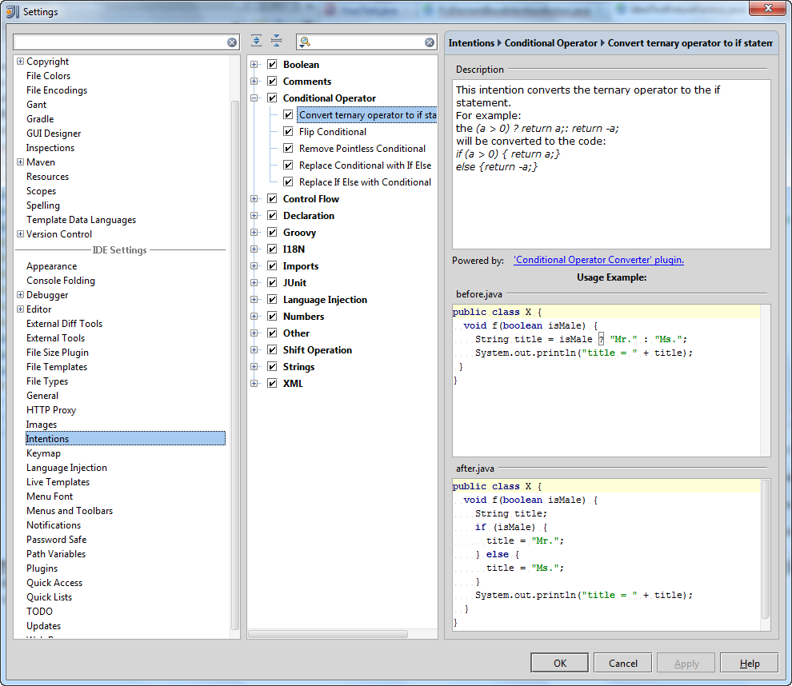
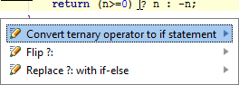

<!-- Copyright 2000-2020 JetBrains s.r.o. and other contributors. Use of this source code is governed by the Apache 2.0 license that can be found in the LICENSE file. -->

This topic describes the [conditional_operator_intention](https://github.com/JetBrains/intellij-sdk-docs/tree/master/code_samples/conditional_operator_intention), a sample plugin that adds a new [intention action](https://www.jetbrains.com/help/idea/intention-actions.html) to the IntelliJ Platform Intentions list. 
In addition, the sample plugin contains a JUnit-based test.

## About Intention Actions

The **IntelliJ Platform** analyzes your code and helps handle situations that may result in errors. 
When a possible problem is suspected, the IDE suggests an appropriate intention action, denoted with special icons. 
For more information, refer to [Intention Actions](https://www.jetbrains.com/help/idea/intention-actions.html) in the **IntelliJ IDEA** Web Help. 

You can view a list of all available intention actions using the [Intention List](https://www.jetbrains.com/help/idea/intention-actions.html#intention-settings) provided by the IDE.

**To display Intention List**

1. Open the **Settings** dialog box.
2. Under **IDE Settings**, click **Intentions**. This displays the list of all intention actions currently available in **IntelliJ IDEA**.
- The intention actions are grouped according to the areas of their use.  
- To enable/disable an intention action, select/deselect the check box to its left.

## Techniques Used

The [conditional_operator_intention](https://github.com/JetBrains/intellij-sdk-docs/tree/master/code_samples/conditional_operator_intention) sample plugin illustrates the use of the following techniques:

- How to analyze a [PSI tree](/basics/architectural_overview/psi_files.md).
- How to find a Java token of interest in the PSI tree.
- How to invoke a quick fix action for a token element under cursor using the [`PsiElementBaseIntentionAction`](upsource:///platform/lang-api/src/com/intellij/codeInsight/intention/PsiElementBaseIntentionAction.java) class.
- How to create a JUnit test for this plugin using the [`IdeaTestFixtureFactory`](upsource:///platform/testFramework/src/com/intellij/testFramework/fixtures/IdeaTestFixtureFactory.java) class.

## Sample Plugin

The **ConditionalOperatorConverter** sample plugin is available in the `<%IntelliJ SDK Docs project%>/code_samples/conditional_operator_intention` directory. 
When launched, this plugin adds the **Convert ternary operator if statement** item to the **Conditional Operator** node in the IDEA Intentions list:



#### Running the Plugin

**To run the sample plugin**

1. Start **IntelliJ IDEA** and open the **conditionalOperatorConvertor** plugin project saved into the `<%IntelliJ SDK Docs project%>/code_samples/conditional_operator_intention` directory.
2. Open the [Project Structure](https://www.jetbrains.com/help/idea/project-structure-dialog.html) dialog and ensure that the project settings are valid for your environment.
3. If necessary, modify the [Run/Debug Configurations](https://www.jetbrains.com/idea/webhelp/run-debug-configuration-plugin.html) and Run the plugin by choosing the **Run** on the main menu.

#### How does it work?

The plugin analyzes symbols under the cursor in your code opened in the IDEA editor. 
If the cursor is positioned on the "?" conditional operator, **IntelliJ IDEA** proposes to replace this conditional (ternary) operator with the "if-then-else" statement:



In this example, the code:

```java
return (n>=0) ? n : -n;
```

will be replaced with the code:

```java
if ((n>=0)) {
    return n;
} else {
    return -n;
}
```

##### Testing the Plugin
> **NOTE** Please note that running the test requires setting system property `idea.home.path` in `test {}` block of `build.gradle`

The sample plugin contains the `ConditionalOperatorConverterTest` Java class and the test data in the `test/testData/` directory. 
To perform the plugin test, run the `ConditionalOperatorConverterTest.testIntention()` method.

For detailed information about testing and all related procedures, refer to [Testing](https://www.jetbrains.com/help/idea/performing-tests.html) in the **IntelliJ IDEA** Web Help.
