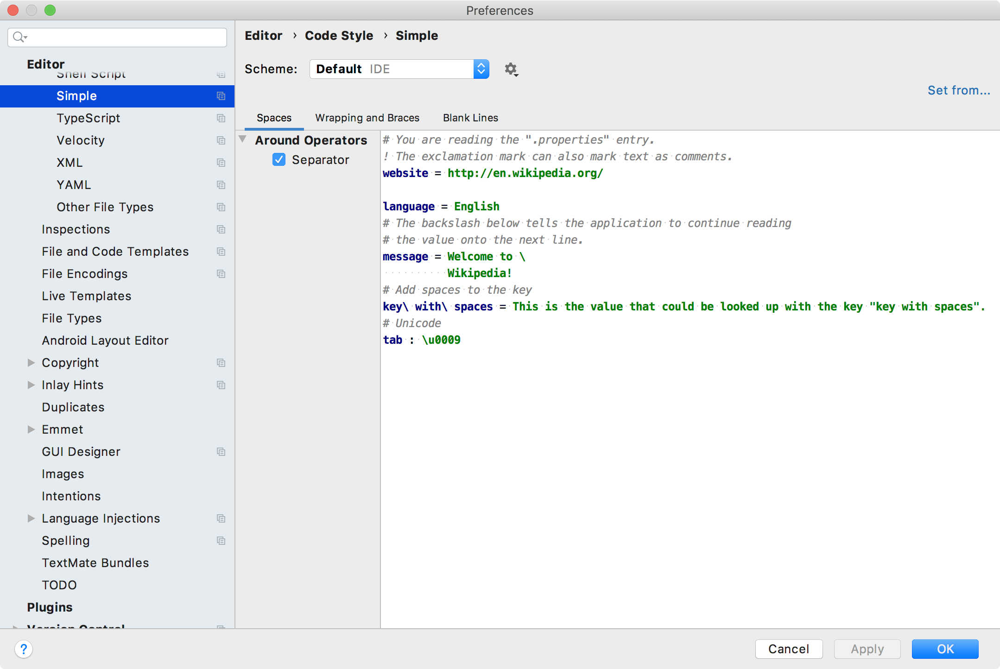

<!-- Copyright 2000-2020 JetBrains s.r.o. and other contributors. Use of this source code is governed by the Apache 2.0 license that can be found in the LICENSE file. -->

Code style settings enable defining formatting options. 
A code style settings provider creates an instance of the settings and also creates an options page in settings/preferences. 
This example creates a settings/preferences page that uses the default language code style settings, customized by a language code style settings provider.

**Reference**: [Code Style Settings](/reference_guide/custom_language_support/code_formatting.md#code-style-settings) 

* bullet list
{:toc}

## 16.1. Define Code Style Settings
Define a code style settings for Simple Language by subclassing [`CustomCodeStyleSettings`](upsource:///platform/lang-api/src/com/intellij/psi/codeStyle/CustomCodeStyleSettings.java).

```java

```

## 16.2. Define Code Style Settings Provider
The code style settings provider gives the IntelliJ Platform a standard way to instantiate `CustomCodeStyleSettings` for the Simple Language. 
Define a code style settings provider for Simple Language by subclassing [`CodeStyleSettingsProvider`](upsource:///platform/lang-api/src/com/intellij/psi/codeStyle/CodeStyleSettingsProvider.java).

```java

```

## 16.3. Register the Code Style Settings Provider
The `SimpleCodeStyleSettingsProvider` implementation is registered with the IntelliJ Platform in the plugin configuration file using the `com.intellij.codeStyleSettingsProvider` extension point. 

```xml
  <extensions defaultExtensionNs="com.intellij">
    <codeStyleSettingsProvider implementation="org.intellij.sdk.language.SimpleCodeStyleSettingsProvider"/>
  </extensions>
```

## 16.4. Define the Language Code Style Settings Provider
Define a code style settings provider for Simple Language by subclassing [`LanguageCodeStyleSettingsProvider`](upsource:///platform/lang-api/src/com/intellij/psi/codeStyle/LanguageCodeStyleSettingsProvider.java), which provides common code style settings for a specific language.

```java

```

## 16.5. Register the Language Code Style Settings Provider
The `SimpleLanguageCodeStyleSettingsProvider` implementation is registered with the IntelliJ Platform in the plugin configuration file using the `com.intellij.langCodeStyleSettingsProvider` extension point. 

```xml
 <extensions defaultExtensionNs="com.intellij">
    <langCodeStyleSettingsProvider 
            implementation="org.intellij.sdk.language.SimpleLanguageCodeStyleSettingsProvider"/>
 </extensions>
```

## 16.6. Run the Project
In the IDE Development Instance, open the Simple Language code formatting page: **Preferences/Settings \| Editor \| Code Style \| Simple**.


