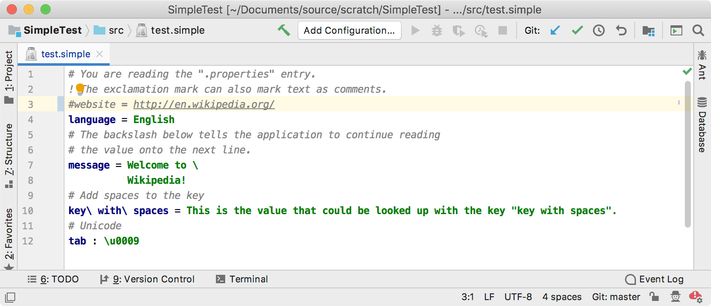

<!-- Copyright 2000-2020 JetBrains s.r.o. and other contributors. Use of this source code is governed by the Apache 2.0 license that can be found in the LICENSE file. -->

A commenter enables the user to comment-out a line of code at the cursor or selected code automatically.
The [`Commenter`](upsource:///platform/core-api/src/com/intellij/lang/Commenter.java) defines support for **Code \| Comment with Line Comment** and **Code \| Comment with Block Comment** actions. 

* bullet list
{:toc}

## 17.1. Define a Commenter
The commenter for Simple Language defines the line comment prefix as `#`.

```java

```

## 17.2. Register the Commenter
The `SimpleCommenter` implementation is registered in the plugin configuration file using the `com.intellij.lang.commenter` extension point. 

```xml
  <extensions defaultExtensionNs="com.intellij">
    <lang.commenter language="Simple" implementationClass="org.intellij.sdk.language.SimpleCommenter"/>
  </extensions>
```

## 17.3. Run the Project
Open the example Simple Language [properties file ](/tutorials/custom_language_support/lexer_and_parser_definition.md#47-run-the-project) in the IDE Development Instance.
Place the cursor at the `website` line.
Select **Code \| Comment with Line Comment**.
The line is converted to a comment.
Select **Code \| Comment with Line Comment** again, and the comment is converted back to active code.


