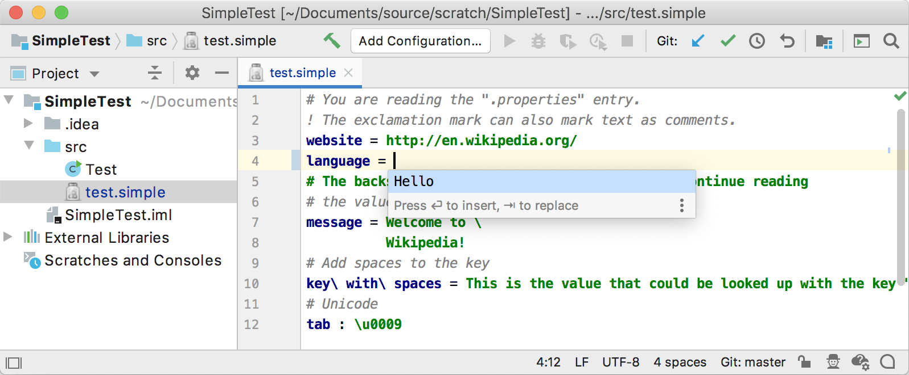

<!-- Copyright 2000-2020 JetBrains s.r.o. and other contributors. Use of this source code is governed by the Apache 2.0 license that can be found in the LICENSE file. -->

Custom languages provide code completion using one of two approaches: Contributor and Reference-based (see [10. Reference Contributor](reference_contributor.md)) completion.

**Reference**: [Code Completion](/reference_guide/custom_language_support/code_completion.md) 

* bullet list
{:toc}

## 9.1. Define a Completion Contributor
For this tutorial, the `simple_language_plugin` provides custom completion for values in Simple Language property files.
Create a completion contributor by subclassing [`CompletionContributor`](upsource:///platform/analysis-api/src/com/intellij/codeInsight/completion/CompletionContributor.java).
This rudimentary completion contributor always adds "Hello" to the results set, regardless of context:

```java

```

## 9.2. Register the Completion Contributor
The `SimpleCompletionContributor` implementation is registered in the plugin configuration file with the IntelliJ Platform using the `com.intellij.completion.contributor` extension point.

```xml
  <extensions defaultExtensionNs="com.intellij">
    <completion.contributor language="Simple" 
            implementationClass="org.intellij.sdk.language.SimpleCompletionContributor"/>
  </extensions>
```

## 9.3. Run the Project
Run the `simple_language_plugin` in a Development Instance and open the [`test.simple`](/tutorials/custom_language_support/lexer_and_parser_definition.md#run-the-project) file.
Erase the property "English" and invoke [Basic Code Completion](https://www.jetbrains.com/help/idea/auto-completing-code.html#invoke-basic-completion). 
The choice "Hello" is shown:


