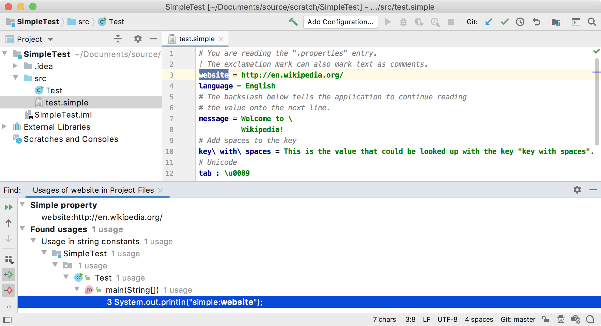

<!-- Copyright 2000-2020 JetBrains s.r.o. and other contributors. Use of this source code is governed by the Apache 2.0 license that can be found in the LICENSE file. -->

A `FindUsagesProvider` uses a word scanner to build an index of words in every file.
A scanner breaks the text into words and defines the context for each word.

**Reference**: [Find Usages](/reference_guide/custom_language_support/find_usages.md) 

* bullet list
{:toc}

## 11.1. Define a Find Usages Provider
The `SimpleFindUsagesProvider` implements [`FindUsagesProvider`](upsource:///platform/indexing-api/src/com/intellij/lang/findUsages/FindUsagesProvider.java). 
Using the [`DefaultWordsScanner`](upsource:///platform/indexing-api/src/com/intellij/lang/cacheBuilder/DefaultWordsScanner.java) ensures the scanner implementation is thread-safe.
See the comments in `FindUsagesProvider` for more information.

```java

```

## 11.2. Register the Find Usages Provider
The `SimpleFindUsagesProvider` implementation is registered with the IntelliJ Platform in the plugin configuration file using the `com.intellij.lang.findUsagesProvider` extension point.

```xml
  <extensions defaultExtensionNs="com.intellij">
    <lang.findUsagesProvider language="Simple" 
            implementationClass="org.intellij.sdk.language.SimpleFindUsagesProvider"/>
  </extensions>
```

## 11.3. Run the Project
Rebuild the project, and run `simple_language_plugin` in a Development Instance.
The IDE now supports [Find Usages](https://www.jetbrains.com/help/idea/find-highlight-usages.html) for any property with a reference:


