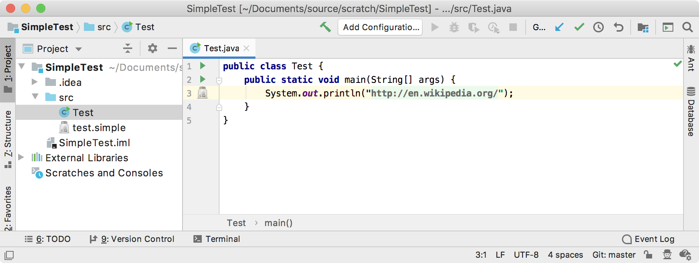

<!-- Copyright 2000-2020 JetBrains s.r.o. and other contributors. Use of this source code is governed by the Apache 2.0 license that can be found in the LICENSE file. -->

A folding builder identifies the folding regions in the code.
In this step of the tutorial, the folding builder is used to identify folding regions and replace the regions with specific text.
Rather than the usual practice of using a folding builder to collapse a class, method, or comments to fewer lines, the folding builder replaces Simple Language keys with their corresponding values.

* bullet list
{:toc}

## 12.1. Define a Folding Builder
The `SimpleFoldingBuilder` replaces usages of properties with their values by default.
Start by subclassing [`FoldingBuilderEx`](upsource:///platform/core-api/src/com/intellij/lang/folding/FoldingBuilderEx.java)

Note that `SimpleFoldingBuilder` also implements [`DumbAware`](upsource:///platform/core-api/src/com/intellij/openapi/project/DumbAware.java), which means the class is allowed to run in dumb mode, when indices are in background update.

> **NOTE** A folding builder must implement [`DumbAware`](upsource:///platform/core-api/src/com/intellij/openapi/project/DumbAware.java) to function in this tutorial and pass tests. 

The `buildFoldRegions()` method searches down a PSI tree from `root` to find all literal expressions containing the [simple prefix](/tutorials/custom_language_support/annotator.md#define-an-annotator) `simple:`.
The remainder of such a string is expected to contain a Simple Language key, and so the text range is stored as a [`FoldingDescriptor`](upsource:///platform/core-api/src/com/intellij/lang/folding/FoldingDescriptor.java).

The `getPlaceholderText()` method retrieves the Simple Language value corresponding to the key associated with the (ASTNode) provided.
The IntelliJ Platform uses the value to substitute for the key when the code gets folded.

```java

```

## 12.2. Register the Folding Builder
The `SimpleFoldingBuilder` implementation is registered with the IntelliJ Platform in the plugin configuration file using the `com.intellij.lang.foldingBuilder` extension point.

```xml
  <extensions defaultExtensionNs="com.intellij">
    <lang.foldingBuilder language="JAVA" 
            implementationClass="org.intellij.sdk.language.SimpleFoldingBuilder"/>
  </extensions>
```

## 12.3. Run the Project
Rebuild the project, and run `simple_language_plugin` in a Development Instance.
Now when a Java file is opened in the Editor, it shows the property's value instead of the key.
This is because `SimpleFoldingBuilder.isCollapsedByDefault()` always returns `true`.
Try using **Code \| Folding \| Expand All** to show the key rather than the value.


