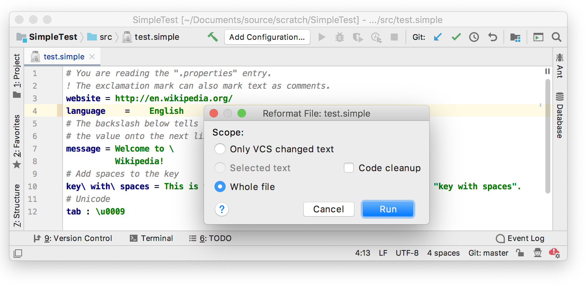

*A formatter allows to reformat the code automatically based on code style settings.*

### 15.1. Define a block

The formatter uses the blocks to receive formatting rules for each PSI element.
Our goal is to cover each PSI element with such block. Since each block builds own children blocks we can generate extra blocks or skip any PSI elements.

```java

```

### 15.2. Define a formatting model builder

Let's define a formatter which removes extra spaces except the single ones around the property separator.

```java

```

### 15.3. Register the formatter

```xml
<lang.formatter language="Simple" implementationClass="com.simpleplugin.SimpleFormattingModelBuilder"/>
```

### 15.4. Run the project

Now add some extra spaces and reformat the code via *⌥⌘L* shortcut.



[Previous](structure_view_factory.md)
[Top](/tutorials/custom_language_support_tutorial.md)
[Next](code_style_settings.md)


