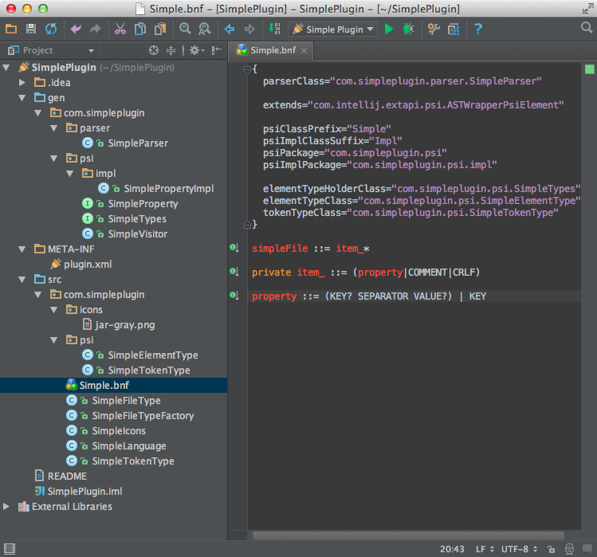

<!-- Copyright 2000-2020 JetBrains s.r.o. and other contributors. Use of this source code is governed by the Apache 2.0 license that can be found in the LICENSE file. -->

In order for the IntelliJ Platform to parse a Simple Language file, tokens and elements must be defined based on [`IElementType`](upsource:///platform/core-api/src/com/intellij/psi/tree/IElementType.java). 
The Simple Language grammar must also be defined to generate a parser.
 
**Reference**: [Implementing a Parser and PSI](/reference_guide/custom_language_support/implementing_parser_and_psi.md) 

* bullet item
{:toc}

## 3.1. Define a Token Type
Create `SimpleTokenType` in the `org.intellij.sdk.language.psi` package (see the `simple_language_plugin` code sample) by subclassing `IElementType`.

```java

```

## 3.2. Define an Element Type
Create the `SimpleElementType` in the `org.intellij.sdk.language.psi` package by subclassing `IElementType`.

```java

```

## 3.3. Define the Grammar
Define a grammar for the Simple Language in the `com/intellij/sdk/language/Simple.bnf` file.

```properties
{
  parserClass="org.intellij.sdk.language.parser.SimpleParser"

  extends="com.intellij.extapi.psi.ASTWrapperPsiElement"

  psiClassPrefix="Simple"
  psiImplClassSuffix="Impl"
  psiPackage="org.intellij.sdk.language.psi"
  psiImplPackage="org.intellij.sdk.language.psi.impl"

  elementTypeHolderClass="org.intellij.sdk.language.psi.SimpleTypes"
  elementTypeClass="org.intellij.sdk.language.psi.SimpleElementType"
  tokenTypeClass="org.intellij.sdk.language.psi.SimpleTokenType"

  psiImplUtilClass="org.intellij.sdk.language.psi.impl.SimplePsiImplUtil"
}

simpleFile ::= item_*

private item_ ::= (property|COMMENT|CRLF)

property ::= (KEY? SEPARATOR VALUE?) | KEY
```

As shown, a properties file can contain properties, comments, and line breaks.

Please see [Grammar Kit](https://github.com/JetBrains/Grammar-Kit) documentation for more details on BNF syntax.

The grammar defines the flexibility of the support for a language.
The above grammar specifies that a property may have or may not have key and value.
This flexibility allows the IntelliJ Platform to recognize incorrectly defined properties and provide corresponding code analysis and quick-fixes.

Note that the `SimpleTypes` class in the `elementTypeHolderClass` field above specifies the name of a class that gets generated from the grammar; it doesn't exist at this point.

## 3.4. Generate a Parser
Now that the grammar is defined generate a parser with PSI classes via **Generate Parser Code** from the context menu on the *Simple.bnf* file.
This step generates a parser and PSI elements in the `/src/main/gen` folder of the project.
Mark this folder as *Generated Sources Root* and make sure everything compiles without errors.

> **TIP** Gradle plugin [gradle-grammarkit-plugin](https://github.com/JetBrains/gradle-grammar-kit-plugin) can be used alternatively.

{:width="800px"}
