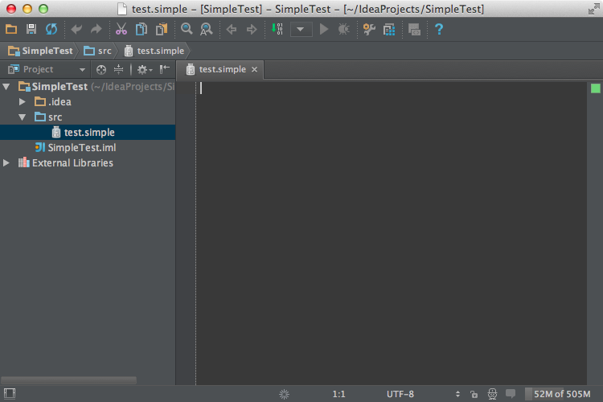

<!-- Copyright 2000-2020 JetBrains s.r.o. and other contributors. Use of this source code is governed by the Apache 2.0 license that can be found in the LICENSE file. -->

The IntelliJ Platform determines file type by examining the name of a file.
Each language has [Language](upsource:///platform/core-api/src/com/intellij/lang/Language.java) and [LanguageFileType](upsource:///platform/core-api/src/com/intellij/openapi/fileTypes/LanguageFileType.java) objects defining the language.
Register the `LanguageFileType` with the IntelliJ Platform in the plugin configuration file. 

**Reference**: [Registering a File Type](/reference_guide/custom_language_support/registering_file_type.md) 

* bullet item
{:toc}

## 2.1. Define the Language
The language implemented in this tutorial is named "Simple" - note the case of the name.
The `SimpleLanguage` class is defined in the `org.intellij.sdk.language` package of the `simple_language_plugin` code sample:

```java

```

## 2.2. Define an Icon
The [icon](https://github.com/JetBrains/intellij-sdk-docs/blob/master/code_samples/simple_language_plugin/src/main/resources/icons/jar-gray.png) for the Simple Language is defined by the `SimpleIcons` class. 
There is nothing uniquely Simple Language-specific about [defining the icon](/reference_guide/work_with_icons_and_images.md) itself.
The definition follows a pattern similar to defining, e.g., `SdkIcons`. 

```java

```

## 2.3. Define a FileType
The Simple Language file type is defined by subclassing [`LanguageFileType`](upsource:///platform/core-api/src/com/intellij/openapi/fileTypes/LanguageFileType.java):

```java

```

## 2.4. Register the FileType Directly
Direct registration is possible when targeting version 2019.2 (and later) of the IntelliJ Platform - no `FileTypeFactory` is required.

Instead, the file type is registered via the `com.intellij.fileType` extension point in `plugin.xml`: 

```xml
  <extensions defaultExtensionNs="com.intellij">
    <fileType name="Simple File" implementationClass="org.intellij.sdk.language.SimpleFileType" 
            fieldName="INSTANCE" language="Simple" extensions="simple"/>
  </extensions>
```

Skip to [section 2.6](#26-run-the-project).

## 2.5. Register the FileType Using a Factory
This pattern is necessary when targeting versions of the IntelliJ Platform prior to 2019.2

### 2.5.1 Define a FileType Factory
First, define `SimpleFileTypeFactory` as a subclass of [`FileTypeFactory`](upsource:///platform/platform-api/src/com/intellij/openapi/fileTypes/FileTypeFactory.java).

```java

```

### 2.5.2 Register the FileType Factory
The `SimpleFileTypeFactory` is registered using the `com.intellij.openapi.fileTypes.FileTypeFactory` extension point in `plugin.xml`.

```xml
  <extensions defaultExtensionNs="com.intellij">
    <fileTypeFactory implementation="org.intellij.sdk.language.SimpleFileTypeFactory"/>
  </extensions>
```

## 2.6. Run the Project
Create an empty file with the extension `*.simple`, and IntelliJ IDEA automatically associates it with our language.
Note the appearance of the Simple Language file icon next to the `test.simple` file in the **Project Tool Window**, and the editor tab for the file.

{:width="800px"}
