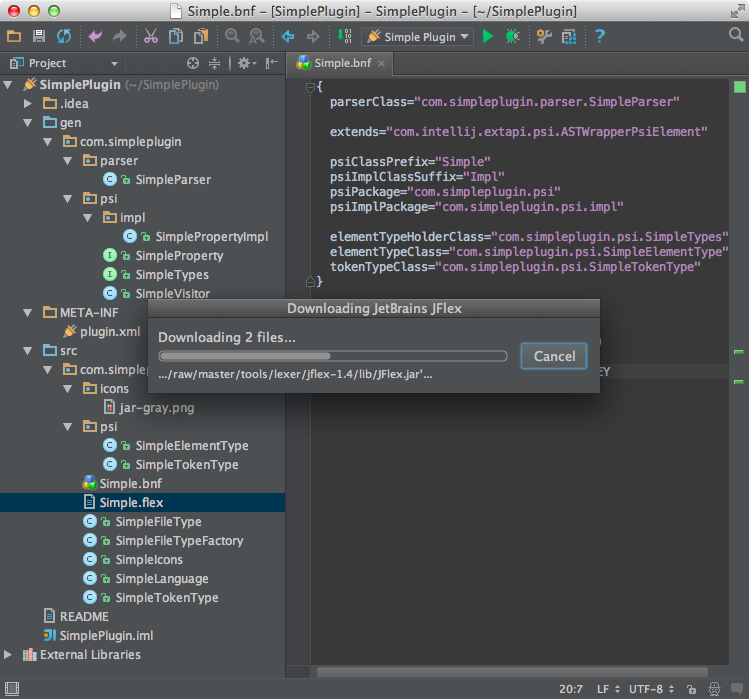

The lexer defines how the contents of a file is broken into tokens.
The easiest way to create a lexer is to use [JFlex](http://jflex.de/)

### 1. Define a lexer

Define */com/simpleplugin/Simple.flex* file with rules for our lexer.

```java
package com.simpleplugin;

import com.intellij.lexer.FlexLexer;
import com.intellij.psi.tree.IElementType;
import com.simpleplugin.psi.SimpleTypes;
import com.intellij.psi.TokenType;

%%

%class SimpleLexer
%implements FlexLexer
%unicode
%function advance
%type IElementType
%eof{  return;
%eof}

CRLF= \n|\r|\r\n
WHITE_SPACE=[\ \t\f]
FIRST_VALUE_CHARACTER=[^ \n\r\f\\] | "\\"{CRLF} | "\\".
VALUE_CHARACTER=[^\n\r\f\\] | "\\"{CRLF} | "\\".
END_OF_LINE_COMMENT=("#"|"!")[^\r\n]*
SEPARATOR=[:=]
KEY_CHARACTER=[^:=\ \n\r\t\f\\] | "\\"{CRLF} | "\\".

%state WAITING_VALUE

%%

<YYINITIAL> {END_OF_LINE_COMMENT}                           { yybegin(YYINITIAL); return SimpleTypes.COMMENT; }

<YYINITIAL> {KEY_CHARACTER}+                                { yybegin(YYINITIAL); return SimpleTypes.KEY; }

<YYINITIAL> {SEPARATOR}                                     { yybegin(WAITING_VALUE); return SimpleTypes.SEPARATOR; }

<WAITING_VALUE> {CRLF}                                     { yybegin(YYINITIAL); return SimpleTypes.CRLF; }

<WAITING_VALUE> {WHITE_SPACE}+                              { yybegin(WAITING_VALUE); return TokenType.WHITE_SPACE; }

<WAITING_VALUE> {FIRST_VALUE_CHARACTER}{VALUE_CHARACTER}*    { yybegin(YYINITIAL); return SimpleTypes.VALUE; }

{CRLF}                                                     { yybegin(YYINITIAL); return SimpleTypes.CRLF; }

{WHITE_SPACE}+                                              { yybegin(YYINITIAL); return TokenType.WHITE_SPACE; }

.                                                           { return TokenType.BAD_CHARACTER; }
```

### 2. Generate a lexer class

Now we can generate a lexer class via *JFlex Generator* from the context menu or via *⌘⇧G* shortcut on Simple.flex file.
The Grammar-Kit plugin uses JFlex lexer generation.
If you run it for the first time it will offer you to choose a folder to download the JFlex library and skeleton to.
Choose the project root directory.



After that the IDE will generates two classes:
*com.simpleplugin.SimpleLexer* and *com.simpleplugin.SimpleLexerAdapter*.

Make sure you've added the corresponding changes to the *com.simpleplugin.SimpleLexerAdapter* class:

```java
package com.simpleplugin;

import com.intellij.lexer.FlexAdapter;

import java.io.Reader;

public class SimpleLexerAdapter extends FlexAdapter {
    public SimpleLexerAdapter() {
        super(new SimpleLexer((Reader) null));
    }
}
```

### 3 Define a file

```java
package com.simpleplugin.psi;

import com.intellij.extapi.psi.PsiFileBase;
import com.intellij.openapi.fileTypes.FileType;
import com.intellij.psi.FileViewProvider;
import com.simpleplugin.SimpleFileType;
import com.simpleplugin.SimpleLanguage;
import org.jetbrains.annotations.NotNull;

import javax.swing.*;

public class SimpleFile extends PsiFileBase {
    public SimpleFile(@NotNull FileViewProvider viewProvider) {
        super(viewProvider, SimpleLanguage.INSTANCE);
    }

    @NotNull
    @Override
    public FileType getFileType() {
        return SimpleFileType.INSTANCE;
    }

    @Override
    public String toString() {
        return "Simple File";
    }

    @Override
    public Icon getIcon(int flags) {
        return super.getIcon(flags);
    }
}
```

### 4. Define a parser definition

```java
package com.simpleplugin;

import com.intellij.lang.ASTNode;
import com.intellij.lang.Language;
import com.intellij.lang.ParserDefinition;
import com.intellij.lang.PsiParser;
import com.intellij.lexer.FlexAdapter;
import com.intellij.lexer.Lexer;
import com.intellij.openapi.project.Project;
import com.intellij.psi.FileViewProvider;
import com.intellij.psi.PsiElement;
import com.intellij.psi.PsiFile;
import com.intellij.psi.TokenType;
import com.intellij.psi.tree.IFileElementType;
import com.intellij.psi.tree.TokenSet;
import com.simpleplugin.parser.SimpleParser;
import com.simpleplugin.psi.SimpleFile;
import com.simpleplugin.psi.SimpleTypes;
import org.jetbrains.annotations.NotNull;

import java.io.Reader;

public class SimpleParserDefinition implements ParserDefinition{
    public static final TokenSet WHITE_SPACES = TokenSet.create(TokenType.WHITE_SPACE);
    public static final TokenSet COMMENTS = TokenSet.create(SimpleTypes.COMMENT);

    public static final IFileElementType FILE = new IFileElementType(Language.<SimpleLanguage>findInstance(SimpleLanguage.class));

    @NotNull
    @Override
    public Lexer createLexer(Project project) {
        return new FlexAdapter(new SimpleLexer((Reader) null));
    }

    @NotNull
    public TokenSet getWhitespaceTokens() {
        return WHITE_SPACES;
    }

    @NotNull
    public TokenSet getCommentTokens() {
        return COMMENTS;
    }

    @NotNull
    public TokenSet getStringLiteralElements() {
        return TokenSet.EMPTY;
    }

    @NotNull
    public PsiParser createParser(final Project project) {
        return new SimpleParser();
    }

    @Override
    public IFileElementType getFileNodeType() {
        return FILE;
    }

    public PsiFile createFile(FileViewProvider viewProvider) {
        return new SimpleFile(viewProvider);
    }

    public SpaceRequirements spaceExistanceTypeBetweenTokens(ASTNode left, ASTNode right) {
        return SpaceRequirements.MAY;
    }

    @NotNull
    public PsiElement createElement(ASTNode node) {
        return SimpleTypes.Factory.createElement(node);
    }
}
```

### 5. Register the parser definition

```xml
<lang.parserDefinition language="Simple" implementationClass="com.simpleplugin.SimpleParserDefinition"/>
```

### 6. Run the project

Create a properties file with the following content:

```
# You are reading the ".properties" entry.
! The exclamation mark can also mark text as comments.
website = http://en.wikipedia.org/
language = English
# The backslash below tells the application to continue reading
# the value onto the next line.
message = Welcome to \
          Wikipedia!
# Add spaces to the key
key\ with\ spaces = This is the value that could be looked up with the key "key with spaces".
# Unicode
tab : \u0009
```

Now open the *PsiViewer* tool window and check how the lexer brake the content of the file into tokens, and the parser parsed the tokens into PSI elements.


----------------

[Previous](grammar_and_parser.html)
[Top](cls_tutorial.html)
[Next](syntax_highlighter_and_color_settings_page.html)

