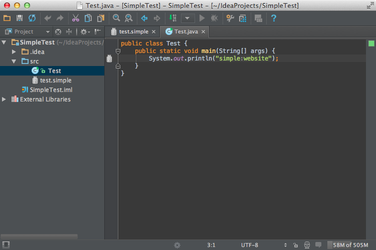

Line markers help to annotate any code with icons on the gutter.
These icons may provide navigation to related code.

### 8.1. Define a line marker provider

Let's annotate usages of our properties within Java code and provide navigation to the definition of these properties.

```java

```

## More technical details for implementers

*  Please return line marker info for exact element you were asked for.
    For example, do not return class marker info if `getLineMarkerInfo()` was called for a method.

*  Please return relevant line marker info for as small element as possible.
     For example, do not return method marker for [`PsiMethod`](upsource:///java/java-psi-api/src/com/intellij/psi/PsiMethod.java). Instead, return it for the [`PsiIdentifier`](upsource:///java/java-psi-api/src/com/intellij/psi/PsiIdentifier.java) which is a name of this method.

### Even more technical details:

What happens when `LineMarkerProvider` returns something for too big PsiElement?

```java
public class MyLineMarkerProvider implements LineMarkerProvider {
  public LineMarkerInfo getLineMarkerInfo(@NotNull PsiElement element) {
    if (element instanceof PsiMethod) return new LineMarkerInfo(element, ...);
    return null;
  }
}
```

Inspection (specifically, [`LineMarkersPass`](upsource:///platform/lang-impl/src/com/intellij/codeInsight/daemon/impl/LineMarkersPass.java)) for performance reasons queries all [`LineMarkerProviders`](upsource:///platform/lang-api/src/com/intellij/codeInsight/daemon/LineMarkerProviders.java) in two passes:

  *  first pass for all elements in visible area

  *  second pass for all the rest elements

If providers return nothing for either area, its line markers are cleared.
So if e.g. a method is half-visible (its name is visible but part of its body isn't) and
some poorly written [`LineMarkerProvider`](upsource:///platform/lang-api/src/com/intellij/codeInsight/daemon/LineMarkerProvider.java) returned info for the `PsiMethod` instead of `PsiIdentifier` then:

  *  the first pass removes line marker info because whole `PsiMethod` is not visible.

  *  the second pass tries to add line marker info back because `LineMarkerProvider` is called for the `PsiMethod` at last.

As a result, line marker icon would blink annoyingly.
To fix this, rewrite `LineMarkerProvider` to return info for `PsiIdentifier` instead of `PsiMethod`:

```java
public class MyLineMarkerProvider implements LineMarkerProvider {
  public LineMarkerInfo getLineMarkerInfo(@NotNull PsiElement element) {
    if (element instanceof PsiIdentifier && element.getParent() instanceof PsiMethod) return new LineMarkerInfo(element, ...);
    return null;
  }
}
```

### 8.2. Register the line marker provider

```xml
<codeInsight.lineMarkerProvider language="JAVA" implementationClass="com.simpleplugin.SimpleLineMarkerProvider"/>
```

### 8.3. Run the project

Now you see the icon on the gutter and can navigate to the property definition.



--------------

[Previous](annotator.md)
[Top](/tutorials/custom_language_support_tutorial.md)
[Next](completion_contributor.md)
