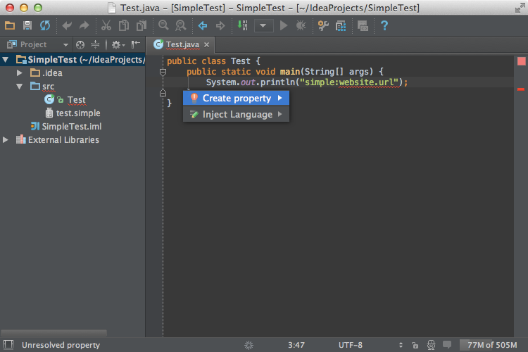
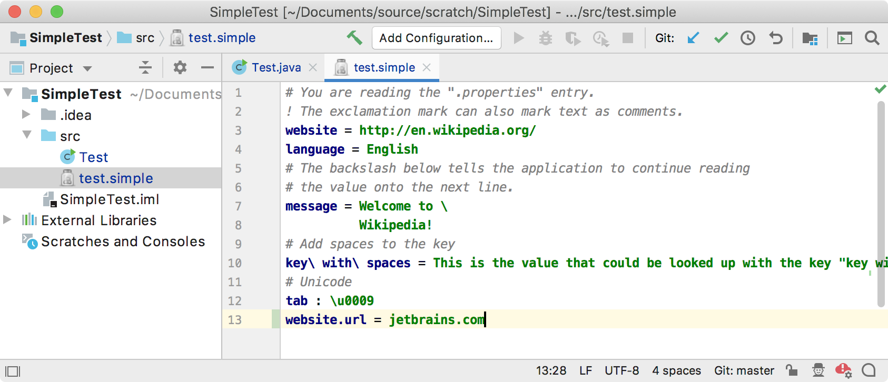

<!-- Copyright 2000-2020 JetBrains s.r.o. and other contributors. Use of this source code is governed by the Apache 2.0 license that can be found in the LICENSE file. -->

A quick fix for a custom language supports the IntelliJ Platform-based IDE feature [Intention Actions](https://www.jetbrains.com/help/idea/intention-actions.html#apply-intention-actions). 
For the Simple Language, this tutorial adds a quick fix that helps to define an unresolved property from its usage.

**Reference**: [Code Inspections and Intentions](/reference_guide/custom_language_support/code_inspections_and_intentions.md) 

* bullet list
{:toc}

## 18.1. Update the Element Factory
The `SimpleElementFactory` is updated to include two new methods to support the user choice of creating a new property for the Simple Language quick fix.
The new `createCRLF()` method supports adding a newline to the end of the [`test.simple`](/tutorials/custom_language_support/lexer_and_parser_definition.md#run-the-project) file before adding a new property. 
A new overload of `createProperty()` creates a new `key`-`value` pair for Simple Language.

```java

```

## 18.2. Define an Intention Action
The `SimpleCreatePropertyQuickFix` creates a property in the file chosen by the user - in this case, a Java file containing a `prefix:key` - and navigate to this property after creation.
Under the hood, `SimpleCreatePropertyQuickFix` is an Intention Action.
For a more in-depth example of an Intention Action, see [`conditional_operator_intention`](https://github.com/JetBrains/intellij-sdk-docs/tree/master/code_samples/conditional_operator_intention). 

```java

```

## 18.3. Update the Annotator
When a `badProperty` annotation is created, the `badProperty.registerFix()` method is called.
This method call registers the `SimpleCreatePropertyQuickFix` as the Intention Action for the Intellij Platform to use to correct the problem. 

```java

```

## 18.4. Run the Project
Open the test [Java file](/tutorials/custom_language_support/annotator.md#run-the-project) in an IDE Development Instance running the `simple_language_plugin`.

To test `SimpleCreatePropertyQuickFix`, change `simple:website` to `simple:website.url`.
The key `website.url` is highlighted by `SimpleAnnotator` as an invalid key, as shown below.
Choose "Create Property". 

{:width="800px"}

The IDE opens the `test.simple` file and adds `website.url` as a new key.
Add the new value `jetbrains.com` for the new `website.url` key.



Now switch back to the Java file; the new key is highlighted as valid. 