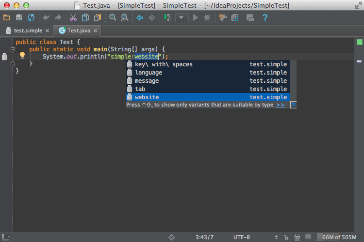
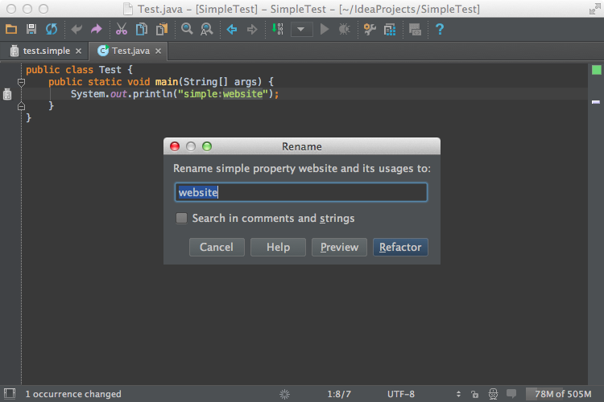
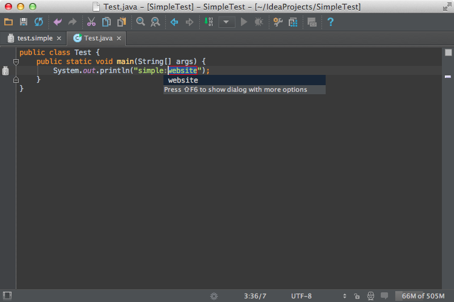

<!-- Copyright 2000-2020 JetBrains s.r.o. and other contributors. Use of this source code is governed by the Apache 2.0 license that can be found in the LICENSE file. -->

The references functionality is one of the most important parts in the implementation of custom language support.
Resolving references means the ability to go from the usage of an element to its declaration, completion, rename refactoring, find usages, etc.

> **NOTE** Every PSI element that can be renamed or referenced needs to implement [`PsiNamedElement`](upsource:///platform/core-api/src/com/intellij/psi/PsiNamedElement.java) interface.

**Reference**: [References and Resolve](/reference_guide/custom_language_support/references_and_resolve.md) 

* bullet list
{:toc}

## 10.1. Define a Named Element Class
The classes below show how the Simple Language fulfills the need to implement `PsiNamedElement`.

The `SimpleNamedElement` interface is subclassed from [`PsiNameIdentifierOwner`](upsource:///platform/core-api/src/com/intellij/psi/PsiNameIdentifierOwner.java).

```java

```
 
The `SimpleNamedElementImpl` class implements the `SimpleNamedElement` interface and extends [`ASTWrapperPsiElement`](upsource:///platform/core-impl/src/com/intellij/extapi/psi/ASTWrapperPsiElement.java).

```java

```
 
## 10.2. Define Helper Methods for Generated PSI Elements
Modify `SimplePsiImplUtil` to support new methods that get added to the PSI class for Simple Language. 
Note that `SimpleElementFactory` isn't defined until the [next step](#define-an-element-factory), so for now it shows as an error.  

```java
public class SimplePsiImplUtil {

  // ...

  public static String getName(SimpleProperty element) {
      return getKey(element);
  }

  public static PsiElement setName(SimpleProperty element, String newName) {
      ASTNode keyNode = element.getNode().findChildByType(SimpleTypes.KEY);
      if (keyNode != null) {

          SimpleProperty property = SimpleElementFactory.createProperty(element.getProject(), newName);
          ASTNode newKeyNode = property.getFirstChild().getNode();
          element.getNode().replaceChild(keyNode, newKeyNode);
      }
      return element;
  }

  public static PsiElement getNameIdentifier(SimpleProperty element) {
      ASTNode keyNode = element.getNode().findChildByType(SimpleTypes.KEY);
      if (keyNode != null) {
          return keyNode.getPsi();
      } else {
          return null;
      }
  }

  // ...
}
```

## 10.3. Define an Element Factory
The `SimpleElementFactory` provides methods for creating `SimpleFile`.

```java
package org.intellij.sdk.language.psi;

import com.intellij.openapi.project.Project;
import com.intellij.psi.*;
import org.intellij.sdk.language.SimpleFileType;

public class SimpleElementFactory {
  public static SimpleProperty createProperty(Project project, String name) {
    final SimpleFile file = createFile(project, name);
    return (SimpleProperty) file.getFirstChild();
  }

  public static SimpleFile createFile(Project project, String text) {
    String name = "dummy.simple";
    return (SimpleFile) PsiFileFactory.getInstance(project).
                createFileFromText(name, SimpleFileType.INSTANCE, text);
  }
}
```

## 10.4. Update Grammar and Regenerate the Parser
Now make corresponding changes to the `Simple.bnf` grammar file by replacing the `property` definition with the lines below.
Don't forget to regenerate the parser after updating the file! 
Right-click on the `Simple.bnf` file and select **Generate Parser Code**.

```java
property ::= (KEY? SEPARATOR VALUE?) | KEY {
  mixin="org.intellij.sdk.language.psi.impl.SimpleNamedElementImpl"
  implements="org.intellij.sdk.language.psi.SimpleNamedElement" 
  methods=[getKey getValue getName setName getNameIdentifier]
}
```

## 10.5. Define a Reference
Now define a reference class to resolve a property from its usage.
This requires extending [`PsiReferenceBase`](upsource:///platform/core-api/src/com/intellij/psi/PsiReferenceBase.java) and implementing [`PsiPolyVariantReference`](upsource:///platform/core-api/src/com/intellij/psi/PsiPolyVariantReference.java). 
The latter enables the reference to resolve to more than one element or to resolve result(s) for a superset of valid resolve cases.

```java

```

## 10.6. Define a Reference Contributor
A reference contributor allows the `simple_language_plugin` to provide references to Simple Language from elements in other languages such as Java.
Create `SimpleReferenceContributor` by subclassing [`PsiReferenceContributor`](upsource:///platform/core-api/src/com/intellij/psi/PsiReferenceContributor.java).
Contribute a reference to each usage of a property:

```java

```

## 10.7. Register the Reference Contributor
The `SimpleReferenceContributor` implementation is registered with the IntelliJ Platform using the `com.intellij.psi.referenceContributor` extension point.

```xml
  <extensions defaultExtensionNs="com.intellij">
    <psi.referenceContributor implementation="org.intellij.sdk.language.SimpleReferenceContributor"/>
  </extensions>
```

## 10.8. Run the Project
Rebuild the project, and run `simple_language_plugin` in a Development Instance.
The IDE now resolves the property and provides [completion](https://www.jetbrains.com/help/idea/auto-completing-code.html#basic_completion) suggestions:

{:width="800px"}

The [Rename refactoring](https://www.jetbrains.com/help/idea/rename-refactorings.html#invoke-rename-refactoring) functionality is now available from definition and usages.

{:width="800px"}

## 10.9. Define a Refactoring Support Provider
Support for in-place refactoring is specified explicitly in a refactoring support provider.
Create `SimpleRefactoringSupportProvider` by subclassing [`RefactoringSupportProvider`](upsource:///platform/lang-api/src/com/intellij/lang/refactoring/RefactoringSupportProvider.java)
As long as an element is a `SimpleProperty` it is allowed to be refactored:

```java

```

## 10.10. Register the Refactoring Support Provider
The `SimpleRefactoringSupportProvider` implementation is registered with the IntelliJ Platform in the plugin configuration file using the `com.intellij.lang.refactoringSupport` extension point.

```xml
  <extensions defaultExtensionNs="com.intellij">
    <lang.refactoringSupport language="Simple"  
            implementationClass="org.intellij.sdk.language.SimpleRefactoringSupportProvider"/>
  </extensions>
```

## 10.11. Run the Project
Rebuild the project, and run `simple_language_plugin` in a Development Instance.
The IDE now supports [refactoring](https://www.jetbrains.com/help/idea/rename-refactorings.html) suggestions:

{:width="800px"}
