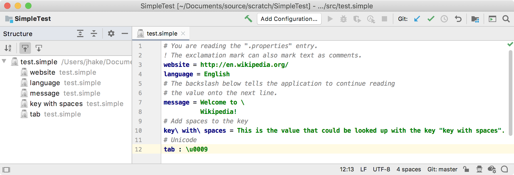

<!-- Copyright 2000-2020 JetBrains s.r.o. and other contributors. Use of this source code is governed by the Apache 2.0 license that can be found in the LICENSE file. -->

The structure view can be customized for a specific file type.
Creating a structure view factory allows showing the structure of any file in a _Structure_ Tool Window for easy navigation between items in the current editor.

**Reference**: [Structure View](/reference_guide/custom_language_support/structure_view.md) 

* bullet list
{:toc}

## 14.1. Define a Structure View Factory
The structure view factory implements [`PsiStructureViewFactory`](upsource:///platform/editor-ui-api/src/com/intellij/lang/PsiStructureViewFactory.java).
The `getStructureViewBuilder()` implementation reuses the IntelliJ Platform class [`TreeBasedStructureViewBuilder`](upsource:///platform/editor-ui-api/src/com/intellij/ide/structureView/TreeBasedStructureViewBuilder.java).
At this point the project will not compile until `SimpleStructureViewModel` is [implemented below](#define-a-structure-view-model).

```java

```

## 14.2. Define a Structure View Model
The `SimpleStructureViewModel` is created by implementing [`StructureViewModel`](upsource:///platform/editor-ui-api/src/com/intellij/ide/structureView/StructureViewModel.java), which defines the model for data displayed in the standard structure view. 
It also extends [`StructureViewModelBase`](upsource:///platform/editor-ui-api/src/com/intellij/ide/structureView/StructureViewModelBase.java), an implementation that links the model to a text editor.

```java

```

## 14.3. Define a Structure View Element
The `SimpleStructureViewElement` implements [`StructureViewTreeElement`](upsource:///platform/editor-ui-api/src/com/intellij/ide/structureView/StructureViewTreeElement.java) and [`SortableTreeElement`](upsource:///platform/editor-ui-api/src/com/intellij/ide/util/treeView/smartTree/SortableTreeElement.java).
The `StructureViewTreeElement` represents an element in the Structure View tree model.
The `SortableTreeElement` represents an item in a smart tree that allows using text other than the presentable text as a key for alphabetic sorting. 

```java

```

## 14.4. Register the Structure View Factory
The `SimpleStructureViewFactory` implementation is registered with the IntelliJ Platform in the plugin configuration file using the `com.intellij.lang.psiStructureViewFactory` extension point.

```xml
  <extensions defaultExtensionNs="com.intellij">
    <lang.psiStructureViewFactory language="Simple" 
            implementationClass="org.intellij.sdk.language.SimpleStructureViewFactory"/>
  </extensions>
```

## 14.5. Run the Project
Rebuild the project, and run `simple_language_plugin` in a Development Instance.
Open the `test.simple` file and choose **View \| Tool Windows \| Structure**.
The IDE now supports a structure view of the Simple Language:


