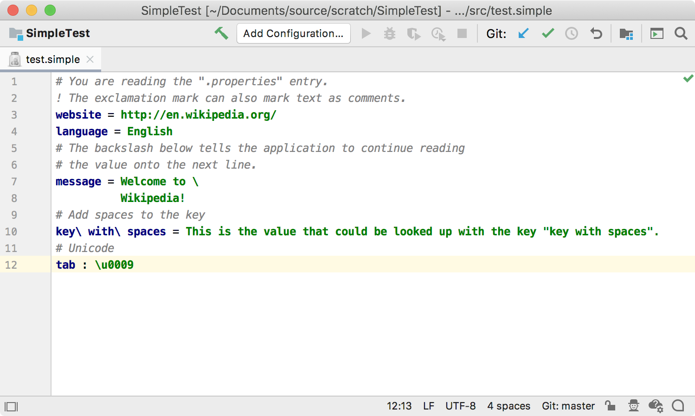
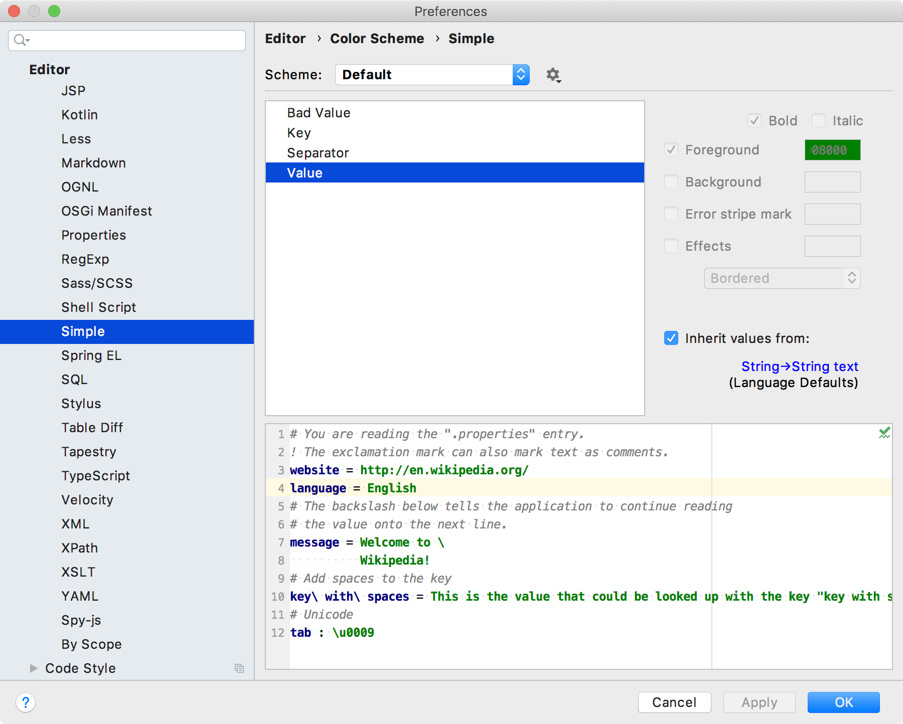

<!-- Copyright 2000-2020 JetBrains s.r.o. and other contributors. Use of this source code is governed by the Apache 2.0 license that can be found in the LICENSE file. -->

The first level of syntax highlighting is based on the lexer output, and is provided by `SyntaxHighlighter`.
A plugin can also define color settings based on `ColorSettingPage` so the user can configure highlight colors.
The `SimpleSyntaxHighlighter`, `SimpleSyntaxHighlighterFactory`, and `SimpleColorSettingsPage` discussed on this page are demonstrated in the `simple_language_plugin` code sample.

**Reference**: [Syntax Highlighting and Error Highlighting](/reference_guide/custom_language_support/syntax_highlighting_and_error_highlighting.md) 

* bullet list
{:toc}

## 5.1. Define a Syntax Highlighter 
The Simple Language syntax highlighter class extends [`SyntaxHighlighterBase`](upsource:///platform/editor-ui-api/src/com/intellij/openapi/fileTypes/SyntaxHighlighterBase.java).
As recommended in [Color Scheme Management](/reference_guide/color_scheme_management.md#text-attribute-key-dependency), the Simple Language highlighting text attributes are specified as a dependency on one of standard Intellij Platform keys. 
For the Simple Language, define only one scheme.

```java

```

### 5.2. Define a Syntax Highlighter Factory
The factory provides a standard way for the IntelliJ Platform to instantiate the syntax highlighter for Simple Language files.
Here, `SimpleSyntaxHighlighterFactory` subclasses [`SyntaxHighlighterFactory`](upsource:///platform/editor-ui-api/src/com/intellij/openapi/fileTypes/SyntaxHighlighterFactory.java).

```java

```

### 5.3. Register the Syntax Highlighter Factory
Register the factory with the IntelliJ Platform in the plugin configuration file using the `com.intellij.lang.syntaxHighlighterFactory` extension point.

```xml
  <extensions defaultExtensionNs="com.intellij">
    <lang.syntaxHighlighterFactory language="Simple" 
                implementationClass="org.intellij.sdk.language.SimpleSyntaxHighlighterFactory"/>
  </extensions>
```

### 5.4. Run the Project
Open the example Simple Language [properties file ](/tutorials/custom_language_support/lexer_and_parser_definition.md#run-the-project) (`test.simple`) in the IDE Development Instance.
The colors for Simple Language Key, Separator, and Value highlighting default to the IDE _Language Defaults_ for Keyword, Braces, Operators, and Strings, respectively.



## 5.5. Define a Color Settings Page
The color settings page adds the ability for users to customize color settings for the highlighting in Simple Language files. 
The `SimpleColorSettingsPage` implements [`ColorSettingsPage`](upsource:///platform/platform-api/src/com/intellij/openapi/options/colors/ColorSettingsPage.java). 

```java

```

### 5.6. Register the Color Settings Page
Register the Simple Language color settings page with the IntelliJ Platform in the plugin configuration file using the `com.intellij.colorSettingsPage` extension point.  

```xml
  <extensions defaultExtensionNs="com.intellij">
    <colorSettingsPage implementation="org.intellij.sdk.language.SimpleColorSettingsPage"/>
  </extensions>
```

### 5.7. Run the Project
In the IDE Development Instance, open the Simple Language highlight settings page: **Preferences/Settings \| Editor \| Color Scheme \| Simple**.
Each color initially inherits from a _Language Defaults_ value.


