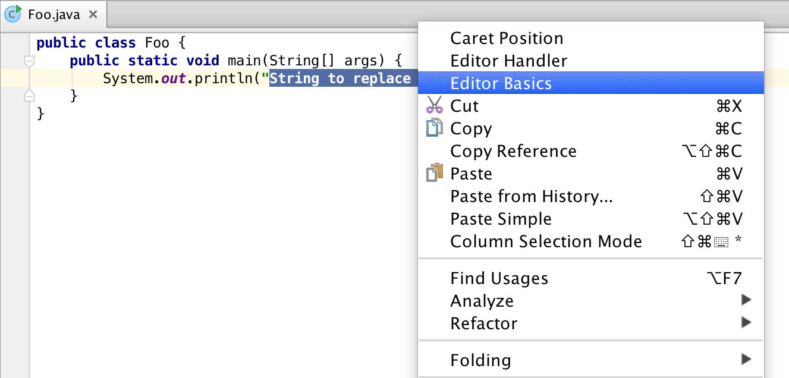
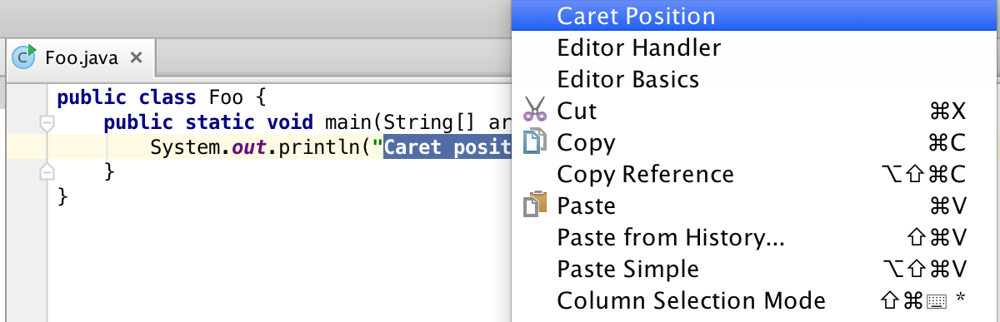
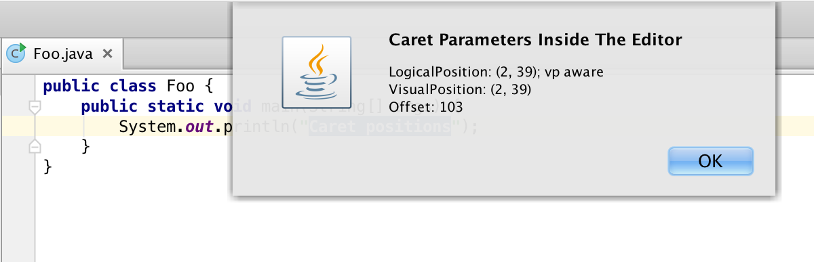

Basics of working with the Editor
===========

### [Source code] (https://github.com/JetBrains/intellij-sdk/tree/master/code_samples/editor_basics)

----------

This tutorial will lead you through the series of steps showing how to work with the Editor in IntelliJ IDEA, how access and modify text it contains,
and how to handle events sent to the Editor.

#Working with text
The following set of steps will show how to access a text selection and change it.

##Prerequirements

###Creating a new action
In this example access to the Editor is made through an action as a plug-in point.
To create an action we need derive
[AnAction.java] (https://github.com/JetBrains/intellij-community/blob/master/platform/editor-ui-api/src/com/intellij/openapi/actionSystem/AnAction.java)
class.

    public class EditorIllustration extends AnAction {
    }

###Registering an action
To register the action we should add a corresponding attribute to the *<actions>* section of the plugin configuration file
[plugin.xml] (https://github.com/JetBrains/intellij-sdk/blob/master/code_samples/editor_basics/resources/META-INF/plugin.xml)

    <actions>
        <action id="EditorBasics.EditorIllustration" class="EditorIllustration" text="Editor Basics"
            description="Illustrates how to plug an action in">
        <add-to-group group-id="EditorPopupMenu" anchor="last"/>
    </action>

If an action is registered in the group EditorPopupMenu, like the sample above shows,
it will be available from the context menu when the focus is located in the editor.

###Defining action's visibility
To determine conditions by which the action will be visible and available for being executed we need to override it's
*public void update(final AnActionEvent e)* method.

    public class EditorIllustration extends AnAction {
        @Override
        public void update(final AnActionEvent e) {
        }
    }

If we want to work with a selected part of the text, it's reasonable to make the action available only when the following requirements are met:

* There is a project open
* There is an instance of the Editor available
* There is a text selection in the Editor

Further steps will show how to check these conditions through obtaining instances of Project and Editor and how to set up a desired level of action's visibility.

##Getting an instance of the Active Editor
A reference to an instance of the Editor can be obtained by calling ```CommonDataKeys.EDITOR```,
obtaining a project reference is performed the same way ```CommonDataKeys.PROJECT```.

    public class EditorIllustration extends AnAction {
        @Override
        public void update(final AnActionEvent e) {
            //Get required data keys
            final Project project = e.getData(CommonDataKeys.PROJECT);
            final Editor editor = e.getData(CommonDataKeys.EDITOR);
            //Set visibility only in case of existing project and editor
            e.getPresentation().setVisible((project != null && editor != null));
        }
    }

------------------

**Note**

To access an Editor instance also can be used other ways:

* If [DataContext] (https://github.com/JetBrains/intellij-community/blob/master/platform/editor-ui-api/src/com/intellij/openapi/actionSystem/DataContext.java)
object is available ```final Editor editor = CommonDataKeys.EDITOR.getData(context);```
* If [ActionEvent] (https://github.com/JetBrains/intellij-community/blob/master/platform/editor-ui-api/src/com/intellij/openapi/actionSystem/AnActionEvent.java)
object is available ```final Editor editor = actionEvent.getData(CommonDataKeys.EDITOR);```

------------------

##Obtaining a caret model and selection
After making sure we have a project open and an instance of the Editor we need to check if any selection is available and set action's visibility accordingly to these conditions.
[SelectionModel] () got from the Editor allows to do it by calling it's ```hasSelection()``` method.
Here's how our ```update(final AnActionEvent e)``` method should look like at the end:

    public class EditorIllustration extends AnAction {
        @Override
        public void update(final AnActionEvent e) {
            //Get required data keys
            final Project project = e.getData(CommonDataKeys.PROJECT);
            final Editor editor = e.getData(CommonDataKeys.EDITOR);
            //Set visibility only in case of existing project and editor and if some text in the editor is selected
            e.getPresentation().setVisible((project != null && editor != null
            && editor.getSelectionModel().hasSelection()));
        }
    }

------------

**Note**
Editor allows to access different models of text representation. Model classes are located in
[editor] (https://github.com/JetBrains/intellij-community/tree/master/platform/editor-ui-api/src/com/intellij/openapi/editor)
subpackage of the
[editor-ui-api] (https://github.com/JetBrains/intellij-community/tree/master/platform/editor-ui-api)
package and include:
[CaretModel.java] (https://github.com/JetBrains/intellij-community/blob/master/platform/editor-ui-api/src/com/intellij/openapi/editor/CaretModel.java),
[FoldingModel.java] (https://github.com/JetBrains/intellij-community/blob/master/platform/editor-ui-api/src/com/intellij/openapi/editor/FoldingModel.java),
[IndentsModel.java] (https://github.com/JetBrains/intellij-community/blob/master/platform/editor-ui-api/src/com/intellij/openapi/editor/IndentsModel.java),
[ScrollingModel.java] (https://github.com/JetBrains/intellij-community/blob/master/platform/editor-ui-api/src/com/intellij/openapi/editor/ScrollingModel.java),
[ScrollingModel.java] (https://github.com/JetBrains/intellij-community/blob/master/platform/editor-ui-api/src/com/intellij/openapi/editor/ScrollingModel.java),
[SoftWrapModel.java] (https://github.com/JetBrains/intellij-community/blob/master/platform/editor-ui-api/src/com/intellij/openapi/editor/SoftWrapModel.java)

------------

##Obtainitg a Document
The action is visible and available now. In order to make it do something we need to override it's
```public void actionPerformed(final AnActionEvent anActionEvent)``` method.

    public class EditorIllustration extends AnAction {
        @Override
        public void update(final AnActionEvent e) {
        //code here
        }
        @Override
        public void actionPerformed(final AnActionEvent anActionEvent) {
        }
    }

To modify the text an instance of the
[Document] (https://github.com/JetBrains/intellij-community/blob/master/platform/core-api/src/com/intellij/openapi/editor/Document.java)
needs to be accessed. Document represents the contents of a text file loaded into memory, and possibly opened in an IDEA text editor.
The instance of a Document will be use later when a text replacement is performed.
We also need to figure out where the selected part of the text is located.

    @Override
    public void actionPerformed(final AnActionEvent anActionEvent) {
        //Get all the required data from data keys
        final Editor editor = anActionEvent.getRequiredData(CommonDataKeys.EDITOR);
        final Project project = anActionEvent.getRequiredData(CommonDataKeys.PROJECT);
        //Access document, caret, and selection
        final Document document = editor.getDocument();
        final SelectionModel selectionModel = editor.getSelectionModel();
        final int start = selectionModel.getSelectionStart();
        final int end = selectionModel.getSelectionEnd();
    }

##Modifying text
Generally replacement can be done by calling
```void replaceString(int startOffset, int endOffset, @NotNull CharSequence s);``` of the Document, however,
the operation of replacement must be executed safely, this mean the Document must be locked and any changes should be performed under the
[write action] (https://confluence.jetbrains.com/display/IDEA/Write+action+in+separate+thread).
See
[Threading Issues](https://confluence.jetbrains.com/display/IDEADEV/IntelliJ+IDEA+Architectural+Overview#IntelliJIDEAArchitecturalOverview-Threading)
section to know more about synchronization issues and changes safety in IntelliJ.

    @Override
    public void actionPerformed(final AnActionEvent anActionEvent) {
        //Get all the required data from data keys
        final Editor editor = anActionEvent.getRequiredData(CommonDataKeys.EDITOR);
        final Project project = anActionEvent.getRequiredData(CommonDataKeys.PROJECT);
        //Access document, caret, and selection
        final Document document = editor.getDocument();
        final SelectionModel selectionModel = editor.getSelectionModel();

        final int start = selectionModel.getSelectionStart();
        final int end = selectionModel.getSelectionEnd();
        //New instance of Runnable to make a replacement
        Runnable runnable = new Runnable() {
            @Override
            public void run() {
                document.replaceString(start, end, "Replacement");
            }
        };
        //Making the replacement
        WriteCommandAction.runWriteCommandAction(project, runnable);
        selectionModel.removeSelection();
    }

-----------



-----------

The source code is located in
[EditorIllustration.java] (https://github.com/JetBrains/intellij-sdk/blob/master/code_samples/editor_basics/src/org/jetbrains/plugins/editor/basics/EditorIllustration.java).
To see how text replacement works, check out
[Editor Basics] (https://github.com/JetBrains/intellij-sdk/blob/master/code_samples/editor_basics/src/org/jetbrains/plugins/editor/basics/)
plugin, make the project, and run it, then invoke the *EditorIllustration* action which is available in the context menu of the editor.

#Editor coordinates system. Positions and offsets
Every caret in the editor has a set of properties describing it's coordinates. These properties can be accessed by obtaining a
[caret model instance] (https://github.com/JetBrains/intellij-community/blob/master/platform/editor-ui-api/src/com/intellij/openapi/editor/CaretModel.java).
Working with caret positions and it's logical and visual properties will be explained in the sample below.

##Prerequirements
Access to the Editor is performed through an action.

##Accessing caret positions
To get an access to caret positions an instance of CaretModel should be obtained.

    public class EditorAreaIllustration extends AnAction {
        @Override
        public void actionPerformed(AnActionEvent anActionEvent) {
            final Editor editor = anActionEvent.getRequiredData(CommonDataKeys.EDITOR);
            CaretModel caretModel = editor.getCaretModel();
        }

        @Override
        public void update(AnActionEvent e) {
           //...
        }
    }

##Logical position
[LogicalPosition.java] (https://github.com/JetBrains/intellij-community/blob/master/platform/editor-ui-api/src/com/intellij/openapi/editor/LogicalPosition.java)
represents a line and a column of the current logical position of the caret. Logical positions ignore folding -
for example, if the top 10 lines of the document are folded, the 10th line in the document will have the line number 10 in its logical position.

    public class EditorAreaIllustration extends AnAction {
            @Override
            public void actionPerformed(AnActionEvent anActionEvent) {
                final Editor editor = anActionEvent.getRequiredData(CommonDataKeys.EDITOR);
                CaretModel caretModel = editor.getCaretModel();
                LogicalPosition logicalPosition = caretModel.getLogicalPosition();
            }

            @Override
            public void update(AnActionEvent e) {
               //...
            }
        }

Logical position may store additional parameters that define its mapping to
[VisualPosition.java] (https://github.com/JetBrains/intellij-community/blob/master/platform/editor-ui-api/src/com/intellij/openapi/editor/VisualPosition.java).
Rationale is that single logical pair matches soft wrap-introduced virtual space, i.e. different visual positions
correspond to the same logical position. It's convenient to store exact visual location details within the logical
position in order to relief further 'logical position' -> 'visual position' mapping.

##Visual position
[VisualPosition.java] (https://github.com/JetBrains/intellij-community/blob/master/platform/editor-ui-api/src/com/intellij/openapi/editor/VisualPosition.java)
represent a visual position and may very from the corresponding logical position.
Visual positions take folding into account - for example,
if the top 10 lines of the document are folded, the 10th line in the document will have the line number 1 in its visual position.

    public class EditorAreaIllustration extends AnAction {
            @Override
            public void actionPerformed(AnActionEvent anActionEvent) {
                final Editor editor = anActionEvent.getRequiredData(CommonDataKeys.EDITOR);
                CaretModel caretModel = editor.getCaretModel();
                LogicalPosition logicalPosition = caretModel.getLogicalPosition();
                VisualPosition visualPosition = caretModel.getVisualPosition();
            }

            @Override
            public void update(AnActionEvent e) {
               //...
            }
        }

##Offset
An absolute offset for a given caret position is accessible through CaretModel as well

    public class EditorAreaIllustration extends AnAction {
        @Override
        public void actionPerformed(AnActionEvent anActionEvent) {
            final Editor editor = anActionEvent.getRequiredData(CommonDataKeys.EDITOR);
            CaretModel caretModel = editor.getCaretModel();
            LogicalPosition logicalPosition = caretModel.getLogicalPosition();
            VisualPosition visualPosition = caretModel.getVisualPosition();
            int offset = caretModel.getOffset();
        }

        @Override
        public void update(AnActionEvent e) {
           //...
        }
    }

##Displaying position values
To display the actual values of logical anf visual positions we add an
```Messages.showInfoMessage()``` call that will show them in form of notification after the action is performed.

    public class EditorAreaIllustration extends AnAction {
            @Override
            public void actionPerformed(AnActionEvent anActionEvent) {
                final Editor editor = anActionEvent.getRequiredData(CommonDataKeys.EDITOR);
                CaretModel caretModel = editor.getCaretModel();
                LogicalPosition logicalPosition = caretModel.getLogicalPosition();
                VisualPosition visualPosition = caretModel.getVisualPosition();
                int offset = caretModel.getOffset();
                Messages.showInfoMessage(logicalPosition.toString() + "\n" +
                        visualPosition.toString() + "\n" +
                        "Offset: " + offset, "Caret Parameters Inside The Editor");
            }

            @Override
            public void update(AnActionEvent e) {
               //...
            }
        }

Check out, compile, and run the
[Editor Basics Plugin] (https://github.com/JetBrains/intellij-sdk/tree/master/code_samples/editor_basics),
then move carets, invoke
[EditorAreaIllustration] (https://github.com/JetBrains/intellij-sdk/blob/master/code_samples/editor_basics/src/org/jetbrains/plugins/editor/basics/EditorAreaIllustration.java)
action, and see how logical and visual positions are related dependently on folding.

Find the action in the context menu:


Perform the action to see caret positions:


#Actions activated by editor events
IntelliJ IDEA SDK provides a set of embedded mechanisms for handling events related to the Editor.

##Handling keystrokes in the Editor
To handle keystrokes and provide custom reactions interface
[TypedActionHandler]()
may be used.
Series of steps below shows how to change standard behaviour of the editor and make it react on typing differently instead of simply displaying a typed character in the editor area.

###Implementing *TypedActionHandler*
First we need to implement an instance of
[TypedActionHandler]():

    public class MyTypedHandler implements TypedActionHandler {
        @Override
        public void execute(@NotNull Editor editor, char c, @NotNull DataContext dataContext) {
        }
    }

###Implementing logic for handling keystrokes
```public void execute(@NotNull Editor editor, char c, @NotNull DataContext dataContext);```
method should contain the main logical part for handling keystrokes. It will be called every time a key is pressed.
In the following example our typed handler is meant insert a string at the zero offset in the editor after a keystroke occurs:

    public class MyTypedHandler implements TypedActionHandler {
        @Override
        public void execute(@NotNull Editor editor, char c, @NotNull DataContext dataContext) {
            final Document document = editor.getDocument();
            Project project = editor.getProject();
            Runnable runnable = new Runnable() {
                @Override
                public void run() {
                    document.insertString(0, "Typed\n");
                }
            };
            WriteCommandAction.runWriteCommandAction(project, runnable);
        }
    }

###Setting up *TypedActionHandler*

To enable a custom implementation of *TypedActionHandler* in the plugin we need to create a new instance of it and pass to
```public TypedActionHandler setupHandler(TypedActionHandler handler);``` method of the
[TypedAction]()
class. By doing it we replace the typing handler with the specified handler.

    public class EditorIllustration extends AnAction {
        static {
            final EditorActionManager actionManager = EditorActionManager.getInstance();
            final TypedAction typedAction = actionManager.getTypedAction();
            typedAction.setupHandler(new MyTypedHandler());
        }
    }

After compiling and running the code snippet above typing in the editor will be handled with inserting an extra string at the 0 position.

##Working with EditorActionHandler
Class
[EditorActionHandler.java] (https://github.com/JetBrains/intellij-community/blob/master/platform/platform-api/src/com/intellij/openapi/editor/actionSystem/EditorActionHandler.java)
stays for actions activated by keystrokes in the editor.
Series of steps below show how access *EditorActionManager* and pass it actions to be executed.
In this example we will use *EditorActionHandler* to insert one extra caret above the current caret if available.

###Prerequirements
Create an action:

    public class EditorHandlerIllustration extends AnAction {
        @Override
        public void actionPerformed(@NotNull AnActionEvent anActionEvent) {
        }
        @Override
        public void update(@NotNull final AnActionEvent anActionEvent) {
        }
    }

Register action in
[plugin.xml]():

    <actions>
        <action id="EditorBasics.EditorHandlerIllustration" class="org.jetbrains.tutorials.editor.basics.EditorHandlerIllustration" text="Editor Handler"
                description="Illustrates how to plug an action in">
          <add-to-group group-id="EditorPopupMenu" anchor="first"/>
        </action>
    </action>

###Setting visibility
Our action should be visible only in case if the following conditions are met:
there's a project open, there's an editor available, and there's at least one caret active in the editor:

    public class EditorHandlerIllustration extends AnAction {
        @Override
        public void actionPerformed(@NotNull AnActionEvent anActionEvent) {
        }
        @Override
        public void update(@NotNull final AnActionEvent anActionEvent) {
            final Project project = anActionEvent.getData(CommonDataKeys.PROJECT);
            final Editor editor = anActionEvent.getData(CommonDataKeys.EDITOR);
            anActionEvent.getPresentation().setVisible((project != null && editor != null && !editor.getCaretModel().getAllCarets().isEmpty()));
        }
    }

###Obtaining *EditorActionHandler*

To manipulate with standard Editor's actions first we need to obtain
an instance of
[EditorActionHandler]() for the action we'd like to work with. Ih this case it will be an instance of
[CloneCaretActionHandler]().

    public class EditorHandlerIllustration extends AnAction {
        @Override
        public void actionPerformed(@NotNull AnActionEvent anActionEvent) {
            final Editor editor = anActionEvent.getRequiredData(CommonDataKeys.EDITOR);
            EditorActionManager actionManager = EditorActionManager.getInstance();
            EditorActionHandler actionHandler = actionManager.getActionHandler(IdeActions.ACTION_EDITOR_CLONE_CARET_BELOW);
        }

        @Override
        public void update(@NotNull final AnActionEvent anActionEvent) {
        //...
        }
    }

###Making *EditorActionHandler* execute actions
To execute an action we need to call the ```public final void execute(@NotNull Editor editor, @Nullable final Caret contextCaret, final DataContext dataContext);```
method of a corresponding *EditorActionHandler*

    public class EditorHandlerIllustration extends AnAction {
        @Override
        public void actionPerformed(@NotNull AnActionEvent anActionEvent) {
            final Editor editor = anActionEvent.getRequiredData(CommonDataKeys.EDITOR);
            EditorActionManager actionManager = EditorActionManager.getInstance();
            EditorActionHandler actionHandler = actionManager.getActionHandler(IdeActions.ACTION_EDITOR_CLONE_CARET_BELOW);
            actionHandler.execute(editor, editor.getCaretModel().getCurrentCaret(), anActionEvent.getDataContext());
        }
        @Override
        public void update(@NotNull final AnActionEvent anActionEvent) {
        //
        }
    }

After compiling and running the following code sample, one extra caret will be placed in the editor below the current active caret.

-----------

### [Source code] (https://github.com/JetBrains/intellij-sdk/tree/master/code_samples/editor_basics)
-----------

Note, that this part of the API allows to operate only with text.
If you need to access PSI please see
[PSI Cookbook] (https://confluence.jetbrains.com/display/IDEADEV/PSI+Cookbook)
section.

**See also**
[editor-ui-api package] (https://github.com/JetBrains/intellij-community/tree/master/platform/editor-ui-api),
[Editor.java] (https://github.com/JetBrains/intellij-community/blob/master/platform/editor-ui-api/src/com/intellij/openapi/editor/Editor.java),
[EditorImpl.java] (https://github.com/JetBrains/intellij-community/blob/master/platform/platform-impl/src/com/intellij/openapi/editor/impl/EditorImpl.java).
[CommonDataKeys.java] (https://github.com/JetBrains/intellij-community/blob/master/platform/editor-ui-api/src/com/intellij/openapi/actionSystem/CommonDataKeys.java),
[DataKey.java] (https://github.com/JetBrains/intellij-community/blob/master/platform/editor-ui-api/src/com/intellij/openapi/actionSystem/DataKey.java),
[AnActionEvent] (https://github.com/JetBrains/intellij-community/blob/ff16ce78a1e0ddb6e67fd1dbc6e6a597e20d483a/platform/editor-ui-api/src/com/intellij/openapi/actionSystem/AnActionEvent.java),
[DataContext] (https://github.com/JetBrains/intellij-community/blob/master/platform/editor-ui-api/src/com/intellij/openapi/actionSystem/DataContext.java)

**Related topics**
[Action System] (https://github.com/JetBrains/intellij-sdk/blob/master/tutorials/action_system.md)


