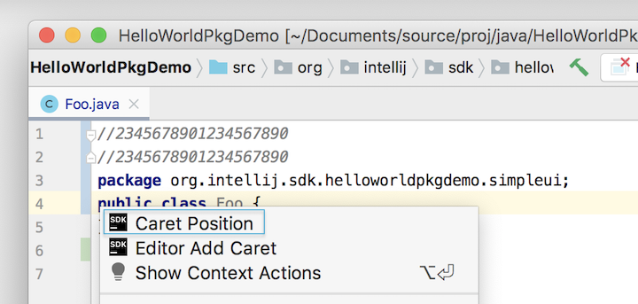
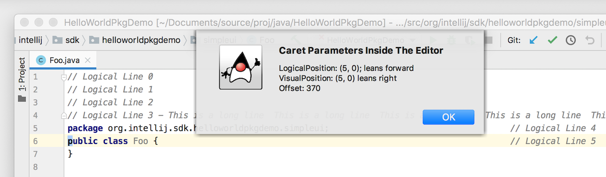
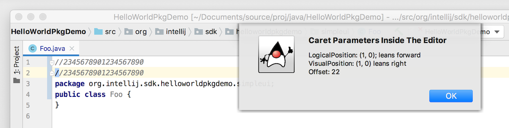

The previous tutorial [Working with Text](working_with_text.md) discussed extending the [AnAction](upsource:///platform/editor-ui-api/src/com/intellij/openapi/actionSystem/AnAction.java) class, and using an [AnActionEvent](upsource:///platform/editor-ui-api/src/com/intellij/openapi/actionSystem/AnActionEvent.java) object.
The event object provides access to [Project](upsource:///platform/core-api/src/com/intellij/openapi/project/Project.java), [Document](upsource:///platform/core-api/src/com/intellij/openapi/editor/Document.java), and [Editor](upsource:///platform/editor-ui-api/src/com/intellij/openapi/editor/Editor.java) objects.

Every caret has a set of properties describing its position in one of several coordinate systems.
This tutorial describes how to access information about the caret(s) in the editor.
The tutorial is presented in the following sections:
* bullet list
{:toc}

## Introduction
In this tutorial the [editor_basics](https://github.com/JetBrains/intellij-sdk-docs/tree/master/code_samples/editor_basics) code sample is used to explore caret positions.
In particular, the **Caret Position** action added by `editor_basics` to the editor context menu is used to retrieve information about the current caret position.  
The action can also be initiated by using the keyboard shortcut.

{:width="500px"}

The source code for the Java class behind the menu action is [EditorAreaIllustration.java](https://github.com/JetBrains/intellij-sdk-docs/blob/master/code_samples/editor_basics/src/main/java/org/intellij/sdk/editor/EditorAreaIllustration.java).
The focus of discussion will be the `EditorAreaIllustration.actionPerformed()` method.
For more information about creating action classes, see the [Actions Tutorial](/tutorials/action_system.md) which covers the topic in depth.

## Caret Positions from the CaretModel and Caret Objects
The properties of a caret can be accessed by obtaining an instance of the [CaretModel](upsource:///platform/editor-ui-api/src/com/intellij/openapi/editor/CaretModel.java) object.
As in the [Working with Text](working_with_text.md) tutorial, the `AnActionEvent` is used to get the `Editor` object.
The `Editor` object provides access to the `CaretModel` object, as shown below:
```java
public class EditorAreaIllustration extends AnAction {
    @Override
    public void actionPerformed(AnActionEvent anActionEvent) {
        final Editor editor = anActionEvent.getRequiredData(CommonDataKeys.EDITOR);
        CaretModel caretModel = editor.getCaretModel();
    }
    @Override
    public void update(AnActionEvent e) { /* ... */ }
}
```

## Caret Coordinate Systems
When a `Document` is opened the `Editor` assigns an internal, zero-based coordinate system to lines and columns in the `Document`.
The first line in a `Document` and the first character in each line are assigned the zero position.
Note that the `Editor` coordinate system is different from what is shown in the editor UI, which is one-based rather than zero-based.

The [Multiple Carets](/reference_guide/multiple_carets.md) documentation covers the subject of more than one caret in a document.
For the purposes of this tutorial, be aware there may be more than one caret in an `Document` at any given time.
Consequently, examples will be based on using the _Primary Caret_ in a `Document`.
If there is only one caret in a `Document`, it is the Primary Caret.
For the case of multiple carets in a `Document`, the Primary Caret is the one on which query and update methods in the model operate at the moment.

### Caret Logical Position
The caret _Logical Position_ is a zero-based, (line and column) position of the caret in the Editor Tool Window.
Line values are based on the corresponding lines in the underlying `Document`.
Logical Position information is obtained from the [LogicalPosition](upsource:///platform/editor-ui-api/src/com/intellij/openapi/editor/LogicalPosition.java) object for that caret.   

The Logical Position line number of a caret ignores the effects of settings that change the presentation of a `Document` within the Editor Tool Window.
Examples of these settings are [Code (Line) Folding](https://www.jetbrains.com/help/idea/working-with-source-code.html#code_folding) and [Soft Line Wrap](https://www.jetbrains.com/help/idea/using-code-editor.html#f804afd8). 
This means regardless of whether one or more lines in an Editor Tool Window are folded or soft-wrapped, the caret Logical Position line number will not change.

The image below shows the simplest case of reporting Logical Position using the caret position functionality of the `editor_basics` plugin.
No Soft Wrap or Code Folding is applied.
Each line has a comment showing the Logical Position line number.
The caret - a blue block - is placed on the letter "p" in "public".
The caret is reported to be at Logical Position (5,0) - which is Logical (Position) line 5, character 0 - the first character in the line.
[Caret Visual Position](#caret-visual-position), [caret leaning,](#caret-column-position), and [caret offset](#caret-offset) are discussed in later sections.  

{:width="800px"}

If Logical Position line numbers 1-3 are folded into line 0, the caret is still reported as Logical Position (5,0).
This means that caret Logical Position is not changed by Code Folding:  

{:width="800px"} 

However, note that applying Code Folding _does change the reported Visual Position_ of the caret even if the Logical Position stays constant.
More about [Visual Position](#caret-visual-position) is discussed below, but it's clear combinations of Code Folding and Soft Wrap can mean that one Logical Position of a caret could map to multiple Visual Positions.
It is for this reason the `Editor` interface provides a number of methods to work with a caret Logical and Visual Position, such as the method `Editor.logicalToVisualPosition()`.

The `LogicalPosition` object for a caret is obtained from the `Caret` object, as shown in the code snippet below.
```java
public class EditorAreaIllustration extends AnAction {
    @Override
    public void actionPerformed(AnActionEvent e) {
      // Get access to the editor and caret model. update() validated editor's existence.
      final Editor editor = e.getRequiredData(CommonDataKeys.EDITOR);
      CaretModel caretModel = editor.getCaretModel();
      Caret primaryCaret = caretModel.getPrimaryCaret();
      LogicalPosition logicalPosition = primaryCaret.getLogicalPosition();
    }
    @Override
    public void update(AnActionEvent e) { /* ... */ }
}
```

### Caret Visual Position
A caret's _Visual Position_ differs from Logical Position in that it takes into account editor presentation settings such as Code Folding and Soft Line Wrap.
In doing so, [VisualPosition](upsource:///platform/editor-ui-api/src/com/intellij/openapi/editor/VisualPosition.java) counts - zero-based - the lines of a `Document` that are _displayed_ in an Editor Tool Window.  
Consequently, Visual Position lines are not uniquely mapped to corresponding lines in the underlying `Document`.

For example, when Soft Line Wrap is applied to a line displayed in an Editor Tool Window it affects the Visual Position.
In the image below, Soft Line Wrap has been applied to Logical line three.
With the caret placed at the same location as in previous tests, it is evident the Logical Position has not changed.
However, the Visual Position line number has increased by 1!
The comments on each line illustrate how the Soft Wrap portion of Logical line three is considered Visual Position line four, as though it was a separate line.

{:width="800px"} 

The Visual Position object for a caret is obtained from the `Caret` object, as shown in the code snippet below. 
```java
public class EditorAreaIllustration extends AnAction {
    @Override
    public void actionPerformed(AnActionEvent anActionEvent) {
      final Editor editor = e.getRequiredData(CommonDataKeys.EDITOR);
      CaretModel caretModel = editor.getCaretModel();
      Caret primaryCaret = caretModel.getPrimaryCaret();
      LogicalPosition logicalPosition = primaryCaret.getLogicalPosition();
      VisualPosition visualPosition = primaryCaret.getVisualPosition();
    }
    @Override
    public void update(AnActionEvent e) { /* ... */ }
}
```

### Caret Column Position
The _Column Position_ is a count of characters from the beginning of a Logical (Position) line to the current caret position in that line.
Characters are counted using a zero-based numbering system, so the first character of a line is numbered zero.
Note that Column Position is different from what is shown in the editor UI, which uses a one-based numbering scheme.

Column Position includes:
* The first character in a Logical line.
* Whitespace, such as tabs.
  Tabs can occupy multiple columns, up to the tab size set for the editor.
* The character selected by the caret.

The Logical Column Position of a caret represents the boundary between two characters.
As defined in the [LogicalPosition](upsource:///platform/editor-ui-api/src/com/intellij/openapi/editor/LogicalPosition.java) class, if a caret position is associated with a succeeding character it is said to _Lean Forward_.

In the example below, placing a (blue) block caret on the first visible character in Logical line three produces a column position of 0 for both Visual and Logical Positions.
In the Logical Position the character leans forward, meaning it is associated with the succeeding character in the Logical line.
For the Visual Position the character is said to _Lean Right_, indicating its association with the succeeding character in the Visual line.
 
{:width="800px"} 

### Caret Offset
The _Offset_ of a caret is a character count from the beginning of a `Document` to the caret position.
Caret offsets are always calculated in terms of Logical Position.
The caret Offset includes:
* The first (0th) character in a document.
* Whitespace characters, including end-of-line and tabs.
* Any characters after end-of-line if the IDE settings permit them.
  (**Preferences \| Editor \| General \| Virtual Space**)
* The character selected by the caret.

The example below demonstrates the Offset of a caret placed at the first character of Logical line one.
Note the Offset is 22, which is 1 greater than the number of visible characters on line one, and the first character on line two.
This is because the Offset includes the EOL character for the first line.

{:width="800px"}

The Offset for a given caret position is accessible through the `Caret` object as well:
```java
public class EditorAreaIllustration extends AnAction {
    @Override
    public void actionPerformed(AnActionEvent anActionEvent) {
      final Editor editor = e.getRequiredData(CommonDataKeys.EDITOR);
      CaretModel caretModel = editor.getCaretModel();
      Caret primaryCaret = caretModel.getPrimaryCaret();
      LogicalPosition logicalPosition = primaryCaret.getLogicalPosition();
      VisualPosition visualPosition = primaryCaret.getVisualPosition();
      int offset = primaryCaret.getOffset();
    }
    @Override
    public void update(AnActionEvent e) { /* ... */ }
 }
```


## Displaying Caret Positions
To display the actual values of logical and visual positions, an
`Messages.showInfoMessage()` shows them in the form of notification after the action is performed.
```java
public class EditorAreaIllustration extends AnAction {
  public void actionPerformed(AnActionEvent e) {
    final Editor editor = e.getRequiredData(CommonDataKeys.EDITOR);
    CaretModel caretModel = editor.getCaretModel();
    Caret primaryCaret = caretModel.getPrimaryCaret();
    // Build and display the caret report.
    StringBuilder report = new StringBuilder();
    report.append(primaryCaret.getLogicalPosition().toString() + "\n");
    report.append(primaryCaret.getVisualPosition().toString() + "\n");
    report.append("Offset: " + primaryCaret.getOffset());
    Messages.showInfoMessage(report.toString(), "Caret Parameters Inside The Editor");
  }
  @Override
  public void update(AnActionEvent e) { /* ... */ }
}
```

