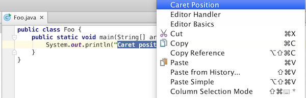
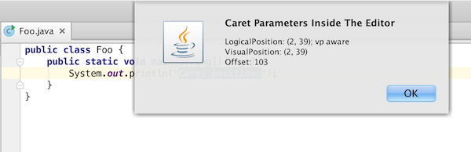

Every caret in the editor has a set of properties describing it's coordinates. 
These properties can be accessed by obtaining a
[caret model instance](upsource:///platform/editor-ui-api/src/com/intellij/openapi/editor/CaretModel.java).
Working with caret positions and it's logical and visual properties will be explained in the sample below.

## 2.1. Pre-requirements
Access to the Editor is performed through an action.

## 2.2. Accessing caret positions

To get an access to caret positions an instance of CaretModel should be obtained.

```java
public class EditorAreaIllustration extends AnAction {
    @Override
    public void actionPerformed(AnActionEvent anActionEvent) {
        final Editor editor = anActionEvent.getRequiredData(CommonDataKeys.EDITOR);
        CaretModel caretModel = editor.getCaretModel();
    }
    @Override
    public void update(AnActionEvent e) {
       //...
    }
}
```

## 2.3. Logical position

[LogicalPosition.java](upsource:///platform/editor-ui-api/src/com/intellij/openapi/editor/LogicalPosition.java)
represents a line and a column of the current logical position of the caret. Logical positions ignore folding -
for example, if the top 10 lines of the document are folded, the 10th line in the document will have the line number 10 in its logical position.

```java
public class EditorAreaIllustration extends AnAction {
    @Override
    public void actionPerformed(AnActionEvent anActionEvent) {
        final Editor editor = anActionEvent.getRequiredData(CommonDataKeys.EDITOR);
        CaretModel caretModel = editor.getCaretModel();
        LogicalPosition logicalPosition = caretModel.getLogicalPosition();
    }
    @Override
    public void update(AnActionEvent e) {
        //...
    }
}
```

Logical position may store additional parameters that define its mapping to
[VisualPosition.java](upsource:///platform/editor-ui-api/src/com/intellij/openapi/editor/VisualPosition.java).
Rationale is that single logical pair matches soft wrap-introduced virtual space, i.e. different visual positions
correspond to the same logical position. It's convenient to store exact visual location details within the logical
position in order to relief further 'logical position' -> 'visual position' mapping.

## 2.4. Visual position

[VisualPosition.java](upsource:///platform/editor-ui-api/src/com/intellij/openapi/editor/VisualPosition.java)
represent a visual position and may very from the corresponding logical position.
Visual positions take folding into account - for example,
if the top 10 lines of the document are folded, the 10th line in the document will have the line number 1 in its visual position.

```java
public class EditorAreaIllustration extends AnAction {
    @Override
    public void actionPerformed(AnActionEvent anActionEvent) {
        final Editor editor = anActionEvent.getRequiredData(CommonDataKeys.EDITOR);
        CaretModel caretModel = editor.getCaretModel();
        LogicalPosition logicalPosition = caretModel.getLogicalPosition();
        VisualPosition visualPosition = caretModel.getVisualPosition();
    }
    @Override
    public void update(AnActionEvent e) {
        //...
    }
}
```

## 2.5. Offset

An absolute offset for a given caret position is accessible through CaretModel as well

```java
public class EditorAreaIllustration extends AnAction {
    @Override
    public void actionPerformed(AnActionEvent anActionEvent) {
        final Editor editor = anActionEvent.getRequiredData(CommonDataKeys.EDITOR);
        CaretModel caretModel = editor.getCaretModel();
        LogicalPosition logicalPosition = caretModel.getLogicalPosition();
        VisualPosition visualPosition = caretModel.getVisualPosition();
        int offset = caretModel.getOffset();
    }
    @Override
    public void update(AnActionEvent e) {
        //...
    }
}
```

## 2.6. Displaying position values
To display the actual values of logical and visual positions we add an
`Messages.showInfoMessage()` call that will show them in form of notification after the action is performed.

```java
public class EditorAreaIllustration extends AnAction {
    @Override
    public void actionPerformed(AnActionEvent anActionEvent) {
        final Editor editor = anActionEvent.getRequiredData(CommonDataKeys.EDITOR);
        CaretModel caretModel = editor.getCaretModel();
        LogicalPosition logicalPosition = caretModel.getLogicalPosition();
        VisualPosition visualPosition = caretModel.getVisualPosition();
        int offset = caretModel.getOffset();
        Messages.showInfoMessage(logicalPosition.toString() + "\n" +
                        visualPosition.toString() + "\n" +
                        "Offset: " + offset, "Caret Parameters Inside The Editor");
    }
    @Override
    public void update(AnActionEvent e) {
           //...
    }
}
```

Check out, compile, and run the
[Editor Basics Plugin](https://github.com/JetBrains/intellij-sdk-docs/tree/master/code_samples/editor_basics),
then move carets, invoke
[EditorAreaIllustration](https://github.com/JetBrains/intellij-sdk-docs/blob/master/code_samples/editor_basics/src/org/jetbrains/tutorials/editor/basics/EditorAreaIllustration.java)
action, and see how logical and visual positions are related dependently on folding.

Find the action in the context menu:



Perform the action to see caret positions:




