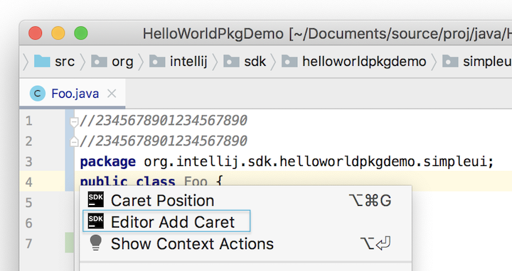

The previous tutorial [Editor Coordinate Systems](coordinates_system.md) described working with caret coordinate systems in an editor window.
Caret position was discussed in terms of Logical Position, Visual Position, and Offset.

This tutorial introduces the Editor Action system, which handles actions activated by keystroke events in the editor.
The development of two classes from the [editor_basics](https://github.com/JetBrains/intellij-sdk-docs/tree/master/code_samples/editor_basics) code sample are used to illustrate:
* Using an IntelliJ Platform [EditorActionHandler](upsource:///platform/platform-api/src/com/intellij/openapi/editor/actionSystem/EditorActionHandler.java) to manipulate a caret.
* Creating and registering a custom [TypedActionHandler](upsource:///platform/platform-api/src/com/intellij/openapi/editor/actionSystem/TypedActionHandler.java) to intercept keystrokes and change the document.

The tutorial is presented in the following sections:
* bullet list
{:toc}

## Using an IntelliJ Platform EditorActionHandler
In this portion of the tutorial the [editor_basics](https://github.com/JetBrains/intellij-sdk-docs/tree/master/code_samples/editor_basics) code sample is used to demonstrate cloning an existing caret.
A custom action class will use `EditorActionManager` to access a specific `EditorActionHandler` for caret cloning.
The `editor_basics` code sample adds an **Editor Add Caret** menu item to the editor context menu:

{:width="500px"}

### Creating the Menu Action Class
The source code for the Java action class is [EditorHandlerIllustration](https://github.com/JetBrains/intellij-sdk-docs/blob/master/code_samples/editor_basics/src/main/java/org/intellij/sdk/editor/EditorHandlerIllustration.java), a subclass of `AnAction`.
For more information about creating action classes, see the [Actions Tutorial](/tutorials/action_system.md) which covers the topic in depth.
As shown below, `EditorHandlerIllustration` will override two class methods:
```java
public class EditorHandlerIllustration extends AnAction {
    @Override                                        
    public void actionPerformed(@NotNull AnActionEvent e) { /*...*/ }
    @Override
    public void update(@NotNull final AnActionEvent e) { /*...*/ }
}
```

The `EditorHandlerIllustration` action is registered in the `editor_basic` [plugin.xml](https://github.com/JetBrains/intellij-sdk-docs/blob/master/code_samples/editor_basics/src/main/resources/META-INF/plugin.xml) file.
Note this action class is registered to appear on the Editor context menu.
```xml
<actions>
    <action id="EditorBasics.EditorHandlerIllustration" class="org.intellij.sdk.editor.EditorHandlerIllustration"
            text="Editor Add Caret" description="Adds a second caret below the existing one."
            icon="EditorBasicsIcons.Sdk_default_icon">
      <add-to-group group-id="EditorPopupMenu" anchor="first"/>
    </action>
</action>
```

### Setting Visibility for the Action Menu Entry
Under what conditions should the `EditorHandlerIllustration` action be capable of cloning a caret?
Only if the following conditions are met in the `EditorHandlerIllustration.update()` method:
* A project is open,
* An editor is available,
* There is at least one caret active in the editor.

After ensuring that `Project` and `Editor` objects are available, the `Editor` object is used to verify there is at least one caret:
```java
public class EditorHandlerIllustration extends AnAction {
    @Override
    public void actionPerformed(@NotNull AnActionEvent anActionEvent) { /*...*/ }

    @Override
  public void update(@NotNull final AnActionEvent e) {
    boolean visibility = false;
    final Project project = e.getProject();
    final Editor editor = e.getData(CommonDataKeys.EDITOR);
    if (editor != null && project != null) {
      visibility = !editor.getCaretModel().getAllCarets().isEmpty();
    }
    e.getPresentation().setVisible(visibility);
  }
}
```

### Acquiring the Correct EditorActionHandler
When the `EditorHandlerIllustration.actionPerformed()` method clones the caret, it should use the appropriate IntelliJ Platform [EditorActionHandler](upsource:///platform/platform-api/src/com/intellij/openapi/editor/actionSystem/EditorActionHandler.java).
To acquire that handler, an instance of the [EditorActionManager](upsource:///platform/platform-api/src/com/intellij/openapi/editor/actionSystem/EditorActionManager.java) needs to be obtained first.
Fortunately, the `EditorActionManager` class provides a static method to do this.

To request the correct `EditorActionHandler` from `EditorActionManager`, consult the [IdeActions](upsource:///platform/platform-api/src/com/intellij/openapi/actionSystem/IdeActions.java) interface for the correct constant to pass into the `EditorActionManager.getActionHandler()` method.
For cloning a caret below the primary caret the constant is `ACTION_EDITOR_CLONE_CARET_BELOW`.
Based on that constant, the `EditorActionManager` returns an instance of [CloneCaretActionHandler](upsource:///platform/platform-impl/src/com/intellij/openapi/editor/actions/CloneCaretActionHandler.java), a subclass of `EditorActionHandler`.
```java
public class EditorHandlerIllustration extends AnAction {
  @Override
  public void actionPerformed(@NotNull AnActionEvent e) {
    final Editor editor = e.getRequiredData(CommonDataKeys.EDITOR);
    EditorActionManager actionManager = EditorActionManager.getInstance();
    EditorActionHandler actionHandler = actionManager.getActionHandler(IdeActions.ACTION_EDITOR_CLONE_CARET_BELOW);
   }

   @Override
   public void update(@NotNull final AnActionEvent anActionEvent) { /*...*/ }
}
```

### Using an EditorActionHandler to Clone the Caret
To actually clone the caret requires only calling the `EditorActionHandler.execute()` method and passing in the appropriate context.
```java
public class EditorHandlerIllustration extends AnAction {
  @Override
  public void actionPerformed(@NotNull AnActionEvent e) {
    final Editor editor = e.getRequiredData(CommonDataKeys.EDITOR);
    EditorActionManager actionManager = EditorActionManager.getInstance();
    EditorActionHandler actionHandler = actionManager.getActionHandler(IdeActions.ACTION_EDITOR_CLONE_CARET_BELOW);
    actionHandler.execute(editor, editor.getCaretModel().getPrimaryCaret(), e.getDataContext());
  }

  @Override
   public void update(@NotNull final AnActionEvent anActionEvent) { /*...*/ }
}
```


## Creating a Custom TypedActionHandler
The [TypedActionHandler](upsource:///platform/platform-api/src/com/intellij/openapi/editor/actionSystem/TypedActionHandler.java) interface is the basis for classes that handle keystroke events from the editor.
Custom implementations of the class are registered to handle editor keystroke events, and receive a callback for each keystroke.
The steps below explain how to use `TypedActionHandler` to customize the behavior of the editor when keystroke events are received.

### Implementing a Custom TypedActionHandler Class
First, a subclass such as `MyTypedHandler` is created based on [TypedActionHandler](upsource:///platform/platform-api/src/com/intellij/openapi/editor/actionSystem/TypedActionHandler.java):
The class overrides the method `TypedActionHandler.execute()`, which is the callback for editor keystroke events.
```java
public class MyTypedHandler implements TypedActionHandler {
    @Override
    public void execute(@NotNull Editor editor, char c, @NotNull DataContext dataContext) {
    }
}
```

### Implementing the Keystroke Event Handling Logic
Override the `TypedActionHandler.execute()` method in `MyTypedHandler` to implement the logic for handling keystroke events. 
This method will be called every time a key is pressed when the Editor Tool Window has focus.

In the following example, the `MyTypedHandler.execute()` method inserts "editor_basics\n" at the zero [caret Offset](coordinates_system.md#caret-offset) position when a keystroke event occurs. 
As explained in [Working with Text](working_with_text.md#safely-modifying-text-in-a-document), safe modifications to the Document must be in the context of a write action. 
So although a method on the `Document` interface does the `String` insertion, the write action ensures a stable context.
```java
class MyTypedHandler implements TypedActionHandler {
  @Override
  public void execute(@NotNull Editor editor, char c, @NotNull DataContext dataContext) {
    final Document document = editor.getDocument();
    Project project = editor.getProject();
    Runnable runnable = () -> document.insertString(0, "editor_basics\n");
    WriteCommandAction.runWriteCommandAction(project, runnable);
  }
}
```

### Registering a Custom TypedActionHandler
To enable a custom implementation of `TypedActionHandler` to receive editor keystroke events, it must be registered to replace the existing typing handler.
The registration is done through the [TypedAction](upsource:///platform/platform-api/src/com/intellij/openapi/editor/actionSystem/TypedAction.java) class.

As is shown in the snippet below, the `EditorActionManager` is used to get access to the `TypedAction` class.
The method `TypedAction.setupHandler()` is used to register the custom `MyTypedHandler` class:
```java
public class EditorHandlerIllustration extends AnAction {
    static {
        final EditorActionManager actionManager = EditorActionManager.getInstance();
        final TypedAction typedAction = actionManager.getTypedAction();
        typedAction.setupHandler(new MyTypedHandler());
    }
}
```

Placing the registration code in the `EditorHandlerIllustration` class is somewhat arbitrary in the sense that the registration of `MyTypedHandler` has nothing to do with the `EditorHandlerIllustration` class.
However, the `EditorHandlerIllustration` class is convenient because it is instantiated at application startup because it is an action registered in `plugin.xml`.
As `EditorHandlerIllustration` is instantiated the `static` block of code is evaluated.
In the `editor_basics` code sample any of the `AnAction` derived classes would work for registering `MyTypedHandler`.