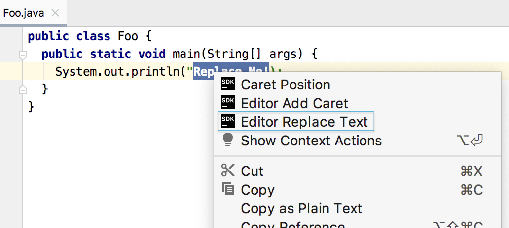

The following set of steps will show how to access a text selection and replace the text with a string.
The tutorial is presented in the following sections:
* bullet list
{:toc}

## Introduction
This tutorial relies heavily on creating and registering actions.
The [Actions Tutorial](/tutorials/action_system.md) covers this topic in depth.

This tutorial uses examples from the [editor_basics](https://github.com/JetBrains/intellij-sdk-docs/tree/master/code_samples/editor_basics/) plugin code sample from the IntelliJ Platform SDK.
It may be helpful to open that project in an IntelliJ Platform-based IDE, build the project, run it, select some text in the editor, and invoke the **Editor Replace Text** menu item on the editor context menu.

{:width="500px"}

## Creating a New Menu Action
In this example, we access the editor from an action.
To review the fundamentals of creating and registering actions, refer to the [Actions Tutorial](/tutorials/action_system.md).
The source code for the Java class in this example is [EditorIllustration](https://github.com/JetBrains/intellij-sdk-docs/blob/master/code_samples/editor_basics/src/main/java/org/intellij/sdk/editor/EditorIllustration.java).

To register the action, we must add the corresponding elements to the `<actions>` section of the plugin configuration file
[plugin.xml](https://github.com/JetBrains/intellij-sdk-docs/blob/master/code_samples/editor_basics/src/main/resources/META-INF/plugin.xml).
The `EditorIllustration` action is registered in the group `EditorPopupMenu` so it will be available from the context menu when focus is on the editor:
```xml
    <action id="EditorBasics.EditorIllustration"
            class="org.intellij.sdk.editor.EditorIllustration"
            text="Editor Replace Text"
            description="Replaces selected text with 'Replacement'."
            icon="EditorBasicsIcons.Sdk_default_icon">
      <add-to-group group-id="EditorPopupMenu" anchor="first"/>
    </action>
```

## Defining the Menu Action's Visibility
To determine conditions by which the action will be visible and available requires `EditorIllustration` to override the
`AnAction.update()` method.
```java
public class EditorIllustration extends AnAction {
    @Override                                        
    public void actionPerformed(@NotNull AnActionEvent e) { /*...*/ }
    @Override
    public void update(@NotNull final AnActionEvent e) { /*...*/ }
}
```

In order to work with a selected part of the text, it's reasonable to make the menu action available only when the following requirements are met:
* There is a [Project](upsource:///platform/core-api/src/com/intellij/openapi/project/Project.java) object,
* There is an instance of [Editor](upsource:///platform/editor-ui-api/src/com/intellij/openapi/editor/Editor.java) available,
* There is a text selection in `Editor`.

Additional steps will show how to check these conditions through obtaining instances of `Project` and `Editor` objects, and how to show or hide the action's menu items based on them.

### Getting an Instance of the Active Editor from an Action Event
Using the [AnActionEvent](upsource:///platform/editor-ui-api/src/com/intellij/openapi/actionSystem/AnActionEvent.java) event passed into the `update` method, a reference to an instance of the editor can be obtained by calling `getData(CommonDataKeys.EDITOR)`.
Similarly, to obtain a project reference, we use the `getProject()` method.
```java
public class EditorIllustration extends AnAction {
    @Override
    public void update(AnActionEvent e) {
        //Get required data keys
        final Project project = e.getProject();
        final Editor editor = e.getData(CommonDataKeys.EDITOR);
        //Set visibility only in case of existing project and editor (for now, selection is added below)
        e.getPresentation().setVisible(project != null && editor != null);
    }
}
```

**Note:**  
There are other ways to access an `Editor` instance:
* If a [DataContext](upsource:///platform/editor-ui-api/src/com/intellij/openapi/actionSystem/DataContext.java) object is available: `CommonDataKeys.EDITOR.getData(context);`
* If only a `Project` object is available, use `FileEditorManager.getInstance(project).getSelectedTextEditor()`

### Obtaining a Caret Model and Selection
After making sure a project is open, and an instance of the editor is obtained, we need to check if any selection is available.
The [SelectionModel](upsource:///platform/editor-ui-api/src/com/intellij/openapi/editor/SelectionModel.java) interface is accessed from the `Editor` object.
Determining whether some text is selected is accomplished by calling the `SelectionModel.hasSelection()` method.
Here's how the `EditorIllustration.update(AnActionEvent e)` method should look:
```java
  @Override
  public void update(final AnActionEvent e) {
    //Get required data keys
    final Project project = e.getProject();
    final Editor editor = e.getData(CommonDataKeys.EDITOR);
    //Set visibility only in case of existing project and editor and if a selection exists
    e.getPresentation().setVisible( (project != null 
                                    && editor != null 
                                    && editor.getSelectionModel().hasSelection()));
  }
```

**Note:**
`Editor` also allows access to different models of text representation. 
The model classes are located in [editor](upsource:///platform/editor-ui-api/src/com/intellij/openapi/editor), and include:
* [CaretModel.java](upsource:///platform/editor-ui-api/src/com/intellij/openapi/editor/CaretModel.java),
* [FoldingModel.java](upsource:///platform/editor-ui-api/src/com/intellij/openapi/editor/FoldingModel.java),
* [IndentsModel.java](upsource:///platform/editor-ui-api/src/com/intellij/openapi/editor/IndentsModel.java),
* [ScrollingModel.java](upsource:///platform/editor-ui-api/src/com/intellij/openapi/editor/ScrollingModel.java),
* [SoftWrapModel.java](upsource:///platform/editor-ui-api/src/com/intellij/openapi/editor/SoftWrapModel.java)


## Replacing the Selected Text
Based on the evaluation of conditions by `EditorIllustration.update()`, the `EditorIllustration` action menu item is visible. 
To make the menu item do something, the `EditorIllustration` class must override the `AnAction.actionPerformed()` method.
As explained below, this will require the `EditorIllustration.actionPerformed()` method to:
* Gain access to the document being edited.
* Get the character locations defining the selection.
* Safely replace the contents of the selection.

### Obtaining the Document and Selection
Modifying the selected text requires an instance of the [Document](upsource:///platform/core-api/src/com/intellij/openapi/editor/Document.java) object, which is accessed from the `Editor` object. 
The [Document](/basics/architectural_overview/documents.md) represents the contents of a text file loaded into memory and opened in an IntelliJ Platform-based IDE editor.
An instance of the `Document` will be used later when a text replacement is performed.

The text replacement will also require information about the where the selection is located in the document, which is provided by the `SelectionModel` object.
Selection information is expressed in terms of [Offset](coordinates_system.md#caret-offset), the count of characters from the beginning of the document to a caret location.
Getting from `AnActionEvent` to information about the selection is shown below: 
```java
public class EditorIllustration extends AnAction {
  @Override
  public void actionPerformed(final AnActionEvent e) {
    //Get all the required data from data keys
    final Editor editor = e.getRequiredData(CommonDataKeys.EDITOR);
    final Project project = e.getRequiredData(CommonDataKeys.PROJECT);
    final Document document = editor.getDocument();
    // Work off of the primary caret to get the selection info
    Caret primaryCaret = editor.getCaretModel().getPrimaryCaret();
    int start = primaryCaret.getSelectionStart();
    int end = primaryCaret.getSelectionEnd();
  }
}
```

### Safely Modifying Text in a Document
Text replacement could be done by calling the `Document` object's `replaceString()` method. 
However, safely replacing the text requires the `Document` to be locked and any changes performed in a write action.
See the [Threading Issues](/basics/architectural_overview/general_threading_rules.md) section to learn more about synchronization issues and changes safety on the IntelliJ Platform.
This example changes the document within a [WriteCommandAction](upsource:///platform/core-api/src/com/intellij/openapi/command/WriteCommandAction.java):
```java
  @Override
  public void actionPerformed(final AnActionEvent e) {
    //Get all the required data from data keys
    final Editor editor = e.getRequiredData(CommonDataKeys.EDITOR);
    final Project project = e.getRequiredData(CommonDataKeys.PROJECT);
    final Document document = editor.getDocument();
    // Work off of the primary caret to get the selection info
    Caret primaryCaret = editor.getCaretModel().getPrimaryCaret();
    int start = primaryCaret.getSelectionStart();
    int end = primaryCaret.getSelectionEnd();
    // Replace the selection with a fixed string.
    // Must do this document change in a write action context.
    WriteCommandAction.runWriteCommandAction(project, () ->
        document.replaceString(start, end, "editor_basics")
    );
    // De-select the text range that was just replaced
    primaryCaret.removeSelection();
  }
```


