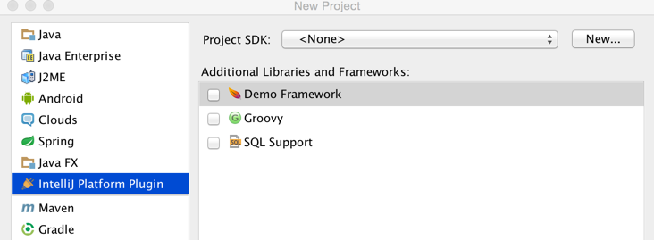

<!-- Copyright 2000-2020 JetBrains s.r.o. and other contributors. Use of this source code is governed by the Apache 2.0 license that can be found in the LICENSE file. -->

The following tutorial shows how to support a custom framework type for a project and make this framework type embedded in a project wizard as a UI component.
The examples in this tutorial rely heavily on the [framework_basics](https://github.com/JetBrains/intellij-sdk-docs/tree/master/code_samples/framework_basics) code sample.

## 1. Creating a New Framework
In oder to make a custom framework available and configurable for a project the [`FrameworkTypeEx`](upsource:///java/idea-ui/src/com/intellij/framework/FrameworkTypeEx.java) class needs to be extended, in this example to make the [DemoFramework](https://github.com/JetBrains/intellij-sdk-docs/blob/master/code_samples/framework_basics/src/main/java/org/intellij/sdk/framework/DemoFramework.java) class.

```java
public class DemoFramework extends FrameworkTypeEx {
}
```

## 2. Registering Framework
The newly created framework class should be registered as an extension point by adding `com.intellij.framework.type` extension in  
[`plugin.xml`](https://github.com/JetBrains/intellij-sdk-docs/blob/master/code_samples/framework_basics/src/main/resources/META-INF/plugin.xml)
configuration file:

```xml
<extensions defaultExtensionNs="com.intellij">
    <framework.type implementation="org.intellij.sdk.framework.DemoFramework"/>
</extensions>
```

## 3. Setting up Mandatory Attributes
The framework component should have a unique name passed as a string literal to the constructor. 
It is best if this is the FQN name of the class:

```java
public class DemoFramework extends FrameworkTypeEx {
    public static final String FRAMEWORK_ID = "org.intellij.sdk.framework.DemoFramework";
    protected DemoFramework() {
        super(FRAMEWORK_ID);
    }
}
```

The *Presentable name* and *icon* define the appearance of visual components related to the framework:

```java
public class DemoFramework extends FrameworkTypeEx {
  @NotNull
  @Override
  public String getPresentableName() {
    return "SDK Demo Framework";
  }

  @NotNull
  @Override
  public Icon getIcon() {
    return SdkIcons.Sdk_default_icon;
  }
}
```

## 4. Creating Provider for Enabling Framework Support
To make the framework set up available while executing the steps to create a project, the 
`DemoFramework.createProvider()` method must be implemented to return an object of type [`FrameworkSupportInModuleConfigurable`](upsource:///java/idea-ui/src/com/intellij/framework/addSupport/FrameworkSupportInModuleConfigurable.java), which adds the framework to a module. 
In this example the framework is added to any [`ModuleType`](upsource:///platform/lang-api/src/com/intellij/openapi/module/ModuleType.java) without checking, which is usually not the case.

```java
@NotNull
@Override
public FrameworkSupportInModuleProvider createProvider() {
    return  new FrameworkSupportInModuleProvider() {
        @NotNull
        @Override
        public FrameworkTypeEx getFrameworkType() {
            return DemoFramework.this;
        }

        @NotNull
        @Override
        public FrameworkSupportInModuleConfigurable createConfigurable(@NotNull FrameworkSupportModel model) {
            return new FrameworkSupportInModuleConfigurable() {
                @Nullable
                @Override
                public JComponent createComponent() {
                    return new JCheckBox("SDK Extra Option");
                }

                @Override
                public void addSupport(@NotNull Module module, @NotNull ModifiableRootModel model, @NotNull ModifiableModelsProvider provider) {
                    // This is the place to set up a library, generate a specific file, etc
                    // and actually add framework support to a module.
                }
            };
        }

        @Override
        public boolean isEnabledForModuleType(@NotNull ModuleType type) {
            return true;
        }
    };
}
```

After compiling and running the code sample above an extra option for configuring the newly created Demo custom framework should be available in the Project Wizard: 




