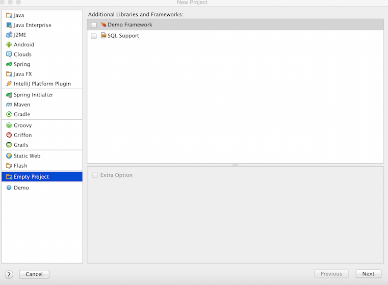
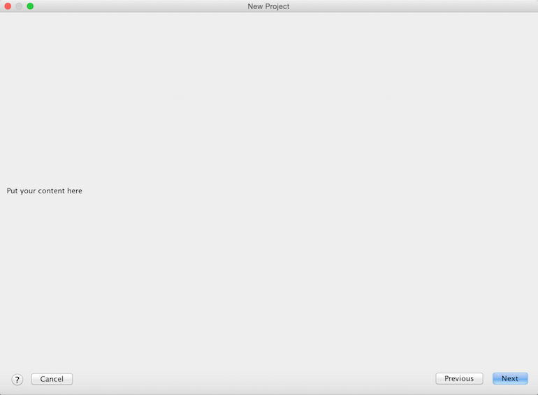

This tutorial shows how to add a extra-step to the Project Wizard in order to provide additional project configuration settings.

## Pre-requirements

Create an empty plugin project.
See 
[Creating a Plugin Project](/basics/getting_started/creating_plugin_project.md)
to know how to do it.

## 1. Register Module Builder

Project configuration settings depend on the project's module type. 
Register a new *moduleBuilder* extension point in the `plugin.xml` configuration file.


```xml
  <extensions defaultExtensionNs="com.intellij">
      <moduleBuilder builderClass="org.jetbrains.tutorials.project.wizard.DemoModuleWizardStep" id="DEMO_STEP" order="first"/>
  </extensions>
```

## 2. Create a Custom Module Builder

Extend [`ModuleBuilder`](upsource:///platform/lang-api/src/com/intellij/ide/util/projectWizard/ModuleBuilder.java) class to provide custom configuration.

```java
public class DemoModuleWizardStep extends ModuleBuilder {
    public void setupRootModel(ModifiableRootModel modifiableRootModel) throws ConfigurationException {

    }

    public ModuleType getModuleType() {
        return null;
    }
}
```

## 3. Define Module Type

Set a module type you want to provide an extra wizard step for. In this example we choose an empty module type.


```java
public class DemoModuleWizardStep extends ModuleBuilder {
    public void setupRootModel(ModifiableRootModel modifiableRootModel) throws ConfigurationException {

    }

    public ModuleType getModuleType() {
        return ModuleType.EMPTY; //or it could be any other module type
    }
}
```

## 4. Design and Implement Wizard Steps

Provide an implementation of a custom UI component to be added to the Wizard.
In this case we leave it as a label.


```java
public class DemoModuleWizardStep extends ModuleBuilder {
    public void setupRootModel(ModifiableRootModel modifiableRootModel) throws ConfigurationException {

    }

    public ModuleType getModuleType() {
        return ModuleType.EMPTY; 
    }

    @Override
    public ModuleWizardStep[] createWizardSteps(@NotNull WizardContext wizardContext, @NotNull ModulesProvider modulesProvider) {
        return new ModuleWizardStep[]{new ModuleWizardStep() {
            @Override
            public JComponent getComponent() {
                  return new JLabel("Put your content here");
            }

            @Override
            public void updateDataModel() {

            }
        }};
    }
}
```

## 5. Checking UI Appearance  

After compiling and running the plugin create a new project using a source-compiled instance of *IntelliJ IDEA*.



Choose an *Empty Module* type, click next, and you get to the just added extra step.
 
 

Modify and tune the UI component depending on your requirements.


