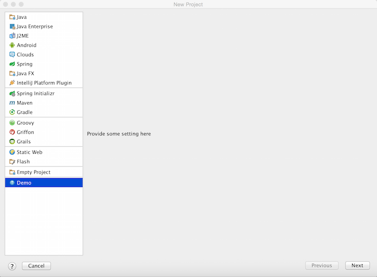

*IntelliJ Platform* provides a set of standard module types which can be chosen, however, you might need to create a module of a type that haven't been supported yet.
This tutorial shows how to register a new module and link it to the project creation procedure and the UI.

## Pre-requirements

Create an empty plugin project.
See 
[Creating a Plugin Project](/basics/getting_started/creating_plugin_project.md)
to know how to do it.

## 1. Register a New Module Type

Add a new *moduleType* extension into the 
`plugin.xml`
configuration file.

```xml
<extensions defaultExtensionNs="com.intellij">
    <moduleType id="DEMO_MODULE_TYPE" implementationClass="com.intellij.tutorials.module.DemoModuleType"/>
</extensions>
```

## 2. Implement ModuleType Interface


```java
public class DemoModuleType extends ModuleType<DemoModuleBuilder> {
    private static final String ID = "DEMO_MODULE_TYPE";

    public DemoModuleType() {
        super(ID);
    }

    public static DemoModuleType getInstance() {
        return (DemoModuleType) ModuleTypeManager.getInstance().findByID(ID);
    }

    @NotNull
    @Override
    public DemoModuleBuilder createModuleBuilder() {
        return new DemoModuleBuilder();
    }

    @NotNull
    @Override
    public String getName() {
        return "Demo Module Type";
    }

    @NotNull
    @Override
    public String getDescription() {
        return "Demo Module Type";
    }

    @Override
    public Icon getBigIcon() {
        return AllIcons.General.Information;
    }

    @Override
    public Icon getNodeIcon(@Deprecated boolean b) {
        return AllIcons.General.Information;
    }

    @NotNull
    @Override
    public ModuleWizardStep[] createWizardSteps(@NotNull WizardContext wizardContext, @NotNull DemoModuleBuilder moduleBuilder, @NotNull ModulesProvider modulesProvider) {
        return super.createWizardSteps(wizardContext, moduleBuilder, modulesProvider);
    }
}
```

## 3. Implement Custom Module Builder

```java
public class DemoModuleBuilder extends ModuleBuilder {
    @Override
    public void setupRootModel(ModifiableRootModel model) throws ConfigurationException {

    }

    @Override
    public ModuleType getModuleType() {
        return DemoModuleType.getInstance();
    }

    @Nullable
    @Override
    public ModuleWizardStep getCustomOptionsStep(WizardContext context, Disposable parentDisposable) {
        return new DemoModuleWizardStep();
    }
}
```

## 4. Provide Custom Wizard Steps

Provide implementation of UI components for the project creating stage.

```java
public class DemoModuleWizardStep extends ModuleWizardStep {
    @Override
    public JComponent getComponent() {
        return new JLabel("Provide some setting here");
    }

    @Override
    public void updateDataModel() {
        //todo update model according to UI
    }
}
```

## 5. Creating a Module of New Type

After compiling and running the plugin, create a new project with a source-compiled instance of *IntelliJ IDEA*.
You will see a new module type and it's settings panel available in the Project Wizard.



